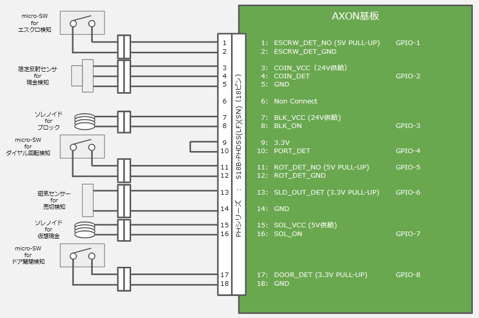
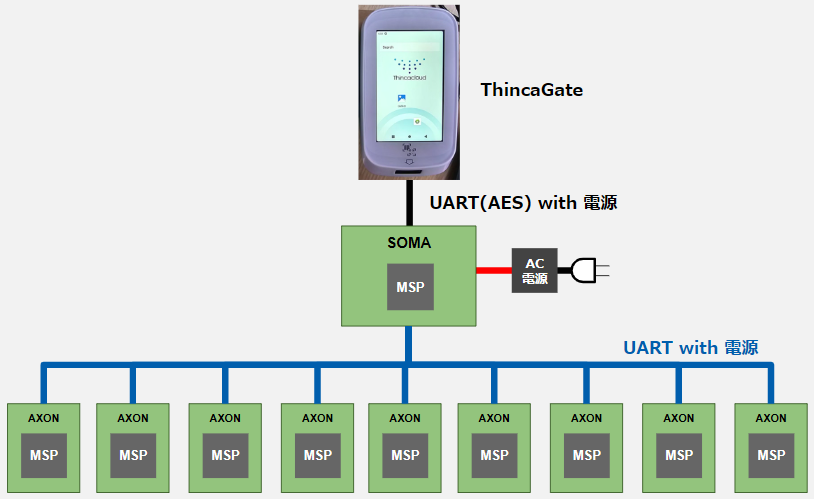
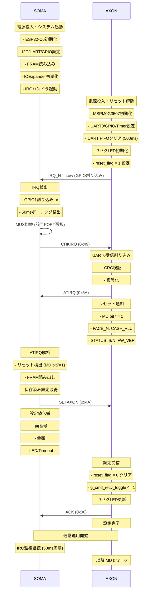
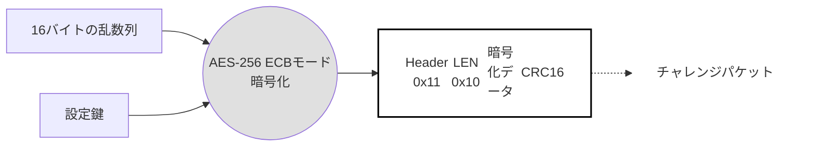
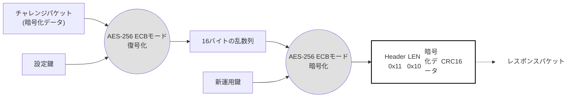

# 多面制御基板 – NEURON内コマンド仕様書

**TEP-SOMA-AXON-1: 2025**

**発行日**: 2025年9月5日
**バージョン**: Ver.0.1

---

**改訂履歴**

| 改訂日付 | 版数 | 内容 |
|---|---|---|
| 2025/10/20 | Ver.0.1 | Draft版 |
| 2025/12/22 | Ver.0.1.1 | 起動シーケンス詳細化、IRQ検出方式追加、ホットプラグ対応記載、リトライ規定の実装詳細追加、電源供給仕様明記 |

---

**目次**

- [1. はじめに](#1-はじめに)
  - [1.1. 目的](#11-目的)
  - [1.2. スコープ](#12-スコープ)
  - [1.3. 用語と定義](#13-用語と定義)
  - [1.4. 記号と略称](#14-記号と略称)
- [2. 概要](#2-概要)
  - [2.1. システム構成図](#21-システム構成図)
  - [2.2. ThincaGate – SOMA基板 – AXON基板　概略図](#22-thincagate--soma基板--axon基板概略図)
  - [2.3. AXON基板 – コインメック　概略図](#23-axon基板--コインメック概略図)
- [3. 仕様](#3-仕様)
  - [3.1. 接続仕様](#31-接続仕様)
  - [3.2. シリアル通信仕様](#32-シリアル通信仕様)
- [4. コマンド(CMD)仕様](#4-コマンドcmd仕様)
  - [4.1. CMD一覧](#41-cmd一覧)
  - [4.2. コマンド説明](#42-コマンド説明)
- [5. 運用鍵更新](#5-運用鍵更新)
  - [5.1. 運用鍵更新シーケンス](#51-運用鍵更新シーケンス)
- [6. AXON基板 ファームウェア アップデート](#6-axon基板-ファームウェア-アップデート)
  - [6.1. FWアップデートシーケンス](#61-fwアップデートシーケンス)
  - [6.2. ファームウェア・コードファイルの形式](#62-ファームウェアコードファイルの形式)

---

## 1. はじめに

### 1.1. 目的

### 1.2. スコープ

### 1.3. 用語と定義

### 1.4. 記号と略称

## 2. 概要

### 2.1. システム構成図

### 2.2. ThincaGate – SOMA基板 – AXON基板　概略図

### 2.3. AXON基板 – コインメック　概略図

## 3. 仕様

### 3.1. 接続仕様

### 3.2. シリアル通信仕様

#### 3.2.1. シリアル通信概要

#### 3.2.2. UART通信方式

#### 3.2.3. キャラクタフォーマット

#### 3.2.4. フレームフォーマット構成と暗号化

#### 3.2.5. 起動タイミング

#### 3.2.6. 通信タイミング

#### 3.2.7. リトライ規定

## 4. コマンド(CMD)仕様

### 4.1. CMD一覧

#### 4.1.1. [暗号化対象] ACKレスポンスフォーマット（ACK）【AXON ⇒ SOMA】

#### 4.1.2. [平文対象] NACKレスポンスフォーマット【AXON ⇒ SOMA】

### 4.2. コマンド説明

#### 4.2.1. [暗号化対象] No Operationコマンド（NOP）【SOMA ⇒ AXON】

#### 4.2.2. [暗号化対象] IRQ確認コマンド（CHKIRQ）【SOMA ⇒ AXON】

#### 4.2.3. [暗号化対象] CHKIRQ応答（ATIRQ）【AXON ⇒ SOMA】

#### 4.2.4. [暗号化対象] AXON基板設定コマンド（SETAXON）【SOMA ⇒ AXON】

#### 4.2.5. [暗号化対象] AXON基板FW Updateコマンド（AFWUP）【SOMA ⇒ AXON】

#### 4.2.6. [暗号化対象] 運用鍵更新コマンド（SETOKEY）【SOMA ⇒ AXON】

#### 4.2.7. [暗号化対象] AXON基板再起動コマンド（AXONRBT）【SOMA ⇒ AXON】

## 5. 運用鍵更新

### 5.1. 運用鍵更新シーケンス

#### 5.1.1. 運用鍵更新の手順

#### 5.1.2. チャレンジパケット

#### 5.1.3. レスポンスパケット

## 6. AXON基板 ファームウェア アップデート

### 6.1. FWアップデートシーケンス

#### 6.1.1. FWアップデートの手順

### 6.2. ファームウェア・コードファイルの形式

#### 6.2.1. [暗号化対象] コードパケットコマンド（CODEPKT）【SOMA ⇒ AXON】

#### 6.2.2. [平文対象] コード受信OKレスポンス（CODEOK）【AXON ⇒ SOMA】

#### 6.2.3. [平文対象] コード受信NGレスポンス（CODENG）【AXON ⇒ SOMA】

#### 6.2.4. [平文対象] エラー確認コマンド（ERRCHK）【AXON ⇒ SOMA】

#### 6.2.5. [平文対象] コード完了レスポンス（CODEFIN）【AXON ⇒ SOMA】

---

# 付録A

## はじめに

本資料は、SOMA基板とAXON基板の間のシリアル通信を規定するUARTインタフェースを利用したTEPの通信インタフェース規格書になります。

## 目的

本資料の目的は、SOMA基板とAXON基板のシリアル通信の双方互換性を保つことを目的とします。


## スコープ

本資料では、NEURON群の物理層、及び、論理層をスコープとします。


## 用語と定義

| 名称 | 説明 |
|---|---|
| 多面制御基板 | ガチャガチャを制御するための基板。
SOMA基板とAXON基板の２種の基板構成となる。 |
| ThincaGate | 決済端末 |
| SOMA基板 | ThincaGateと通信を行う基板。AXON基板を制御する。 |
| AXON基板 | SOMA基板と通信を行う基板。SOMA基板からの命令で動作する。 |
| ThincaGate | 決済端末 |
| SYNAPSE基板 | ThincaGate と入れ替えて売上情報だけをAWSに上げるWi-Fiモジュール |


## 記号と略称

| 名称 | 説明 |
|---|---|
| AWS | Amazon Web Service |
| TG | ThincaGate |
| SOMA | SOMA PCB Board |
| AXON | AXON PCB Board |
| I/F | Inter/Face |
| UART | Universal Asynchronous Receiver Transmitter |
| LSB | Least Significant Bit |
| MSB | Most Significant Bit |
| Etu | Elementary Time Unit |
| ACK | Acknowledgement |
| RFU | Reserved for Future Use |
| NACK | Negative Acknowledgement |
| CPU | Central Processing Unit |
| CRC | Cyclic Redundancy Check |
| CAN | Controller Area Network |
|  |  |

---

# 付録B

## システム構成図

下記のFigure 2-1にシステム構成図を示します。


**Figure 2-1, システム構成図**


基本的な機器構成としては「AXON」、「SOMA」、「TG」の３つの電子機器で構成されます。SOMAはこれらのAXONを束ねて制御するSOMA基板を示しています。TGはThincaGateを示しています。これら３つの機器間で通信や制御を行う事で、キャッシュレス決済（クレジットタッチ決済、電子マネー決済、QR決済、ハウスマネー決済、クーポン決済、等）を実現します。


## ThincaGate – SOMA基板 – AXON基板　概略図

Figure 2-1にThincaGateとSOMA基板とAXON基板の接続概略図を示します。



**Figure 2-2, ThincaGateとSOMA基板とAXON基板の接続概略図**
本概略図は、カプセルトイ向けの基板構成です。


## AXON基板 – コインメック　概略図

Figure 2-3にAXON基板とカプセルトイ間の接続概略図を示します。



**Figure 2-3, カプセルトイとAXON基板間の接続概略図**


概略図のため例として１ポートのみの接続図を示しています。

---

# 付録C

## 接続仕様

下記のTable 3-1にSOMAから見たAXON I/Fのピンアサインの仕様を示します。


Table 3-1, SOMA I/Fのピンアサイン情報

| PIN No. | 項目 | 内容 |
|---|---|---|
| 1 | 24V | 電源24V |
| 2 | IRQ_IN | 割り込み信号 |
| 3 | TX | SOMAがAXONにデータを送信するための信号 |
| 4 | RX | SOMAがAXONからデータを受信するための信号。 |
| 5 | GND | GND |


下記のTable 3-2にAXON I/Fのピンアサインの仕様を示します。


Table 3-2, AXON I/Fのピンアサイン情報

| PIN No. | 項目 | 内容 |
|---|---|---|
| 1 | ESCRW_DET_NO | 返金ボタン押下検出（ノーマリーオープン：5V PULL-UP）<br>0：検出（Lowパルス）<br>1：通常状態 |
| 2 | ESCRW_DET_GND | 返却ボタン押下検出用 マイクロスイッチ用GND |
| 3 | COIN_VCC | 硬貨検出用 フォトセンサーVcc（24V/15mA） |
| 4 | COIN_DET | 硬貨検出（ノーマリーオープン：5V PULL-UP）<br>0：検出（Lowパルス）<br>1：通常状態 |
| 5 | GND | 基板GND |
| 6 | NC | Non connect |
| 7 | BLK_VCC | 硬貨用ブロックソレノイド用 Vcc（12V/100mA）<br>0：硬貨ブロック<br>1：硬貨投入許可 |
| 8 | BLK_ON | 回転検出（ノーマリーオープン：5V PULL-UP）(硬貨用ブロックソレノイド制御出力) <br>0：検出（50msのLowパルス）<br>1：通常状態 |
| 9 | 3.3V | 電源3.3V |
| 10 | PORT_DET | PORT利用検出<br>0：OPEN<br>1：検出 |
| 11 | ROT_DET_NO | カプセル排出検出（ノーマリーオープン：5V PULL-UP）<br>0：検出（Lowパルス）<br>1：通常状態 |
| 12 | ROT_DET_GND | カプセル排出検出用 マイクロスイッチ用GND |
| 13 | SLD_OUT_DET_VCC | 売り切れ検出（オープンコレクタ出力：3.3V PULL-UP）<br>0：売り切れ状態（Lowレベル）<br>1：通常状態 |
| 14 | GND | 基板GND |
| 15 | SOL_VCC | キャッシュレス決済用 ソレノイドVcc（5V/1A供給） |
| 16 | SOL_ON | キャッシュレス決済用 ソレノイドON<br>0：決済未完了<br>1：決済完了 |
| 17 | DOOR_DET | カプセルトイ前面パネル開閉検知<br>0：通常状態（CLOSE状態）<br>1：解放状態（OPEN状態） |
| 18 | GND | 基板GND |


AXON I/Fとコインメック間でAXON基板側に搭載されるコネクタは「18ピン」の「S18B-PHDSS(LF)(SN)（JST製）」です。


## 3.2シリアル通信仕様

### 3.2.1シリアル通信概要


SOMAはMUXを変更することで通信対象のAXONに対して任意のタイミングで通信することが出来ます。もしくは、AXONからの割り込み要求信号を契機とし、対象のAXON基板と通信を行います。


### 3.2.2 UART通信方式


AXONの通信方式の仕様を下記のTable 3-3に示します。TGとSOMA間と同じ仕様になります.

Table 3-3, 通信方式仕様

| 項目 | 内容 | 内容 |
|---|---|---|
| 通信プロトコル | UART | UART |
| 通信方法 | 全二重通信 | 全二重通信 |
| 通信速度 | 115200 bps（1etu = 8.68us） | 115200 bps（1etu = 8.68us） |
| 信号電圧 | +3.3V | +3.3V |
| 同期方式 | 非同期式 | 非同期式 |
| ビット構成 | スタートビット | 1 bit |
| ビット構成 | データビット | 8 bits（LSBファースト） |
| ビット構成 | パリティビット | なし |
| ビット構成 | ストップビット | 1 bit |
| フロー制御 | 無し | 無し |
| データ順序 | LSBファースト | LSBファースト |


### 3.2.3キャラクタフォーマット


Byteは、SOMAとAXONの間で送受信されます。キャラクタフォーマットは、下記のFigure 3-1の通り、10etuで構成されます。

| Start Bit | D0 | D1 | D2 | D3 | D4 | D5 | D6 | D7 | Stop Bit |
|:---------:|:--:|:--:|:--:|:--:|:--:|:--:|:--:|:--:|:--------:|
| 1 etu | 1 etu | 1 etu | 1 etu | 1 etu | 1 etu | 1 etu | 1 etu | 1 etu | 1 etu |


### フレームフォーマット構成と暗号化


AXONとSOMA間の通信フレームを下記のTable 3-4に示します。基本的なフレームフォーマットは、下記のTable 3-4の通り、ヘッダ1 Byteと、データ32 Byte、CRC16 2Byte、の合計35バイトで構成されます。


Table 3-4, フレームフォーマット

| 1st byte | 2nd byte | 3rd – 34th byte | 35th, 36th byte |
|---|---|---|---|
| Header(1 byte) | LEN(1 byte) | data(32 bytes) | CRC16(2 byte) |
| ヘッダ | データ長 | データ部（暗号化対象） | CRC16 |


#### ヘッダ


コマンド識別子。コマンド種別によって値が変わる1バイトの値です。詳細は「4章 コマンド(CMD)仕様」を参照してください。


#### データ長


自身のバイト数とCRC16を含めない自身以降の、データの長さ。


#### 暗号化方式

◆　暗号化方式：AES-256 ECBモード
データ部は、NISTの推奨規格であるAES-256アルゴリズムにより暗号化されます。AES-128のアルゴリズムは以下のページに公開されています。

http://csrc.nist.gov/publications/fips/fips197/fips-197.pdf


#### 暗号鍵


AXONとSOMAで交換されるパケットのデータ部の暗号化には、2つの暗号鍵が使用されます。


◆　運用鍵：運用鍵設定コマンド以外のパケットの暗号・復号に使用される暗号鍵。

運用鍵設定コマンドで変更可能。ファームウェアの書込み時には

Default値が設定される。

◆　設定鍵：運用鍵設定コマンドの暗号・復号に使用される暗号鍵。固定値で変更できない。


#### CRC16


データ部をCRC16演算した結果。式は「ISO/IEC 13239」に定義されている以下の式を用い、初期値は以下の通りとする。演算方向はLSBファーストとする。


式：X^16+X^12+X^5+1

初期値：0xFFFF


例）データ部が “0x000000” の3バイト時、演算結果は ”0xCCC6” となる。


### 起動タイミング


下記のFigure 3-2にSOMAとAXONの起動時のタイミングチャートを示します。
```
電源     ┊   RESET   ┊  起動中              ┊  Polling/READY
ON       ┊           ┊                      ┊
         ┊           ┊                      ┊
SOMA: ───┼───────────┼──────────────────────┼─────────────────
         ┊  [RESET]  ┊   [起動中]           ┊  [Polling]
         ┊           ┊                      ┊
         ┊←Treset──→┊                      ┊
         ┊ (max.1秒) ┊                      ┊
         ┊           ┊←────Tstartup───────→┊
         ┊           ┊    (max.10秒)        ┊
         ┊           ┊                      ┊
AXON: ───┼───────────┼──────────────────────┼─────────────────
         ┊  [RESET]  ┊   [起動中]           ┊  [READY]
         ┊           ┊                      ┊
```
Figure 3-2, 起動時のタイミングチャート


上記のFigure 3-2のSOMAとAXONの状態説明を下記のTable 3-5に示します。


Table 3-5, SOMAとAXONの状態

| 状態 | 内容 |
|---|---|
| Power-OFF | 電源が印加されていない状態 |
| RESET | CPUが動作していないリセット状態 |
| 起動中 | CPUが受信待機状態へ遷移するための準備を行っている状態 |
| Polling | TGに対してデータを送信している状態
AXONとコマンドの送受信が可能な状態 |
| READY | SOMAとコマンドの送受信が可能な状態 |


上記のFigure 3-2のSOMAとAXONのリセット解除タイミング（Treset）と起動時間（Tstartup）を下記のTable 3-6に示します。


Table 3-6,起動時のタイミング規定

| 変数 | 最小値 | 最大値 |
|---|---|---|
| Treset | - | １秒 |
| Tstartup | - | １0秒 |


リセット期間中や起動中はコマンドを送受信できません。

#### 3.2.5. 起動シーケンス

SOMAとAXONの起動時の通信シーケンスを以下に示します。



Figure 3-3, SOMA-AXON起動シーケンス

**起動シーケンス重要ポイント**

1. **reset_flagの役割**: 電源投入/WDTリセット後、最初のATIRQでSOMAに通知 (MD bit7=1)
2. **クリアタイミング**: SETAXONコマンド受信時（正常動作確認後）→ reset_flag = 0
3. **IRQ_N信号**: AXONが起動完了をSOMAに通知 (Active Low)
4. **UART FIFOクリア**: AXON起動時に500ms遅延読み出しで残留データ除去
5. **MUX切替**: SOMA側でポート選択後にCHKIRQ送信
6. **IRQ検出方式**: GPIO1割り込みモード (フォールバック: 50msポーリング)
7. **ホットプラグ対応**: SOMA起動後にAXON接続した場合でも、ATIRQ受信成功時にPORT_FLG=0→1に自動更新
8. **電源供給**: AXONの24V電源はSOMAから供給される。ケーブル接続時に同時供給されるため、AXON単独の電源OFF状態は発生しない

#### 3.2.6. IRQ検出とキュー処理

**IRQ検出方式**

SOMA側のIRQ検出は以下の2つの方式を実装しています:

1. **GPIO1割り込みモード** (優先): IOExpander INT信号(GPIO1)の立ち下がりエッジ検出
2. **ポーリングモード** (フォールバック): 50ms周期でIOExpanderレジスタを読み取り

GPIO1割り込み初期化に失敗した場合、自動的にポーリングモードにフォールバックします。

**IRQキュー処理**

GPIO1割り込みモード時、ISR(割り込みサービスルーチン)で検出したIRQイベントをFreeRTOSキュー(サイズ10)に格納します。

- **キュー満杯時**: 新しいIRQイベントは破棄され、`queue_overflow_count`がインクリメントされます
- **オーバーフロー影響**:
  - AXON電源切断中: IRQ信号不安定による大量検出。問題なし
  - AXON正常動作中: ユーザー操作(コイン投入/回転検出)の取りこぼしリスクあり
- **処理遅延**: キューに溜まったイベントは順次処理されるため、古いIRQが後から処理される場合あり

**ケーブル切断時の動作**

AXONとの接続ケーブル切断時(=24V電源供給停止時):
1. IRQ信号が不安定になり、ISRが連続発火
2. キューが満杯になり、オーバーフローが発生
3. `process_axon_irq()`でCHKIRQを送信するが、AXONから応答なし
4. リトライ後、タイムアウトで処理終了

ケーブル再接続時:
1. キューに残った古いIRQイベント(最大10個)を順次処理
2. IOExpanderで現在のIRQ状態を確認 → 全てHIGH(=IRQ解除済み)
3. 各PORTのCHKIRQ送信で、実際にIRQを出しているPORTのみATIRQ応答
4. リセット検出(MD bit7=1) → SETAXON送信 → 通常運用開始

#### 3.2.7. 通信タイミング


下記のFigure 3-3にSOMAとAXONの通信時のタイミングチャートを示します。
```
            ┌────┐          ┊           ┊          ┌────┐
SOMA:  ─────┤送信├──────────┊───────────┊──────────┤送信├─────
            └────┘          ┊           ┊          └────┘
                ┊           ┊           ┊           ┊
                ┊←───T0────→┊           ┊           ┊
                ┊           ┊           ┊           ┊
                ┊           ┌────┐      ┊           ┊
AXON:  ─────────┊───────────┤送信├──────┊───────────┊─────
                ┊           └────┘      ┊           ┊
                ┊           ┊           ┊           ┊
                ┊           ┊←───T1────→┊           ┊
                ┊           ┊           ┊           ┊
```
Figure 3-3, 通信時のタイミングチャート


上記のFigure 3-3のT0とT1の説明を下記のTable 3-7に示します。


Table 3-7, CLP端末の状態

| 変数 | 内容 |
|---|---|
| T0 | SOMAのコマンド送信完了からAXONのコマンド送信開始までの時間。SOMAは、T0までにAXONからのコマンドを受信できるようにして下さい。 |
| T1 | AXONのコマンド送信完了からSOMAのコマンド送信開始までの時間。AXONは、T1までにSOMAからのコマンドを受信できるようにして下さい。 |


AXONは、T0までにSOMAからのコマンドを受信できるようにし、SOMAは、T1までにAXONからのコマンドを受信できるようにして下さい。T0とT1の時間に関しては、下記の通りになります。
T0 = 10ms
T1 = 10ms

SOMAとAXONは、コマンドを送信する場合、10ms以上遅延させた後にコマンドを送信して下さい。また、タイムアウト時間は下記の通りになります。
T0 = T1 = 50ms


### 3.2.8. リトライ規定

コマンド間のタイムアウト規定は「50ms」になります。SOMAとAXON間のシリアル通信経路に正常に送受信ができない何らかの障害（ノイズ、パケットロス、等）が発生した際に、コマンドのリトライを許容致します。SOMAはコマンドレスポンスが受信できない場合の同じコマンドの再送を、AXONはコマンドレスポンスが到達しない場合の同じコマンドの再受信を考慮した設計として下さい。

**SOMA側実装リトライ仕様** (`src/protocol/src/s2a_packet.h`定義)

- **最大リトライ回数**: 5回 (`S2A_MAX_RETRY_COUNT = 5`)
- **リトライ間隔**: 50ms (`S2A_RETRY_INTERVAL_MS = 50`)
- **タイムアウト**: 50ms (`S2A_TIMEOUT_MS = 50`)
- **IRQポーリング周期**: 50ms (`S2A_IRQ_POLL_INTERVAL_MS = 50`)

**リトライ失敗時の動作**

5回リトライしても正常に通信ができない場合:
1. エラーログ出力: `PORT X: ATIRQ failed after 5 retries`
2. MUX無効化: `disable_uart_mux()` で次のPORT処理へ移行
3. 連続失敗カウント更新: 3回連続失敗時に電源問題の警告ログ出力

**電源問題検出**

連続3回以上CHKIRQに応答がない場合:
```
⚠️ PORT X: IRQ detected but no UART response (count: 3/10)
   → Possible AXON power issue (24V supply missing?)
   → Check POWER LED status on AXON board
```

---

# 付録D

## CMD一覧

下記のTable 4-1にSOMAから送信されるCMD、及び、AXONから送信されるレスポンス（RSP）一覧を示します。


Table 4-1, コマンド一覧

| HD | ID | 名称 | 送信元 | 返信 | 内容 |
|---|---|---|---|---|---|
| 汎用レスポンス | 汎用レスポンス | 汎用レスポンス | 汎用レスポンス | 汎用レスポンス | 汎用レスポンス |
| 0x10 | 0x00 | ACK | AXON | - | 正常レスポンス |
| 0x90 | 0xXX | NACK | AXON | - | 異常レスポンス |
| 一般CMD/レスポンス | 一般CMD/レスポンス | 一般CMD/レスポンス | 一般CMD/レスポンス | 一般CMD/レスポンス | 一般CMD/レスポンス |
| 0x14 | 0x50 | NOP | SOMA | ACK/NACK | No Operationコマンド |
| 0x14 | 0x49 | CHKIRQ | SOMA | ATIRQ | 割り込み要求確認コマンド |
| 0x14 | 0x6A | ATIRQ | AXON | - | CHKIRQコマンドレスポンス |
| 0x14 | 0x4A | SETAXON | SOMA | ACK/NACK | AXON基板設定コマンド |
| 0x14 | 0x4B | AFWUP | SOMA | ACK/NACK | AXON基板FWアップデートコマンド |
| 0x15 | - | SETOKEY | SOMA | ACK/NACK | 運用鍵設定コマンド |
| 再起動CMD/レスポンス | 再起動CMD/レスポンス | 再起動CMD/レスポンス | 再起動CMD/レスポンス | 再起動CMD/レスポンス | 再起動CMD/レスポンス |
| 0x14 | 0x7F | AXONRBT | SOMA | ACK or NACK | AXON基板再起動コマンド |
| FWアップデート用 コード送信CMD/レスポンス | FWアップデート用 コード送信CMD/レスポンス | FWアップデート用 コード送信CMD/レスポンス | FWアップデート用 コード送信CMD/レスポンス | FWアップデート用 コード送信CMD/レスポンス | FWアップデート用 コード送信CMD/レスポンス |
| 0xA5 | - | CODEPKT | SOMA | CDOK or CDNG | コードパケット |
| 0xB4 | - | CODEOK | AXON | - | コード受信OK |
| 0xBD | - | CODENG | AXON | - | コード受信NG |
| 0xC4 | - | ERRCHK | SOMA | CDFIN | エラー確認パケット |
| 0xD4 | - | CODEFIN | AXON | - | コード完了 |


また、CMDで共通する「LEN」「DIC」「AuthCode」「RND」「CRC16」の説明をTable 4-2に示します。


Table 4-2, 共通バイトの内容

| 名称 | Bit | 形式 | 内容 |
|---|---|---|---|
| LEN | [0:7] | 平文 | ・データ長<br>自身のバイト数とCRC16を含めない自身以降の、データの長さ。（変動値）<br>“0x20”：32バイト |
| DIC | [0:15] | 暗号文 | ・データ整合性チェックデータ（固定値）<br>“0x0123” |
| AuthCode | [0:15] | 〃 | ・認証コード<br>AXONが発行するコマンド認証用コード。悪意を持った第三者が、SOMAからのコマンドを読出し、複製したコード列をAXONに送り込んでも無効とする為のコード。SOMAからの正常なコマンド（運用鍵設定コマンドと検査ステート設定コマンドを除く）を受信し、受け付ける度に変更される |
| RND | [0:15] | 〃 | ・乱数<br>16ビット長の乱数、パケット毎に異なる乱数を採用。これにより、平分データが同じでも、暗号化後のテキストは毎回異なる数値になる |
| CRC16 | [0:15] | 平文 | ・CRC16<br>データ部をCRC16演算した結果 |


### 4.1.1. [暗号化対象] ACKレスポンスフォーマット（ACK）【AXON ⇒ SOMA】


下記のTable 4-3に共通のACKレスポンスフォーマット一覧を示します。


暗号対象は「3rd Byte ～ 34th Byte」です。


Table 4-3, ACKレスポンスフォーマット

| 1st Byte | 2nd Byte | 3rd Byte | 4th Byte | 5th Byte | 6th Byte | 7th Byte | 8th Byte | 9th Byte |
|---|---|---|---|---|---|---|---|---|
| Header | LEN | ID | RFU | RFU | RFU | RFU | RFU | RFU |
| [0:7] | [0:7] | [0:7] | [0:199] | [0:199] | [0:199] | [0:199] | [0:199] | [0:199] |
| 1 byte | 1 byte | 1 byte | 25 bytes | 25 bytes | 25 bytes | 25 bytes | 25 bytes | 25 bytes |


| 10th Byte | 11th Byte | 12th Byte | 13th Byte | 14th Byte | 15th Byte | 16th Byte | 17th Byte | 18th Byte |
|---|---|---|---|---|---|---|---|---|
| RFU | RFU | RFU | RFU | RFU | RFU | RFU | RFU | RFU |
| [0:199] | [0:199] | [0:199] | [0:199] | [0:199] | [0:199] | [0:199] | [0:199] | [0:199] |
| 25 bytes | 25 bytes | 25 bytes | 25 bytes | 25 bytes | 25 bytes | 25 bytes | 25 bytes | 25 bytes |


| 19th Byte | 20th Byte | 21th Byte | 22th Byte | 23th Byte | 24th Byte | 25th Byte | 26th Byte | 27th Byte |
|---|---|---|---|---|---|---|---|---|
| RFU | RFU | RFU | RFU | RFU | RFU | RFU | RFU | RFU |
| [0:199] | [0:199] | [0:199] | [0:199] | [0:199] | [0:199] | [0:199] | [0:199] | [0:199] |
| 25 bytes | 25 bytes | 25 bytes | 25 bytes | 25 bytes | 25 bytes | 25 bytes | 25 bytes | 25 bytes |


| 28th Byte | 29th Byte | 30th Byte | 31th Byte | 32th Byte | 33th Byte | 34th Byte | 35th Byte | 36th Byte |
|---|---|---|---|---|---|---|---|---|
| RFU | DIC | DIC | AuthCode | AuthCode | RND | RND | CRC16 | CRC16 |
| [0:199] | [0:15] | [0:15] | [0:15] | [0:15] | [0:15] | [0:15] | [0:15] | [0:15] |
| 25 bytes | 2 bytes | 2 bytes | 2 bytes | 2 bytes | 2 bytes | 2 bytes | 2 byte | 2 byte |


これらの項目の内容を下記のTable 4-4に示します。


Table 4-4, ACKの内容

| 名称 | Byte | Bit | 内容 |
|---|---|---|---|
| Header | 1st | [0:7] | ・コマンド識別子：“0x10” |
| LEN | 2nd | [0:7] | ・データ長：”0x20”（32バイト） |
| ID | 3rd | [0:7] | ・識別子：”0x00” |
| RFU | 4th ~ 28th | [0:199] | ・ALL 0 の固定値 |
| DIC | 29th, 30th | [0:15] | データ整合性チェックデータ |
| AuthCode | 31th, 32th | [0:15] | 認証コード |
| RND | 33th, 34th | [0:15] | 乱数 |
| CRC16 | 35th, 36th | [0:15] | CRC16 |


ACKの説明を下記のTable 4-5に示します。


Table 4-5, ACKの説明

|  | Header | ID | 内容 |
|---|---|---|---|
| ACK | 0x10 | 0x00 | 正常にコマンドを処理した |


### 4.1.2. [平文対象] NACKレスポンスフォーマット【AXON ⇒ SOMA】


下記のTable 4-6に共通のコマンドNACKレスポンスフォーマット一覧を示します。


Table 4-6, NACKレスポンスフォーマット

| 1st Byte | 2nd Byte | 3rd Byte | 4th Byte | 5th Byte |
|---|---|---|---|---|
| Header | LEN | ERR_CODE | CRC16 | CRC16 |
| [0:7] | [0:7] | [0:7] | [0:15] | [0:15] |
| 1 byte | 1 byte | 1 byte | 2 bytes | 2 bytes |


これらの項目の内容を下記のTable 4-7に示します。


Table 4-7, NACKの内容

| 名称 | Byte | Bit | 内容 |
|---|---|---|---|
| Header | 1st | [0:7] | ・コマンド識別子：“0x90” |
| LEN | 2nd | [0:7] | ・データ長：”0x01”（1バイト） |
| ERR_CODE | 3rd | [0:7] | ・エラーコード（Table 4-8） |
| CRC16 | 4th, 5th | [0:15] | ・CRC16 |


NACKのエラー毎に分類した一覧を下記のTable 4-8に示します。


Table 4-8, NACKの説明

|  | Header | ERR_CODE | 内容 |
|---|---|---|---|
| NACK | 0x90 | 0x00 | 未確認コマンドを受信した |
| NACK | 0x90 | 0x01 | コマンドの処理が時間内に完了できなかった |
| NACK | 0x90 | 0x02 | コマンドのデータの内容が間違っている |
| NACK | 0x90 | 0x03 | コマンドの長さが間違っている |
| NACK | 0x90 | 0x04 | コマンドのCRC16が間違っている |
| NACK | 0x90 | 0xFF | 予期せぬエラーが発生した |


## コマンド説明


### 4.2.1. [暗号化対象] No Operationコマンド（NOP）【SOMA ⇒ AXON】


本NOPコマンドは、SOMAからAXONに対して、ACKを確認するためのコマンドです。下記のTable 4-11にNOPコマンドのコマンドフォーマットを示します。


暗号対象は「3rd Byte ～ 34th Byte」です。


Table 4-9, NOPコマンドフォーマット

| 1st Byte | 2nd Byte | 3rd Byte | 4th Byte | 5th Byte | 6th Byte | 7th Byte | 8th Byte | 9th Byte |
|---|---|---|---|---|---|---|---|---|
| Header | LEN | ID | RFU | RFU | RFU | RFU | RFU | RFU |
| [0:7] | [0:7] | [0:7] | [0:199] | [0:199] | [0:199] | [0:199] | [0:199] | [0:199] |
| 1 byte | 1 byte | 1 byte | 25 byte | 25 byte | 25 byte | 25 byte | 25 byte | 25 byte |


| 10th Byte | 11th Byte | 12th Byte | 13th Byte | 14th Byte | 15th Byte | 16th Byte | 17th Byte | 18th Byte |
|---|---|---|---|---|---|---|---|---|
| RFU | RFU | RFU | RFU | RFU | RFU | RFU | RFU | RFU |
| [0:199] | [0:199] | [0:199] | [0:199] | [0:199] | [0:199] | [0:199] | [0:199] | [0:199] |
| 25 byte | 25 byte | 25 byte | 25 byte | 25 byte | 25 byte | 25 byte | 25 byte | 25 byte |


| 19th Byte | 20th Byte | 21th Byte | 22th Byte | 23th Byte | 24th Byte | 25th Byte | 26th Byte | 27th Byte |
|---|---|---|---|---|---|---|---|---|
| RFU | RFU | RFU | RFU | RFU | RFU | RFU | RFU | RFU |
| [0:199] | [0:199] | [0:199] | [0:199] | [0:199] | [0:199] | [0:199] | [0:199] | [0:199] |
| 25 byte | 25 byte | 25 byte | 25 byte | 25 byte | 25 byte | 25 byte | 25 byte | 25 byte |


| 28th Byte | 29th Byte | 30th Byte | 31th Byte | 32th Byte | 33th Byte | 34th Byte | 35th Byte | 36th Byte |
|---|---|---|---|---|---|---|---|---|
| RFU | DIC | DIC | AuthCode | AuthCode | RND | RND | CRC16 | CRC16 |
| [0:199] | [0:15] | [0:15] | [0:15] | [0:15] | [0:15] | [0:15] | [0:15] | [0:15] |
| 25 bytes | 2 bytes | 2 bytes | 2 bytes | 2 bytes | 2 bytes | 2 bytes | 2 byte | 2 byte |


これらの項目の説明を下記のTable 4-10に示します。


Table 4-10, NOPの内容

| 名称 | Byte | Bit | 内容 |
|---|---|---|---|
| Header | 1st | [0:7] | ・コマンド識別子：“0x14” |
| LEN | 2nd | [0:7] | ・データ長：”0x20”（32バイト） |
| ID | 3rd | [0:7] | ・識別子：”0x50” |
| RFU | 4th ~ 28th | [0:199] | ・RFU（ALL "0” 固定） |
| DIC | 29th, 30th | [0:15] | データ整合性チェックデータ |
| AuthCode | 31th, 32th | [0:15] | 認証コード |
| RND | 33th, 34th | [0:15] | 乱数 |
| CRC16 | 35th, 36th | [0:15] | CRC16 |


### 4.2.2. [暗号化対象] IRQ確認コマンド（CHKIRQ）【SOMA ⇒ AXON】


本CHKIRQコマンドは、AXONからの割り込み要求信号を受けた結果、AXONに状態を確認するためのコマンドです。下記のTable 4-13にCHKIRQコマンドのコマンドフォーマットを示します。
※）AXONからの割り込み要求が、1秒間なかった場合、強制的にIRQの入力を確認すること。


暗号対象は「3rd Byte ～ 34th Byte」です。


Table 4-11, CHKIRQコマンドフォーマット

| 1st Byte | 2nd Byte | 3rd Byte | 4th Byte | 5th Byte | 6th Byte | 7th Byte | 8th Byte | 9th Byte |
|---|---|---|---|---|---|---|---|---|
| Header | LEN | ID | RFU | RFU | RFU | RFU | RFU | RFU |
| [0:7] | [0:7] | [0:7] | [0:199] | [0:199] | [0:199] | [0:199] | [0:199] | [0:199] |
| 1 byte | 1 byte | 1 byte | 25 byte | 25 byte | 25 byte | 25 byte | 25 byte | 25 byte |


| 10th Byte | 11th Byte | 12th Byte | 13th Byte | 14th Byte | 15th Byte | 16th Byte | 17th Byte | 18th Byte |
|---|---|---|---|---|---|---|---|---|
| RFU | RFU | RFU | RFU | RFU | RFU | RFU | RFU | RFU |
| [0:199] | [0:199] | [0:199] | [0:199] | [0:199] | [0:199] | [0:199] | [0:199] | [0:199] |
| 25 byte | 25 byte | 25 byte | 25 byte | 25 byte | 25 byte | 25 byte | 25 byte | 25 byte |


| 19th Byte | 20th Byte | 21th Byte | 22th Byte | 23th Byte | 24th Byte | 25th Byte | 26th Byte | 27th Byte |
|---|---|---|---|---|---|---|---|---|
| RFU | RFU | RFU | RFU | RFU | RFU | RFU | RFU | RFU |
| [0:199] | [0:199] | [0:199] | [0:199] | [0:199] | [0:199] | [0:199] | [0:199] | [0:199] |
| 25 byte | 25 byte | 25 byte | 25 byte | 25 byte | 25 byte | 25 byte | 25 byte | 25 byte |


| 28th Byte | 29th Byte | 30th Byte | 31th Byte | 32th Byte | 33th Byte | 34th Byte | 35th Byte | 36th Byte |
|---|---|---|---|---|---|---|---|---|
| RFU | DIC | DIC | AuthCode | AuthCode | RND | RND | CRC16 | CRC16 |
| [0:199] | [0:15] | [0:15] | [0:15] | [0:15] | [0:15] | [0:15] | [0:15] | [0:15] |
| 25 bytes | 2 bytes | 2 bytes | 2 bytes | 2 bytes | 2 bytes | 2 bytes | 2 byte | 2 byte |


これらの項目の説明を下記のTable 4-14に示します。


Table 4-14, NOPの詳細説明

| 名称 | Byte | Bit | 内容 |
|---|---|---|---|
| Header | 1st | [0:7] | ・コマンド識別子：“0x14” |
| LEN | 2nd | [0:7] | ・データ長：”0x20”（32バイト） |
| ID | 3rd | [0:7] | ・識別子：”0x49” |
| RFU | 4th ~ 28th | [0:199] | ・RFU（ALL "0” 固定） |
| DIC | 29th, 30th | [0:15] | データ整合性チェックデータ |
| AuthCode | 31th, 32th | [0:15] | 認証コード |
| RND | 33th, 34th | [0:15] | 乱数 |
| CRC16 | 35th, 36th | [0:15] | CRC16 |


### 4.2.3. [暗号化対象] CHKIRQ応答（ATIRQ）【AXON ⇒ SOMA】


本ATIRQレスポンスは、AXONからSOMAへ情報を渡すためのCHKIRQコマンドに対するレスポンスです。下記のTable 4-15にATIRQレスポンスフォーマットを示します。


暗号対象は「3rd Byte ～ 34th Byte」です。


Table 4-15, ATIRQフォーマット

| 1st Byte | 2nd Byte | 3rd Byte | 4th Byte | 5th Byte | 6th Byte | 7th Byte | 8th Byte | 9th Byte |
|---|---|---|---|---|---|---|---|---|
| Header | LEN | ID | MD | FACE_N | CASH_VLU | CASH_VLU | STATUS | STATUS |
| [0:7] | [0:7] | [0:7] | [0:7] | [0:7] | [0:15] | [0:15] | [0:15] | [0:15] |
| 1 byte | 1 byte | 1 byte | 1 byte | 1 byte | 2 bytes | 2 bytes | 2 bytes | 2 bytes |


| 10th Byte | 11th Byte | 12th Byte | 13th Byte | 14th Byte | 15th Byte | 16th Byte | 17th Byte | 18th Byte |
|---|---|---|---|---|---|---|---|---|
| MSN | MSN | MSN | MSN | MSN | MSN | AFW_VER | CHK_LED | CHK_TOUT |
| [0:47] | [0:47] | [0:47] | [0:47] | [0:47] | [0:47] | [0:7] | [0:7] | [0:7] |
| 6 bytes | 6 bytes | 6 bytes | 6 bytes | 6 bytes | 6 bytes | 1 byte | 1 byte | 1 byte |


| 19th Byte | 20th Byte | 21th Byte | 22th Byte | 23th Byte | 24th Byte | 25th Byte | 26th Byte | 27th Byte |
|---|---|---|---|---|---|---|---|---|
| RFU | RFU | RFU | RFU | RFU | RFU | RFU | RFU | RFU |
| [0:79] | [0:79] | [0:79] | [0:79] | [0:79] | [0:79] | [0:79] | [0:79] | [0:79] |
| 10 bytes | 10 bytes | 10 bytes | 10 bytes | 10 bytes | 10 bytes | 10 bytes | 10 bytes | 10 bytes |


| 28th Byte | 29th Byte | 30th Byte | 31th Byte | 32th Byte | 33th Byte | 34th Byte | 35th Byte | 36th Byte |
|---|---|---|---|---|---|---|---|---|
| RFU | DIC | DIC | AuthCode | AuthCode | RND | RND | CRC16 | CRC16 |
| [0:79] | [0:15] | [0:15] | [0:15] | [0:15] | [0:15] | [0:15] | [0:15] | [0:15] |
| 10 bytes | 2 bytes | 2 bytes | 2 bytes | 2 bytes | 2 bytes | 2 bytes | 2 byte | 2 byte |


これらの項目の内容を下記のTable 4-16に示します。


Table 4-16, ATIRQの内容

| 名称 | Byte | Bit | 内容 |
|---|---|---|---|
| Header | 1st | [0:7] | ・コマンド識別子：“0x14” |
| LEN | 2nd | [0:7] | ・データ長：”0x20”（32バイト） |
| ID | 3rd | [0:7] | ・識別子：”0x6A” |
| MD | 4th | [0:7] | ・モード通知<br><br>**Bit 内容**<br>**7**: ・AXON基板リセットフラグ<br>　　0：通常状態<br>　　1：リセット状態<br>**6**: ・RFU（"0"固定）<br>**5**: ・RFU（"0"固定）<br>**4**: ・コマンド受信状況<br>　　SOMAからのコマンド受信毎にトグル<br>**3**: ・面番号設定中<br>　　※ 7セグLEDは点滅<br>**2**: ・金額設定中<br>　　※7セグLEDは点滅<br>**1**: ・LEFT（金額枚数）ボタン押下状態<br>　　0：通常状態<br>　　1：押下中<br>**0**: ・RIGHT（面）ボタン押下状態<br>　　0：通常状態<br>　　1：押下中 |
| FACE_N | 5th | [0:7] | ・AXON基板の設定されている面番号 |
| CASH_VLU | 6th ,7th | [0:15] | ・AXON基板の設定されている金額 |
| STATUS | 8th ,9th | [0:15] | ・FACE状態通知<br><br>**Bit 内容**<br>**[15:8]**: ダイヤル回転数カウント<br>　0x00 >   0xFF間を繰り返す<br>**7**: ・RFU（"0"固定）<br>**6**: ・ドア開閉状態<br>　　0：通常状態（ドアCLOSE状態）<br>　　1：ドアOPEN状態<br>**5**: ・現金ブロック状態（Latch式）<br>　　0：通常状態<br>　　1：ブロック状態<br>**4**: ・現金返却ボタン押下検出（Latch式）<br>　　0：通常状態<br>　　1：返却ボタン押下状態<br>**3**: ・現金用 光センサー状態（Latch式）<br>　　0：現金投入中<br>　　1：現金なし<br>**2**: ・電子マネー用 ソレノイド状態（Latch式）<br>　　0：ハンドル回転不可<br>　　1：ハンドル回転OK<br>**1**: ・売り切れ検知<br>　　0：販売可能<br>　　1：売り切れ<br>**0**: ・FACEの有効無効検出<br>　　0：本FACE無効<br>　　1：本FACE有効 |
| SSN | 10th～15th | [0:47] | ・AXON基板のシリアル番号<br><br>例）25L6200001 ⇒ 0x19_0C_3E_00_03E9<br><br>①製造年（最大値：99）<br>②製造月（A, B, C, D, E, F, G, H, I, J, K, L）<br>　変換：A→1, B→2,  … L→12<br>③製品番号（最大値：99）<br>④オプション（最大値：9）<br>⑤ロット番号（最大値：9999） |
| AFW_VER | 16th | [0:7] | ・AXON基板のFWバージョン情報 |
| CHK_LED | 17th | [0:7] | ・指定されたFACE番号のLED状態確認<br><br>例 - 1）0b0001_0111：LED白点灯<br>例 - 2）0b0010_0100：LED青低速点滅<br>例 - 3）0b0000_0111：消灯<br>例 - 4）0b0000_0000：消灯 |
| CHK_TOUT | 18th | [0:7] | ・電子マネー用 ソレノイドON時間のタイムアウト設定確認<br><br>**設定値とタイムアウト時間**:<br>**4,5,6,7:** ・RFU("0"固定)<br><br>**0,1,2,3:**<br>0x0: 30秒 (Default)<br>0x1: 15秒<br>0x2: 20秒<br>0x3: 25秒<br>0x4: 30秒<br>0x5: 35秒<br>0x6: 40秒<br>0x7: 45秒<br>0x8: 50秒<br>0x9: 55秒<br>0xA: 60秒<br>0xB: 90秒<br>0xC: 120秒<br>0xD: 150秒<br>0xE: 無限秒<br>上記以外: 30秒 (異常値) |
| RFU | 19th ~ 28th | [0:79] | ・RFU（ALL "0” 固定） |
| DIC | 29th, 30th | [0:15] | データ整合性チェックデータ |
| AuthCode | 31th, 32th | [0:15] | 認証コード |
| RND | 33th, 34th | [0:15] | 乱数 |
| CRC16 | 35th, 36th | [0:15] | CRC16 |

### 4.2.4. [暗号化対象] AXON基板設定コマンド（SETAXON）【SOMA ⇒ AXON】


本SETAXONコマンドは、SOMAからAXONに対して、の選択されたFACEに設定するためのコマンドです。下記のTable 4-17にSETAXONコマンドのコマンドフォーマットを示します。


暗号対象は「3rd Byte ～ 34th Byte」です。


Table 4-17, SETAXONコマンドフォーマット

| 1st Byte | 2nd Byte | 3rd Byte | 4th Byte | 5th Byte | 6th Byte | 7th Byte | 8th Byte | 9th Byte |
|---|---|---|---|---|---|---|---|---|
| Header | LEN | ID | FACE_N | SET_SOL | SET_LED | SET_TOUT | RFU | RFU |
| [0:7] | [0:7] | [0:7] | [0:7] | [0:7] | [0:7] | [0:7] | [0:167] | [0:167] |
| 1 byte | 1 byte | 1 byte | 1 byte | 1 byte | 1 byte | 1 byte | 21 byte | 21 byte |


| 10th Byte | 11th Byte | 12th Byte | 13th Byte | 14th Byte | 15th Byte | 16th Byte | 17th Byte | 18th Byte |
|---|---|---|---|---|---|---|---|---|
| SET_FACE_N | SET_CASH_VLU | SET_CASH_VLU | RFU | RFU | RFU | RFU | RFU | RFU |
| [0:7] | [0:15] | [0:15] | [0:127] | [0:127] | [0:127] | [0:127] | [0:127] | [0:127] |
| 1 byte | 2 bytes | 2 bytes | 16 bytes | 16 bytes | 16 bytes | 16 bytes | 16 bytes | 16 bytes |


| 19th Byte | 20th Byte | 21th Byte | 22th Byte | 23th Byte | 24th Byte | 25th Byte | 26th Byte | 27th Byte |
|---|---|---|---|---|---|---|---|---|
| RFU | RFU | RFU | RFU | RFU | RFU | RFU | RFU | RFU |
| [0:127] | [0:127] | [0:127] | [0:127] | [0:127] | [0:127] | [0:127] | [0:127] | [0:127] |
| 16 bytes | 16 bytes | 16 bytes | 16 bytes | 16 bytes | 16 bytes | 16 bytes | 16 bytes | 16 bytes |


| 28th Byte | 29th Byte | 30th Byte | 31th Byte | 32th Byte | 33th Byte | 34th Byte | 35th Byte | 36th Byte |
|---|---|---|---|---|---|---|---|---|
| RFU | DIC | DIC | AuthCode | AuthCode | RND | RND | CRC16 | CRC16 |
| [0:127] | [0:15] | [0:15] | [0:15] | [0:15] | [0:15] | [0:15] | [0:15] | [0:15] |
| 16 bytes | 2 bytes | 2 bytes | 2 bytes | 2 bytes | 2 bytes | 2 bytes | 2 byte | 2 byte |


これらの項目の説明を下記のTable 4-18に示します。


Table 4-18, SETAXONの詳細

| 名称 | Byte | Bit | 内容 |
|---|---|---|---|
| Header | 1st | [0:7] | ・コマンド識別子：“0x14” |
| LEN | 2nd | [0:7] | ・データ長：”0x20”（32バイト） |
| ID | 3rd | [0:7] | ・識別子：”0x4A” |
| FACE_N | 4th | [0:7] | ・FACE番号指定：”0x01” ～ “0x09” |
| SET_SOL | 5th | [0:7] | ・指定されたFACE番号のFACE設定<br><br>**Bit 内容**<br>**7**: ・RFU（"0" 固定）<br>**6**: ・RFU（"0" 固定）<br>**5**: ・RFU（"0" 固定）<br>**4**: ・現金ブロックON<br>　　0：ブロックOFF<br>　　1：ブロックON<br>**3**: ・RFU（"0" 固定）<br>**2**: ・RFU（"0" 固定）<br>**1**: ・RFU（"0" 固定）<br>**0**: ・電子マネー用 ソレノイドON<br>　　0：電子マネー用 ソレノイドOFF<br>　　1：電子マネー用 ソレノイドON |
| SET_LED | 6th | [0:7] | ・指定されたFACE番号のLED設定<br>　（面番号と金額設定の２個のLED状態）<br><br>**Bit 内容**<br>**7**: ・RFU（"0" 固定）<br>**6**,**5**,**4**: ・LED動作設定<br>　　**値　内容**<br>　　0b0000：消灯<br>　　0b0001：点灯<br>　　0b0010：低速点滅（500ms周期）<br>　　0b0011：高速点滅（250ms周期）<br>　　0b0100：蛍光（PWM）点滅<br>　　上記以外：消灯<br>**3**: ・RFU（"0" 固定）<br>**2**: ・LED（青色）設定<br>　　0：LED（青色）無効<br>　　1：LED（青色）有効<br>**1**: ・LED（緑色）設定<br>　　0：LED（緑色）無効<br>　　1：LED（緑色）有効<br>**0**: ・LED（赤色）設定<br>　　0：LED（赤色）無効<br>　　1：LED（赤色）有効<br><br>例 - 1）0b0001_0111：LED白点灯<br>例 - 2）0b0010_0100：LED青低速点滅<br>例 - 3）0b0000_0111：消灯<br>例 - 4）0b0000_0000：消灯 |
| SET_TOUT | 7th | [0:7] | ・電子マネー用 ソレノイドON時間のタイムアウト設定<br><br>**Bit 内容**<br>**[4:7]**: ・RFU（"0" 固定）<br>**[0:3]**: ・タイムアウト設定<br>　　**値　内容**<br>　　0x0：30秒 (Default)<br>　　0x1：15秒<br>　　0x2：20秒<br>　　0x3：25秒<br>　　0x4：30秒<br>　　0x5：35秒<br>　　0x6：40秒<br>　　0x7：45秒<br>　　0x8：50秒<br>　　0x9：55秒<br>　　0xA：60秒<br>　　0xB：90秒<br>　　0xC：120秒<br>　　0xD：150秒<br>　　0xE：無限秒<br>　　上記以外：30秒 |
| RFU | 8th, 9th | [0:15] | ・RFU（ALL "0” 固定） |
| SET_FACE_N | 10th | [0:7] | ・AXON基板に設定する面番号<br><br>**Bit 内容**<br>**7~4**: ・RFU<br>**3~0**: ・設定されている面番号（16進数）<br><br>※設定している時、７セグLEDは点滅する事<br>※設定完了は両ボタンを同時長押し（3秒間） |
| SET_CASH_VLU | 11th ,12th | [0:15] | ・AXON基板に設定する金額<br><br>**Bit 内容**<br>**15~0**: ・設定されている金額（16進数）<br>　　0xFF：25,500円<br>　　0x01：100円<br><br>※設定している時、７セグLEDは点滅する事<br>※設定完了は両ボタンを同時長押し（3秒間） |
| RFU | 15th ~ 28th | [0:127] | ・RFU（ALL "0” 固定） |
| DIC | 29th, 30th | [0:15] | データ整合性チェックデータ |
| AuthCode | 31th, 32th | [0:15] | 認証コード |
| RND | 33th, 34th | [0:15] | 乱数 |
| CRC16 | 35th, 36th | [0:15] | CRC16 |


### 4.2.5. [暗号化対象] AXON基板FW Updateコマンド（AFWUP）【SOMA ⇒ AXON】


本AFWUPコマンドは、AXON基板のファームウェアをアップデートさせるためのコマンドです。下記のTable 4-35にAFWUPコマンドのコマンドフォーマットを示します.

暗号対象は「3rd Byte ～ 34th Byte」です。


Table 4-35, AFMUPのコマンドフォーマット

| 1st Byte | 2nd Byte | 3rd Byte | 4th Byte | 5th Byte | 6th Byte | 7th Byte | 8th Byte | 9th Byte |
|---|---|---|---|---|---|---|---|---|
| Header | LEN | ID | RFU | RFU | RFU | RFU | RFU | RFU |
| [0:7] | [0:7] | [0:7] | [0:191] | [0:191] | [0:191] | [0:191] | [0:191] | [0:191] |
| 1 byte | 1 byte | 1 byte | 24 bytes | 24 bytes | 24 bytes | 24 bytes | 24 bytes | 24 bytes |


| 10th Byte | 11th Byte | 12th Byte | 13th Byte | 14th Byte | 15th Byte | 16th Byte | 17th Byte | 18th Byte |
|---|---|---|---|---|---|---|---|---|
| RFU | RFU | RFU | RFU | RFU | RFU | RFU | RFU | RFU |
| [0:199] | [0:199] | [0:199] | [0:199] | [0:199] | [0:199] | [0:199] | [0:199] | [0:199] |
| 25 bytes | 25 bytes | 25 bytes | 25 bytes | 25 bytes | 25 bytes | 25 bytes | 25 bytes | 25 bytes |


| 19th Byte | 20th Byte | 21th Byte | 22th Byte | 23th Byte | 24th Byte | 25th Byte | 26th Byte | 27th Byte |
|---|---|---|---|---|---|---|---|---|
| RFU | RFU | RFU | RFU | RFU | RFU | RFU | RFU | RFU |
| [0:199] | [0:199] | [0:199] | [0:199] | [0:199] | [0:199] | [0:199] | [0:199] | [0:199] |
| 25 bytes | 25 bytes | 25 bytes | 25 bytes | 25 bytes | 25 bytes | 25 bytes | 25 bytes | 25 bytes |


| 28th Byte | 29th Byte | 30th Byte | 31th Byte | 32th Byte | 33th Byte | 34th Byte | 35th Byte | 36th Byte |
|---|---|---|---|---|---|---|---|---|
| RFU | DIC | DIC | AuthCode | AuthCode | RND | RND | CRC16 | CRC16 |
| [0:199] | [0:15] | [0:15] | [0:15] | [0:15] | [0:15] | [0:15] | [0:15] | [0:15] |
| 25 bytes | 2 bytes | 2 bytes | 2 bytes | 2 bytes | 2 bytes | 2 bytes | 2 byte | 2 byte |


これらの項目の説明を下記のTable 4-20に示します。


Table 4-20, AFWUPの内容

| 名称 | Byte | Bit | 内容 |
|---|---|---|---|
| Header | 1st | [0:7] | ・コマンド識別子：“0x14” |
| LEN | 2nd | [0:7] | ・データ長：”0x20”（32バイト） |
| ID | 3rd | [0:7] | ・識別子：”0x4B” |
| RFU | 4th ~ 28th | [0:199] | ・ALL 0 の固定値 |
| DIC | 29th, 30th | [0:15] | データ整合性チェックデータ |
| AuthCode | 31th, 32th | [0:15] | 認証コード |
| RND | 33th, 34th | [0:15] | 乱数 |
| CRC16 | 35th, 36th | [0:15] | CRC16 |


FWアップデート手順の詳細は「FWアップデート機能」を参照


### 4.2.6. [暗号化対象] 運用鍵更新コマンド（SETOKEY）【SOMA ⇒ AXON】


本SETOKEYコマンドは、AES128の運用鍵を更新するコマンドです。下記のTable 4-21にSETOKEYコマンドのコマンドフォーマットを示します。


暗号対象は「3rd Byte ～ 18th Byte」です。


Table 4-21, SETOKEYコマンドフォーマット

| 1st Byte | 2nd Byte | 3rd Byte | 4th Byte | 5th Byte | 6th Byte | 7th Byte | 8th Byte | 9th Byte |
|---|---|---|---|---|---|---|---|---|
| Header | LEN | OKEY | OKEY | OKEY | OKEY | OKEY | OKEY | OKEY |
| [0:7] | [0:7] | [0:127] | [0:127] | [0:127] | [0:127] | [0:127] | [0:127] | [0:127] |
| 1 byte | 1 byte | 16 bytes | 16 bytes | 16 bytes | 16 bytes | 16 bytes | 16 bytes | 16 bytes |


| 10th Byte | 11th Byte | 12th Byte | 13th Byte | 14th Byte | 15th Byte | 16th Byte | 17th Byte | 18th Byte |
|---|---|---|---|---|---|---|---|---|
| OKEY | OKEY | OKEY | OKEY | OKEY | OKEY | OKEY | OKEY | OKEY |
| [0:127] | [0:127] | [0:127] | [0:127] | [0:127] | [0:127] | [0:127] | [0:127] | [0:127] |
| 16 bytes | 16 bytes | 16 bytes | 16 bytes | 16 bytes | 16 bytes | 16 bytes | 16 bytes | 16 bytes |


これらの項目の説明を下記のTable 4-22に示します。


Table 4-22, SETOKEYの内容

| 名称 | Byte | Bit | 内容 |
|---|---|---|---|
| Header | 1st | [0:7] | ・コマンド識別子：“0x15” |
| LEN | 2nd | [0:7] | ・データ長：”0x10”（16バイト） |
| OKEY | 3rd ~ 18th | [0:127] | ・新運用鍵（16バイト） |


運用鍵更新手順の詳細は「運用鍵更新機能」を参照


### 4.2.7. [暗号化対象] AXON基板再起動コマンド（AXONRBT）【SOMA ⇒ AXON】


本AXONRBTコマンドは、AXON基板を再起動するコマンドです。下記のTable 4-39にAXONRBTコマンドのコマンドフォーマットを示します。

AXON基板の再起動時間は「10秒」になります。運用鍵更新から再スタートとなります。AXON基板の再起動は全てSOMA基板の制御のため、TGからの命令は不要です。


暗号対象は「3rd Byte ～ 34th Byte」です。


Table 4-23, AXONRBTコマンドフォーマット

| 1st Byte | 2nd Byte | 3rd Byte | 4th Byte | 5th Byte | 6th Byte | 7th Byte | 8th Byte | 9th Byte |
|---|---|---|---|---|---|---|---|---|
| Header | LEN | ID | RFU | RFU | RFU | RFU | RFU | RFU |
| [0:7] | [0:7] | [0:7] | [0:199] | [0:199] | [0:199] | [0:199] | [0:199] | [0:199] |
| 1 byte | 1 byte | 1 byte | 25 bytes | 25 bytes | 25 bytes | 25 bytes | 25 bytes | 25 bytes |


| 10th Byte | 11th Byte | 12th Byte | 13th Byte | 14th Byte | 15th Byte | 16th Byte | 17th Byte | 18th Byte |
|---|---|---|---|---|---|---|---|---|
| RFU | RFU | RFU | RFU | RFU | RFU | RFU | RFU | RFU |
| [0:199] | [0:199] | [0:199] | [0:199] | [0:199] | [0:199] | [0:199] | [0:199] | [0:199] |
| 25 bytes | 25 bytes | 25 bytes | 25 bytes | 25 bytes | 25 bytes | 25 bytes | 25 bytes | 25 bytes |


| 19th Byte | 20th Byte | 21th Byte | 22th Byte | 23th Byte | 24th Byte | 25th Byte | 26th Byte | 27th Byte |
|---|---|---|---|---|---|---|---|---|
| RFU | RFU | RFU | RFU | RFU | RFU | RFU | RFU | RFU |
| [0:199] | [0:199] | [0:199] | [0:199] | [0:199] | [0:199] | [0:199] | [0:199] | [0:199] |
| 25 bytes | 25 bytes | 25 bytes | 25 bytes | 25 bytes | 25 bytes | 25 bytes | 25 bytes | 25 bytes |


| 28th Byte | 29th Byte | 30th Byte | 31th Byte | 32th Byte | 33th Byte | 34th Byte | 35th Byte | 36th Byte |
|---|---|---|---|---|---|---|---|---|
| RFU | DIC | DIC | AuthCode | AuthCode | RND | RND | CRC16 | CRC16 |
| [0:199] | [0:15] | [0:15] | [0:15] | [0:15] | [0:15] | [0:15] | [0:15] | [0:15] |
| 25 bytes | 2 bytes | 2 bytes | 2 bytes | 2 bytes | 2 bytes | 2 bytes | 2 byte | 2 byte |


これらの項目の説明を下記のTable 4-24に示します。


Table 4-24, AXONRBTの内容

| 名称 | Byte | Bit | 内容 |
|---|---|---|---|
| Header | 1st | [0:7] | ・コマンド識別子：“0x14” |
| LEN | 2nd | [0:7] | ・データ長：”0x20”（32バイト） |
| ID | 3rd | [0:7] | ・識別子：”0x7F” |
| RFU | 4th ~ 28th | [0:199] | ・ALL 0 の固定値 |
| DIC | 29th, 30th | [0:15] | データ整合性チェックデータ |
| AuthCode | 31th, 32th | [0:15] | 認証コード |
| RND | 33th, 34th | [0:15] | 乱数 |
| CRC16 | 35th, 36th | [0:15] | CRC16 |


---

# 付録E

## 運用鍵更新シーケンス

SOMA基板では、初回ファームウェアの書込み時に運用鍵のDefault値が書き込まれ、Defaut値で動作を開始します。実運用を開始するまえに、運用鍵更新コマンドにより運用鍵を変更してください。運用開始後でも、運用鍵更新コマンドは常に受け付けられますので、適宜、運用鍵の変更が可能です。


ファームウェアアップデートを行った場合、既に記録されている運用鍵はそのまま保持されます。


TGからのコマンドで、Headerが"0x11"の場合、運用鍵更新コマンドと解釈され、パケット内のデータ部は設定鍵により復号されます。その後、以下の運用鍵更新の手順を実行し、正常に完了すると運用鍵の変更が行われます。


### 5.1.1. 運用鍵更新の手順


運用鍵更新コマンドを受信すると、SOMA基板は通知パケットの定常送信を中断。運用鍵更新コマンドを復号し、新運用鍵を一時的に内部に記録。


SOMA基板は16バイトの乱数を発生し、乱数を設定鍵で暗号化したチャレンジパケットを送信。


TGはチャレンジパケットを設定鍵で復号し、平文の乱数を取り出す。


TGは取り出した乱数を新運用鍵（運用鍵更新コマンドで送った鍵）で暗号化し、SOMA基板に送信（レスポンスパケット）。


SOMA基板はレスポンスパケットを①で受信した新運用鍵で復号し、乱数を取り出す。


SOMA基板は取り出した乱数と、②で発生した乱数値の比較を行い、一致した場合に新運用鍵を採用し、新運用鍵にて通常ステートを再開する。


TGはSOMA基板からの通常ステート時の通知パケットの受信を確認し、新運用鍵にて暗号化された正規のパケットと判定したら終了。


### 5.1.2. チャレンジパケット


チャレンジパケットは、SOMA基板にて生成しTGに送られます。SOMA基板は16バイトの乱数を生成、乱数を設定鍵で暗号化、更にヘッダ（"0x11"）とLEN（”0x10”）とCRC16を付加します。




### 5.1.3　レスポンスパケット


レスポンスパケットは、TGにて生成しSOMA基板に送ります。TGはチャレンジパケットのデータ部を設定鍵にて復号、平文の乱数を取り出します。更に取り出した乱数を新運用鍵にて暗号化、ヘッダ（"0x11"）とLEN（"0x10”）とCRC16を付加します。




チャレンジパケット送出後、3秒以内にレスポンスパケットを受信しない場合タイムアウトとなり、運用鍵更新は中止され、通常動作に戻ります。


---

# 付録F

## FWアップデートシーケンス

FWアップデートコマンドを受信すると、アップデートコードの受信状態になります。アップデートコードはテキストファイルとして準備されます。SOMA基板ではテキストファイルを読み込み、16進データに変換し、更に暗号化してAXON基板に送らなければなりません。AXON基板は、アップデートコードを全て正常に受信すると、ファームウェアの更新を行った後、リセット状態から新ファームウェアの実行を開始します。


ファームウェアアップデートを行っても、以下の値は保持されます。

◆　設定鍵、運用鍵

◆　ユーザーメモリの内容


通信時エラーの検出は、暗号化後の各行単位のCRC16と、平分のアップデートコード全データを計算したCRC16で行います。


ファームウェアアップデート時には、コードパケットのファームウェアコード部（32バイト）のみが、運用鍵にて暗号化されます。


### 6.1.1. FWアップデートの手順


FWアップデートコマンドを受信すると、コマンドACK応答をSOMA基板に返します。SOMA基板はAXON基板からのコマンドACKパケットの受信を確認。コマンドACK応答が返らない場合、コマンドを再送します。


SOMA基板はテキスト形式のアップデートコード・ファイルを1行単位で読出し、テキストから16進数に変換、運用鍵にて暗号化しAXON基板に送信。1行16バイトのファームウェアコードで構成される。16バイト中、未使用のバイトには0x00を埋め込む。アドレス情報と行毎のCRC16を付加した上で送信。同時に、全データ確認用のCRCも計算。


AXON基板からのデータACK応答を受信したら、次の行を送信。


AXON基板からデータNAK応答が返った場合、同じ行を再送。


最終行まで送信完了したら、エラー確認パケットを送信。


エラー確認パケットを受信すると、AXON基板からの完了応答が送信される。完了応答でエラー有りの場合、①からやり直し。（エラー確認がOKの場合、AXON基板は新ファームウェアコードで実行を開始。エラー確認がNGの場合、AXON基板は旧FWのまま通常ステートへ戻る。）


SOMA基板はAXON基板からの通常ステート時通知パケットの受信を確認し終了。コード送信完了からリセット完了までは「30秒」になります。


## ファームウェア・コードファイルの形式

アップデートコード・ファイルはASCIIテキスト形式で、以下の様な構成になっています。


### 6.2.1. [暗号化対象] コードパケットコマンド（CODEPKT）【SOMA ⇒ AXON】


本CODEPKTコマンドは、AXON基板のFWをアップデートするために送信されるFWのコードです。下記のTable 4-39にCODEPKTコマンドのコマンドフォーマットを示します。


暗号対象は「7th Byte ～ 38th Byte」です。


Table 6-1, CODEPKTのコマンドフォーマット

| 1st Byte | 2nd Byte | 3rd Byte | 4th Byte | 5th Byte | 6th Byte | 7th Byte | 8th Byte | 9th Byte |
|---|---|---|---|---|---|---|---|---|
| Header | LEN | Address | Address | Address | Address | FW_CODE | FW_CODE | FW_CODE |
| [0:7] | [0:7] | [0:31] | [0:31] | [0:31] | [0:31] | [0:255] | [0:255] | [0:255] |
| 1 byte | 1 byte | 4 bytes | 4 bytes | 4 bytes | 4 bytes | 32 bytes | 32 bytes | 32 bytes |


| 10th Byte | 11th Byte | 12th Byte | 13th Byte | 14th Byte | 15th Byte | 16th Byte | 17th Byte | 18th Byte |
|---|---|---|---|---|---|---|---|---|
| FW_CODE | FW_CODE | FW_CODE | FW_CODE | FW_CODE | FW_CODE | FW_CODE | FW_CODE | FW_CODE |
| [0:255] | [0:255] | [0:255] | [0:255] | [0:255] | [0:255] | [0:255] | [0:255] | [0:255] |
| 32 bytes | 32 bytes | 32 bytes | 32 bytes | 32 bytes | 32 bytes | 32 bytes | 32 bytes | 32 bytes |


| 19th Byte | 20th Byte | 21th Byte | 22th Byte | 23th Byte | 24th Byte | 25th Byte | 26th Byte | 27th Byte |
|---|---|---|---|---|---|---|---|---|
| FW_CODE | FW_CODE | FW_CODE | FW_CODE | FW_CODE | FW_CODE | FW_CODE | FW_CODE | FW_CODE |
| [0:255] | [0:255] | [0:255] | [0:255] | [0:255] | [0:255] | [0:255] | [0:255] | [0:255] |
| 32 bytes | 32 bytes | 32 bytes | 32 bytes | 32 bytes | 32 bytes | 32 bytes | 32 bytes | 32 bytes |


| 28th Byte | 29th Byte | 30th Byte | 31th Byte | 32th Byte | 33th Byte | 34th Byte | 35th Byte | 36th Byte |
|---|---|---|---|---|---|---|---|---|
| FW_CODE | FW_CODE | FW_CODE | FW_CODE | FW_CODE | FW_CODE | FW_CODE | FW_CODE | FW_CODE |
| [0:255] | [0:255] | [0:255] | [0:255] | [0:255] | [0:255] | [0:255] | [0:255] | [0:255] |
| 32 bytes | 32 bytes | 32 bytes | 32 bytes | 32 bytes | 32 bytes | 32 bytes | 32 bytes | 32 bytes |


| 37th Byte | 38th Byte | 39th Byte | 40th Byte |
|---|---|---|---|
| FW_CODE | FW_CODE | CRC16 | CRC16 |
| [0:255] | [0:255] | [0:15] | [0:15] |
| 32 bytes | 32 bytes | 2 byte | 2 byte |


これらの項目の説明を下記のTable 4-40に示します。


Table 6-2, CODEPKTの内容

| 名称 | Byte | Bit | 内容 |
|---|---|---|---|
| Header | 1st | [0:7] | ・コマンド識別子：“0xA5” |
| LEN | 2nd | [0:7] | ・データ長：”0x24”（36バイト） |
| Address | 3rd ~ 6th | [0:31] | ・FWアドレス<br>FW_CODE部の最初のデー<br>タのアドレス（32ビッ<br>ト）。有効範囲は（0xXXXXXXXXから<br>0xXXXXXXXX）、および（0xXXXXXXXXから<br>0xXXXXXXXX）LSB First。アドレスはTGで管理し、<br>ファームウェアコードに付加する。アドレスが有効<br>範囲以外のコードパケットを送ると、SOMA基板は<br>FWアップデートを中止し通常動作に戻ります |
| FW_CODE | 7th ~ 38th | [0:255] | ・ファームウェアコード<br>常に32バイトで構成。ファームウェアコードが存在<br>しないバイトは0x00で埋める。ファイルのテキス<br>トを16進数値に変換し、運用鍵にて暗号化。 |


### [平文対象] コード受信OKレスポンス（CODEOK）【AXON ⇒ SOMA】


本CODEOKレスポンスは、CODEPKTコマンドに対する正常に受信できた時に応答するレスポンスになります。下記のTable 4-39にCODEOKレスポンスのフォーマットを示します。


Table 6-3, CODEOKのレスポンスフォーマット

| 1st Byte | 2nd Byte | 3rd Byte | 4th Byte | 5th Byte | 6th Byte | 7th Byte | 8th Byte |
|---|---|---|---|---|---|---|---|
| Header | LEN | Address | Address | Address | Address | CRC16 | CRC16 |
| [0:7] | [0:7] | [0:31] | [0:31] | [0:31] | [0:31] | [0:15] | [0:15] |
| 1 byte | 1 byte | 4 bytes | 4 bytes | 4 bytes | 4 bytes | 2 bytes | 2 bytes |


これらの項目の説明を下記のTable 4-40に示します。


Table 6-4, CODEOKの内容

| 名称 | Byte | Bit | 内容 |
|---|---|---|---|
| Header | 1st | [0:7] | ・コマンド識別子：“0xB4” |
| LEN | 2nd | [0:7] | ・データ長：”0x04”（4バイト） |
| Address | 3rd ~ 6th | [0:31] | ・FWアドレス<br>FW_CODE部の最初のデー<br>タのアドレス（32ビッ<br>ト）。有効範囲は（0xXXXXXXXXから<br>0xXXXXXXXX）、および（0xXXXXXXXXから<br>0xXXXXXXXX）LSB First。アドレスはTGで管理し、<br>ファームウェアコードに付加する。アドレスが有効<br>範囲以外のコードパケットを送ると、SOMA基板は<br>FWアップデートを中止し通常動作に戻ります |
| CRC16 | 7th, 8th | [0:15] | CRC16 |


### [平文対象] コード受信NGレスポンス（CODENG）【AXON ⇒ SOMA】


本CODENGレスポンスは、CODEPKTコマンドに対する正常に受信できなかった時に応答するレスポンスになります。下記のTable 4-39にCODENGレスポンスのフォーマットを示します。


Table 6-5, CODENGのレスポンスフォーマット

| 1st Byte | 2nd Byte | 3rd Byte | 4th Byte | 5th Byte | 6th Byte | 7th Byte | 8th Byte |
|---|---|---|---|---|---|---|---|
| Header | LEN | Address | Address | Address | Address | CRC16 | CRC16 |
| [0:7] | [0:7] | [0:31] | [0:31] | [0:31] | [0:31] | [0:15] | [0:15] |
| 1 byte | 1 byte | 4 bytes | 4 bytes | 4 bytes | 4 bytes | 2 bytes | 2 bytes |


これらの項目の説明を下記のTable 4-40に示します。


Table 6-6, CODENGの内容

| 名称 | Byte | Bit | 内容 |
|---|---|---|---|
| Header | 1st | [0:7] | ・コマンド識別子：“0xBD” |
| LEN | 2nd | [0:7] | ・データ長：”0x04”（4バイト） |
| Address | 3rd ~ 6th | [0:31] | ・FWアドレス<br>FW_CODE部の最初のデータのアドレス（32ビット）。<br>有効範囲は（0xXXXXXXXXから<br>0xXXXXXXXX）、および（0xXXXXXXXXから0xXXXXXXXX）LSB First。<br>アドレスはTGで管理し、ファームウェアコードに付加する。<br>アドレスが有効範囲以外のコードパケットを送ると、SOMA基板は<br>FWアップデートを中止し通常動作に戻ります |
| CRC16 | 7th, 8th | [0:15] | CRC16 |


### [平文対象] エラー確認コマンド（ERRCHK）【AXON ⇒ SOMA】


本ERRCHKコマンドは、FWコードの転送が完了した後、全てのFWコードが正常に受信できたのかを確認するためのコマンドなります。下記のTable 4-39にERRCHKコマンドのフォーマットを示します。


Table 6-7, ERRCHKのコマンドフォーマット

| 1st Byte | 2nd Byte | 3rd Byte | 4th Byte | 5th Byte | 6th Byte |
|---|---|---|---|---|---|
| Header | LEN | WholeCode CRC16 | WholeCode CRC16 | CRC16 | CRC16 |
| [0:7] | [0:7] | [0:15] | [0:15] | [0:15] | [0:15] |
| 1 byte | 1 byte | 2 bytes | 2 bytes | 2 bytes | 2 bytes |


これらの項目の説明を下記のTable 6-8に示します。


Table 6-8, ERRCHKの内容

| 名称 | Byte | Bit | 内容 |
|---|---|---|---|
| Header | 1st | [0:7] | ・コマンド識別子：“0xC4” |
| LEN | 2nd | [0:7] | ・データ長：”0x02”（2バイト） |
| WholeCode CRC16 | 3rd, 4th | [0:15] | ・全FWコードCRC16演算結果<br>平分状態のファームウェアコードのCode部のみを、16ビット単位で演算したCRC16の演算結果。 |
| CRC16 | 5th, 6th | [0:15] | CRC16 |


### [平文対象] コード完了レスポンス（CODEFIN）【AXON ⇒ SOMA】

本CODEFINレスポンスは、ERRCHKコマンドに対する正常にFWコードの受信が完了できた時に応答するレスポンスになります。下記のTable 6-9にCODEFINレスポンスのフォーマットを示します。


Table 6-9, CODEFINのレスポンスフォーマット

| 1st Byte | 2nd Byte | 3rd Byte | 4th Byte | 5th Byte | 6th Byte | 7th Byte | 8th Byte |
|---|---|---|---|---|---|---|---|
| RSLT | LEN | RX_CRC16 | RX_CRC16 | CALC_CRC16 | CALC_CRC16 | CRC16 | CRC16 |
| [0:7] | [0:7] | [0:15] | [0:15] | [0:15] | [0:15] | [0:15] | [0:15] |
| 1 byte | 1 byte | 2 bytes | 2 bytes | 2 bytes | 2 bytes | 2 bytes | 2 bytes |


これらの項目の説明を下記のTable 6-10に示します。


Table 6-10, CODEFINの内容

| 名称 | Byte | Bit | 内容 |
|---|---|---|---|
| RSLT | 1st | [0:7] | ・結果<br>"0xD4"：エラー確認OK（エラー無し）<br>Others：エラー確認NG（エラー発生） |
| LEN | 2nd | [0:7] | ・データ長：”0x04”（4バイト） |
| RX_CRC16 | 3rd, 4th | [0:15] | エラー確認パケットで受信したCRC16の演算結果。 |
| CALC_CRC16 | 5th, 6th | [0:15] | AXON基板で演算したCRC16の演算結果。 |
| CRC16 | 7th, 8th | [0:15] | CRC16 |

---

# 付録G　SOMA基板：FRAMのカウンタテーブル（例）

[基本仕様書.md - 11.4. FRAMメモリマップ](../基本仕様書.md#114-framメモリマップ) を参照


---

# 付録H　AXON基板：LED点灯・点滅・消灯仕様

以下にAXON基板のLED仕様を示します。


| LED色 | LED状態 | 内容 |
|---|---|---|
| - | 消灯 | 電源OFF　or　テストモード |
| 水色 | 点灯 | 通常状態 |
| 緑色 | 蛍灯 | 面選択 = 現金ブロックON |
|  |  |  |
|  |  |  |


---

# 付録I　Thincacloudについて


  |  |  |
