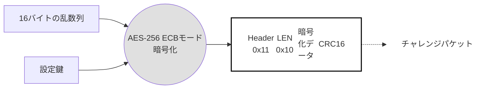
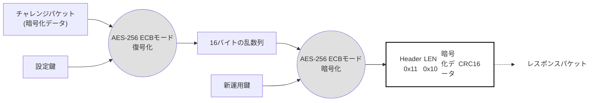

# ThincaGate – SOMA基板間通信コマンド仕様書

**TEP-SOMA-TG-1: 2025**

**発行日**: 2025年12月4日
**バージョン**: Ver.1.0

---

**改訂履歴**

| 改訂日付 | 版数 | 内容 |
|---|---|---|
| 2025/12/4 | Ver.1.0 | 正式版 |

---

**目次**

- [1. はじめに](#1-はじめに)
  - [1.1. 目的](#11-目的)
  - [1.2. スコープ](#12-スコープ)
  - [1.3. 用語と定義](#13-用語と定義)
  - [1.4. 記号と略称](#14-記号と略称)
- [2. 概要](#2-概要)
  - [2.1. システム構成図](#21-システム構成図)
  - [2.2. ThincaGate – SOMA基板 – AXON基板　概略図](#22-thincagate--soma基板--axon基板概略図)
  - [2.3. AXON基板 – コインメック　概略図](#23-axon基板--コインメック概略図)
- [3. 仕様](#3-仕様)
  - [3.1. 接続仕様](#31-接続仕様)
  - [3.2. シリアル通信仕様](#32-シリアル通信仕様)
- [4. コマンド(CMD)仕様](#4-コマンドcmd仕様)
  - [4.1. CMD一覧](#41-cmd一覧)
  - [4.2. コマンド説明](#42-コマンド説明)
- [5. 運用鍵更新](#5-運用鍵更新)
  - [5.1. 運用鍵更新シーケンス](#51-運用鍵更新シーケンス)
- [6. SOMA基板 ファームウェア アップデート](#6-soma基板-ファームウェア-アップデート)
  - [6.1. FWアップデートシーケンス](#61-fwアップデートシーケンス)
  - [6.2. ファームウェア・コードファイルの形式](#62-ファームウェアコードファイルの形式)

---

## 1. はじめに

### 1.1. 目的

本資料の目的は、多面制御基板とThincaGate間やSYNAPSE基板のシリアル通信の双方互換性を保つことを目的とします。

### 1.2. スコープ

本資料では、多面制御基板の物理層、及び、論理層をスコープとします。

### 1.3. 用語と定義

| 名称 | 説明 |
|---|---|
| 多面制御基板 | ガチャガチャを制御するための基板。 SOMA基板とAXON基板の２種の基板構成となる。 |
| ThincaGate | 決済端末 |
| SOMA基板 | ThincaGateと通信を行う基板。AXON基板を制御する。 |
| AXON基板 | SOMA基板と通信を行う基板。SOMA基板からの命令で動作する。 |
| SYNAPSE基板 | ThincaGate と入れ替えて売上情報だけをAWSに上げるWi-Fiモジュール |

### 1.4. 記号と略称

| 名称 | 説明 |
|---|---|
| AWS | Amazon Web Service |
| TG | ThincaGate |
| SOMA | SOMA PCB Board |
| AXON | AXON PCB Board |
| I/F | Inter/Face |
| UART | Universal Asynchronous Receiver Transmitter |
| LSB | Least Significant Bit |
| MSB | Most Significant Bit |
| Etu | Elementary Time Unit |
| ACK | Acknowledgement |
| RFU | Reserved for Future Use |
| NACK | Negative Acknowledgement |
| CPU | Central Processing Unit |
| CRC | Cyclic Redundancy Check |
| CAN | Controller Area Network |

## 2. 概要

### 2.1. システム構成図

下記のFigure 2-1にシステム構成図を示します。

**Figure 2-1, システム構成図**

基本的な機器構成としては「AXON」、「SOMA」、「TG」の３つの電子機器で構成されます。SOMAはこれらのAXONを束ねて制御するSOMA基板を示しています。TGはThincaGateを示しています。これら３つの機器間で通信や制御を行う事で、キャッシュレス決済（クレジットタッチ決済、電子マネー決済、QR決済、ハウスマネー決済、クーポン決済、等）を実現します。

### 2.2. ThincaGate – SOMA基板 – AXON基板　概略図

Figure 2-2にThincaGateとSOMA基板とAXON基板の接続概略図を示します。

**Figure 2-2, ThincaGateとSOMA基板とAXON基板の接続概略図**

本概略図は、カプセルトイ向けの基板構成です。

### 2.3. AXON基板 – コインメック　概略図

Figure 2-3にAXON基板とカプセルトイ間の接続概略図を示します。

**Figure 2-3, カプセルトイとAXON基板間の接続概略図**

概略図のため例として１ポートのみの接続図を示しています。

## 3. 仕様

### 3.1. 接続仕様

### 3.2. シリアル通信仕様

#### 3.2.1. シリアル通信概要

#### 3.2.2. Polling通知間隔

#### 3.2.3. UART通信方式

#### 3.2.4. キャラクタフォーマット

#### 3.2.5. フレームフォーマット構成と暗号化

#### 3.2.6. 起動タイミング

#### 3.2.7. 通信タイミング

#### 3.2.8. リトライ規定

## 4. コマンド(CMD)仕様

### 4.1. CMD一覧

#### 4.1.1. [暗号化対象] ACKレスポンスフォーマット（ACK）【SOMA ⇒ TG】

#### 4.1.2. [平文対象] NACKレスポンスフォーマット【SOMA ⇒ TG】

#### 4.1.3. [暗号化対象] 状態通知フォーマット（STATUS）【SOMA ⇒ TG】

### 4.2. コマンド説明

#### 4.2.1. [暗号化対象] No Operationコマンド（NOP）【TG ⇒ SOMA】

#### 4.2.2. [暗号化対象] STOPコマンド（STP）【TG ⇒ SOMA】

#### 4.2.3. [暗号化対象] SOMAシリアル番号確認コマンド（MSN）【TG ⇒ SOMA】

#### 4.2.4. [暗号化対象] MSNコマンドレスポンス（ATMSN）【SOMA ⇒ TG】

#### 4.2.5. [暗号化対象] AXONシリアル番号確認コマンド（SSN）【TG ⇒ SOMA】

#### 4.2.6. [暗号化対象] SSNコマンドレスポンス（ATSSN）【SOMA ⇒ TG】

#### 4.2.7. [暗号化対象] AXON基板設定コマンド（SETAXON）【TG ⇒ SOMA】

#### 4.2.8. [暗号化対象] AXON基板確認コマンド（CHKAXON）【TG ⇒ SOMA】

#### 4.2.9. [暗号化対象] CHKAXONコマンドレスポンス（ATCKSB）【SOMA ⇒ TG】

#### 4.2.10. [暗号化対象] ユーザーメモリ書き込みコマンド（WUM）【TG ⇒ SOMA】

#### 4.2.11. [暗号化対象] ユーザーメモリ読み出しコマンド（RUM）【TG ⇒ SOMA】

#### 4.2.12. [暗号化対象] RUMコマンドレスポンス（ATRUM）【SOMA ⇒ TG】

#### 4.2.13. [暗号化対象] SOMA基板FW Updateコマンド（MFWUP）【TG ⇒ SOMA】

#### 4.2.14. [暗号化対象] 運用鍵更新コマンド（SETOKEY）【TG ⇒ SOMA】

#### 4.2.15. [暗号化対象] SOMA基板再起動コマンド（SOMARBT）【TG ⇒ SOMA】

## 5. 運用鍵更新

### 5.1. 運用鍵更新シーケンス

#### 5.1.1. 運用鍵更新の手順

#### 5.1.2. チャレンジパケット

#### 5.1.3. レスポンスパケット

## 6. SOMA基板 ファームウェア アップデート

### 6.1. FWアップデートシーケンス

#### 6.1.1. FWアップデートの手順

### 6.2. ファームウェア・コードファイルの形式

#### 6.2.1. [暗号化対象] コードパケットコマンド（CODEPKT）【TG ⇒ SOMA】

#### 6.2.2. [平文対象] コード受信OKレスポンス（CODEOK）【SOMA ⇒ TG】

#### 6.2.3. [平文対象] コード受信NGレスポンス（CODENG）【SOMA ⇒ TG】

#### 6.2.4. [平文対象] エラー確認コマンド（ERRCHK）【SOMA ⇒ TG】

#### 6.2.5. [平文対象] コード完了レスポンス（CODEFIN）【SOMA ⇒ TG】

---

# 付録A

## SOMA基板 PORT確認シーケンス

### AXON設定Table伝搬SOMA基板 ⇒ AXON基板シーケンス

### 金額設定 or 面番号を変更するための事前準備

### 面番号変更シーケンス（保存された前データ有無によって）

### 面番号変更シーケンス（0面を利用する）

### ダイヤル回転サブルーチン

### 通常動作（購入）

#### 現金決済時（現金投下 ⇒ ダイヤル回転）

#### キャッシュレス決済時（キャッシュレス決済 ⇒ ダイヤル回転）

### 通常動作（購入以外）

#### 現金決済時（現金投下 ⇒ 返金）

#### キャッシュレス決済時（キャッシュレス決済 ⇒ 中止）

#### キャッシュレス決済時（キャッシュレス決済 ⇒ 処理未了）

### 運用動作

#### カプセルトイの0円設定：カプセルを取らせる

#### 売り切れ時（売り切れの面のLEDの色を変えたいが特許回避の為、やらない）

---

# 付録B

本資料は、多面制御基板とThincaGateの間のシリアル通信を規定するUARTインタフェースを利用したTEPの通信インタフェース規格書になります。

---

# 付録C

## 目的

本資料の目的は、多面制御基板とThincaGate間やSYNAPSE基板のシリアル通信の双方互換性を保つことを目的とします。

## スコープ

本資料では、多面制御基板の物理層、及び、論理層をスコープとします。

## 用語と定義

| 名称 | 説明 |
|---|---|
| 多面制御基板 | ガチャガチャを制御するための基板。
SOMA基板とAXON基板の２種の基板構成となる。 |
| ThincaGate | 決済端末 |
| SOMA基板 | ThincaGateと通信を行う基板。AXON基板を制御する。 |
| AXON基板 | SOMA基板と通信を行う基板。SOMA基板からの命令で動作する。 |
| ThincaGate | 決済端末 |
| SYNAPSE基板 | ThincaGate と入れ替えて売上情報だけをAWSに上げるWi-Fiモジュール |

## 記号と略称

| 名称 | 説明 |
|---|---|
| AWS | Amazon Web Service |
| TG | ThincaGate |
| SOMA | SOMA PCB Board |
| AXON | AXON PCB Board |
| I/F | Inter/Face |
| UART | Universal Asynchronous Receiver Transmitter |
| LSB | Least Significant Bit |
| MSB | Most Significant Bit |
| Etu | Elementary Time Unit |
| ACK | Acknowledgement |
| RFU | Reserved for Future Use |
| NACK | Negative Acknowledgement |
| CPU | Central Processing Unit |
| CRC | Cyclic Redundancy Check |
| CAN | Controller Area Network |
|  |  |

---

# 付録D

## システム構成図

下記の

Figure 2-1にシステム構成図を示します。

**Figure 2-1, システム構成図**

基本的な機器構成としては「AXON」、「SOMA」、「TG」の３つの電子機器で構成されます。SOMAはこれらのAXONを束ねて制御するSOMA基板を示しています。TGはThincaGateを示しています。これら３つの機器間で通信や制御を行う事で、キャッシュレス決済（クレジットタッチ決済、電子マネー決済、QR決済、ハウスマネー決済、クーポン決済、等）を実現します。

## ThincaGate – SOMA基板 – AXON基板　概略図

Figure 2-1にThincaGateとSOMA基板とAXON基板の接続概略図を示します。

**Figure 2-2, ThincaGateとSOMA基板とAXON基板の接続概略図**

本概略図は、カプセルトイ向けの基板構成です。

## AXON基板 – コインメック　概略図

Figure 2-1にAXON基板とカプセルトイ間の接続概略図を示します。

**Figure 2-3, カプセルトイとAXON基板間の接続概略図**

概略図のため例として１ポートのみの接続図を示しています。

---

# 付録E

## 接続仕様

下記のTable 3-1にSOMAから見たTG I/Fのピンアサインの仕様を示します。

Table 3-1, TG I/Fのピンアサイン情報

| PIN No. | 項目 | 内容 |
|---|---|---|
| 1 | 24V | 電源24V |
| 2 | GND | GND |
| 3 | TXD | SOMAがTG側へのデータを送信するための信号。 |
| 4 | RXD | SOMAがTG側からのデータを受信するための信号。 |

TG I/Fとの通信で使用される、SOMA基板側に搭載するコネクタは「S4B-PH-SM4-TB(LF)(SN)」です。

また、下記のTable 3-2にEXMから見たSOMA I/Fのピンアサインの仕様を示します。

Table 3-2, SOMA I/Fのピンアサイン情報

| PIN No. | 項目 | 内容 |
|---|---|---|
| 1 | ESCRW_DET_NO | 返金ボタン押下検出（ノーマリーオープン：5V PULL-UP） 0：検出（Lowパルス） 1：通常状態 |
| 2 | ESCRW_DET_GND | カプセル排出検出用 マイクロスイッチ用GND |
| 3 | COIN_VCC | 硬貨検出用 フォトセンサーVcc（24V/15mA） |
| 4 | COIN_DET | 硬貨検出（ノーマリーオープン：5V PULL-UP） 0：検出（Lowパルス） 1：通常状態 |
| 5 | GND | 基板GND |
| 6 | NC | Non connect |
| 7 | BLK_VCC | 硬貨用ブロックソレノイド用 Vcc（12V/100mA） 0：硬貨ブロック 1：硬貨投入許可 |
| 8 | BLK_ON | 回転検出（ノーマリーオープン：5V PULL-UP） 0：検出（50msのLowパルス） 1：通常状態 |
| 9 | 3.3V | 電源3.3V |
| 10 | PORT_DET | PORT利用検出 0：OPEN 1：検出 |
| 11 | ROT_DET_NO | カプセル排出検出（ノーマリーオープン：5V PULL-UP） 0：検出（Lowパルス） 1：通常状態 |
| 12 | ROT_DET_GND | カプセル排出検出用 マイクロスイッチ用GND |
| 13 | SLD_OUT_DET_VCC | 売り切れ検出（オープンコレクタ出力：3.3V PULL-UP） 0：売り切れ状態（Lowレベル） 1：通常状態 |
| 14 | GND | 基板GND |
| 15 | SOL_VCC | キャッシュレス決済用 ソレノイドVcc（5V/1A供給） |
| 16 | SOL_ON | キャッシュレス決済用 ソレノイドON 0：決済未完了 1：決済完了 |
| 17 | DOOR_DET | カプセルトイ前面パネル開閉検知 0：通常状態（CLOSE状態） 1：解放状態（OPEN状態） |
| 18 | GND | 基板GND |

AXON I/Fとコインメック間でAXON基板側に搭載されるコネクタは「16ピン」の「S16B-PH-K-S(LF)(SN)（JST製）」です。

## シリアル通信仕様

### シリアル通信概要

SOMAはTGに対して定期的に状態を通知する「Polling」動作を行っています。また、TGからのコマンドに基づき動作し応答します。

### Polling通知間隔

Pollingコマンドの通知間隔は「20ms」です。

### UART通信方式

SOMAの通信方式の仕様を下記のTable 3-3に示します。

Table 3-3, 通信方式仕様

| 項目 | 内容 | 内容 |
|---|---|---|
| 通信プロトコル | UART | UART |
| 通信方法 | 全二重通信 | 全二重通信 |
| 通信速度 | 115200 bps（1etu = 8.68us） | 115200 bps（1etu = 8.68us） |
| 信号電圧 | +3.3V | +3.3V |
| 同期方式 | 非同期式 | 非同期式 |
| ビット構成 | スタートビット | 1 bit |
| ビット構成 | データビット | 8 bits（LSBファースト） |
| ビット構成 | パリティビット | なし |
| ビット構成 | ストップビット | 1 bit |
| フロー制御 | 無し | 無し |
| データ順序 | LSBファースト | LSBファースト |

### キャラクタフォーマット

Byteは、SOMAとTGの間で送受信されます。キャラクタフォーマットは、下記のFigure 3-1の通り、10etuで構成されます。

Figure 3-1, キャラクタフォーマット

### フレームフォーマット構成と暗号化

TGとSOMA間の通信フレームを下記のTable 3-4に示します。基本的なフレームフォーマットは、下記のTable 3-4の通り、ヘッダ1 Byteと、データ32 Byte、CRC16 2Byte、の合計36バイトで構成されます。

Table 3-4, フレームフォーマット

| 1st byte | 2nd byte | 3rd – 34th byte | 35th, 36th byte |
|---|---|---|---|
| Header (1 byte) | LEN (1 byte) | data (32 bytes) | CRC16 (2 byte) |
| ヘッダ | データ長 | データ部（暗号化対象） | CRC16 |

#### ヘッダ

コマンド識別子。コマンド種別によって値が変わる1バイトの値です。詳細は「4章 コマンド(CMD)仕様」を参照してください。

#### データ長

自身のバイト数とCRC16を含めない自身以降の、データの長さ。

#### 暗号化方式
◆　暗号化方式：AES-256 ECBモード

データ部は、NISTの推奨規格であるAES-256アルゴリズムにより暗号化されます。AES-256のアルゴリズムは以下のページに公開されています。

http://csrc.nist.gov/publications/fips/fips197/fips-197.pdf

#### 暗号鍵

TGと交換されるパケットのデータ部の暗号化には、2つの暗号鍵が使用されます。

◆　運用鍵：運用鍵設定コマンド以外のパケットの暗号・復号に使用される暗号鍵。

運用鍵設定コマンドで変更可能。ファームウェアの書込み時には

Default値が設定される。

◆　設定鍵：運用鍵設定コマンドの暗号・復号に使用される暗号鍵。固定値で変更できない。

#### CRC16

データ部をCRC16演算した結果。式は「ISO/IEC 13239」に定義されている以下の式を用い、初期値は以下の通りとする。演算方向はLSBファーストとする。

式：X^16+X^12+X^5+1

初期値：0xFFFF

例）データ部が “0x000000” の3バイト時、演算結果は ”0xCCC6” となる。
　　この場合の送信バイト列：[C6 CC]

### 起動タイミング

下記のFigure 3-2にSOMAの起動時のタイミングチャートを示します。

Figure 3-2, 起動時のタイミングチャート

上記のFigure 3-2のSOMA状態の説明を下記のTable 3-5に示します。

Table 3-5, CLP端末の状態

| 状態 | 内容 |
|---|---|
| Power-OFF | 電源が印加されていない状態 |
| RESET | CPUが動作していないリセット状態 |
| 起動中 | CPUが受信待機状態へ遷移するための準備を行っている状態 |
| Polling | TGに対してデータを送信している状態 |

上記のFigure 3-2のSOMAのリセット解除タイミング（Treset）と起動時間（Tstartup）を下記のTable 3-6に示します。

Table 3-6, CLP端末起動時のタイミング規定

| 変数 | 最小値 | 最大値 |
|---|---|---|
| Treset | - | １秒 |
| Tstartup | - | １0秒 |

SOMAは、リセット期間中や起動中はコマンドを送受信できません。

### 通信タイミング

下記のFigure 3-3にSOMAとTGの通信時のタイミングチャートを示します。

Figure 3-3, 通信時のタイミングチャート

上記のFigure 3-3のT0とT1の説明を下記のTable 3-7に示します。

Table 3-7, CLP端末の状態

| 変数 | 内容 |
|---|---|
| T0 | TGのコマンド送信完了からSOMAのコマンド送信開始までの時間。TGは、T0までにSOMAからのコマンドを受信できるようにして下さい。 |
| T1 | SOMAのコマンド送信完了からTGのコマンド送信開始までの時間。SOMAは、T1までにTGからのコマンドを受信できるようにして下さい。 |

TGは、T0までにSOMAからのコマンドを受信できるようにし、SOMAは、T1までにTGからのコマンドを受信できるようにして下さい。T0とT1の時間に関しては、下記の通りになります。
T0 = 50ms
T1 = 50ms

TGとSOMAは、コマンドを送信する場合、50ms以上遅延させた後にコマンドを送信して下さい。また、タイムアウト時間は下記の通りになります。

T0 = T1 = 1000ms

### リトライ規定

コマンド間のタイムアウト規定は「1000ms」になります。TGとSOMA間のシリアル通信経路に正常に送受信ができない何らかの障害（ノイズ、パケットロス、等）が発生した際に、コマンドのリトライを許容致します。TGはコマンドレスポンスが受信できない場合の同じコマンドの再送を、SOMAはコマンドレスポンスが到達しない場合の同じコマンドの再受信を考慮した設計として下さい。

**リトライ仕様:**
- **タイムアウト**: 1000ms
- **最大リトライ回数**: 5回
- **リトライ間隔**: 50ms

リトライ回数は5回までとし、5回リトライしても正常に通信ができない場合は、通信エラーのログを出力して次の処理へ

---

# 付録F

## CMD一覧

下記のTable 4-1に機器から送信されるCMD、及び、SOMAから送信されるレスポンス（RSP）一覧を示します。

Table 4-1, コマンド一覧

| HD | ID | 名称 | 送信元 | 返信 | バイト数 | 暗号化 | 内容 |
|---|---|---|---|---|---|---|---|
| 汎用レスポンス | 汎用レスポンス | 汎用レスポンス | 汎用レスポンス | 汎用レスポンス | 汎用レスポンス | 汎用レスポンス | 汎用レスポンス |
| 0x10 | 0x00 | ACK | SOMA | - | 36 bytes | 運用鍵 | 正常レスポンス |
| 0x90 | 0xXX | NACK | SOMA | - | 5 bytes | 平文 | 異常レスポンス |
| 0x10 | 0x01 | STATUS | SOMA | - | 36 bytes | 運用鍵 | 状態通知 |
| 一般CMD/レスポンス | 一般CMD/レスポンス | 一般CMD/レスポンス | 一般CMD/レスポンス | 一般CMD/レスポンス | 一般CMD/レスポンス | 一般CMD/レスポンス | 一般CMD/レスポンス |
| 0x10 | 0x10 | NOP | TG | ACK/NACK | 36 bytes | 運用鍵 | No Operationコマンド |
| 0x10 | 0x11 | STP | TG | ACK/NACK | 36 bytes | 運用鍵 | 状態通知停止コマンド |
| 0x10 | 0x12 | MSN | TG | ATMSN | 36 bytes | 運用鍵 | SOMA基板シリアル番号確認コマンド |
| 0x10 | 0x23 | ATMSN | SOMA | - | 36 bytes | 運用鍵 | MSNコマンドレスポンス |
| 0x10 | 0x13 | SSN | TG | ATSSN | 36 bytes | 運用鍵 | AXON基板シリアル番号 ＆
FW Ver確認コマンド |
| 0x10 | 0x24 | ATSSN | SOMA | - | 36 bytes | 運用鍵 | SSNコマンドレスポンス |
| 0x10 | 0x14 | SETAXON | TG | ACK/NACK | 36 bytes | 運用鍵 | AXON基板設定コマンド |
| 0x10 | 0x15 | CHKAXON | TG | ATCKSB | 36 bytes | 運用鍵 | AXON基板状態確認コマンド |
| 0x10 | 0x26 | ATCKSB | SOMA | - | 36 bytes | 運用鍵 | CHKAXONコマンドレスポンス |
| 0x10 | 0x16 | WUM | TG | ACK/NACK | 36 bytes | 運用鍵 | ユーザーメモリ書き込みコマンド |
| 0x10 | 0x17 | RUM | TG | ATRUM | 36 bytes | 運用鍵 | ユーザーメモリ読み出しコマンド |
| 0x10 | 0x28 | ATRUM | SOMA | - | 36 bytes | 運用鍵 | RUMコマンドレスポンス |
| 0x10 | 0x18 | MFWUP | TG | ACK/NACK | 36 bytes | 運用鍵 | SOMA基板FWアップデートコマンド |
| 0x11 | - | SETOKEY | TG | ACK/NACK | 34 bytes | 設定鍵 | 運用鍵設定コマンド（設定鍵で暗号化） |
| 再起動CMD/レスポンス | 再起動CMD/レスポンス | 再起動CMD/レスポンス | 再起動CMD/レスポンス | 再起動CMD/レスポンス | 再起動CMD/レスポンス | 再起動CMD/レスポンス | 再起動CMD/レスポンス |
| 0x10 | 0x3F | SOMARBT | TG | ACK or NACK | 36 bytes | 運用鍵 | SOMA基板再起動コマンド |
| FWアップデート用 コード送信CMD/レスポンス | FWアップデート用 コード送信CMD/レスポンス | FWアップデート用 コード送信CMD/レスポンス | FWアップデート用 コード送信CMD/レスポンス | FWアップデート用 コード送信CMD/レスポンス | FWアップデート用 コード送信CMD/レスポンス | FWアップデート用 コード送信CMD/レスポンス | FWアップデート用 コード送信CMD/レスポンス |
| 0xA1 | - | CODEPKT | TG | CDOK or CDNG | 40 bytes | 運用鍵 | コードパケット（運用鍵で暗号化） |
| 0xB0 | - | CODEOK | SOMA | - | 8 bytes | 平文 | コード受信OK |
| 0xB9 | - | CODENG | SOMA | - | 8 bytes | 平文 | コード受信NG |
| 0xC0 | - | ERRCHK | TG | CODEFIN | 6 bytes | 平文 | エラー確認パケット |
| 0xD0 | - | CODEFIN | SOMA | - | 8 bytes | 平文 | コード完了 |

また、CMDで共通する「LEN」「DIC」「AuthCode」「RND」「CRC16」の説明をTable 4-2に示します。

Table 4-2, 共通バイトの内容

| 名称 | Bit | 形式 | 内容 |
|---|---|---|---|
| LEN | [0:7] | 平文 | ・データ長 自身のバイト数とCRC16を含めない自身以降の、データの長さ。（変動値） “0x20”：32バイト |
| DIC | [0:15] | 暗号文 | ・データ整合性チェックデータ（固定値）“0x0123” 期待するデータ順: 0x01, 0x23 実態に通知されるデータ順: 0x23, 0x01 送信バイト列：[01 23] |
| AuthCode | [0:15] | 〃 | ・認証コード SOMAが発行するコマンド認証用コード。悪意を持った第三者が、TGからのコマンドを読出し、複製したコード列をSOMAに送り込んでも無効とする為のコード。TGからの正常なコマンド（運用鍵設定コマンドと検査ステート設定コマンドを除く）を受信し、受け付ける度に変更される |
| RND | [0:15] | 〃 | ・乱数 16ビット長の乱数、パケット毎に異なる乱数を採用。これにより、平分データが同じでも、暗号化後のテキストは毎回異なる数値になる |
| CRC16 | [0:15] | 平文 | ・CRC16 データ部をCRC16演算した結果 |

### 4.1.1. [暗号化対象] ACKレスポンスフォーマット（ACK）【SOMA ⇒ TG】

下記のTable 4-3に共通のACKレスポンスフォーマット一覧を示します。

暗号対象は「3rd Byte ～ 34th Byte」です。

Table 4-3, ACKレスポンスフォーマット

| 1st Byte | 2nd Byte | 3rd Byte | 4th Byte | 5th Byte | 6th Byte | 7th Byte | 8th Byte | 9th Byte |
|---|---|---|---|---|---|---|---|---|
| Header | LEN | ID | RFU | RFU | RFU | RFU | RFU | RFU |
| [0:7] | [0:7] | [0:7] | [0:199] | [0:199] | [0:199] | [0:199] | [0:199] | [0:199] |
| 1 byte | 1 byte | 1 byte | 25 bytes | 25 bytes | 25 bytes | 25 bytes | 25 bytes | 25 bytes |

| 10th Byte | 11th Byte | 12th Byte | 13th Byte | 14th Byte | 15th Byte | 16th Byte | 17th Byte | 18th Byte |
|---|---|---|---|---|---|---|---|---|
| RFU | RFU | RFU | RFU | RFU | RFU | RFU | RFU | RFU |
| [0:199] | [0:199] | [0:199] | [0:199] | [0:199] | [0:199] | [0:199] | [0:199] | [0:199] |
| 25 bytes | 25 bytes | 25 bytes | 25 bytes | 25 bytes | 25 bytes | 25 bytes | 25 bytes | 25 bytes |

| 19th Byte | 20th Byte | 21th Byte | 22th Byte | 23th Byte | 24th Byte | 25th Byte | 26th Byte | 27th Byte |
|---|---|---|---|---|---|---|---|---|
| RFU | RFU | RFU | RFU | RFU | RFU | RFU | RFU | RFU |
| [0:199] | [0:199] | [0:199] | [0:199] | [0:199] | [0:199] | [0:199] | [0:199] | [0:199] |
| 25 bytes | 25 bytes | 25 bytes | 25 bytes | 25 bytes | 25 bytes | 25 bytes | 25 bytes | 25 bytes |

| 28th Byte | 29th Byte | 30th Byte | 31th Byte | 32th Byte | 33th Byte | 34th Byte | 35th Byte | 36th Byte |
|---|---|---|---|---|---|---|---|---|
| RFU | DIC | DIC | AuthCode | AuthCode | RND | RND | CRC16 | CRC16 |
| [0:199] | [0:15] | [0:15] | [0:15] | [0:15] | [0:15] | [0:15] | [0:15] | [0:15] |
| 25 bytes | 2 bytes | 2 bytes | 2 bytes | 2 bytes | 2 bytes | 2 bytes | 2 byte | 2 byte |

これらの項目の内容を下記のTable 4-4に示します。

Table 4-4, ACKの内容

| 名称 | Byte | Bit | 内容 |
|---|---|---|---|
| Header | 1st | [0:7] | ・コマンド識別子：“0x10” |
| LEN | 2nd | [0:7] | ・データ長：”0x20”（32バイト） |
| ID | 3rd | [0:7] | ・識別子：”0x00” |
| RFU | 4th ~ 28th | [0:199] | ・ALL 0 の固定値 |
| DIC | 29th, 30th | [0:15] | データ整合性チェックデータ |
| AuthCode | 31th, 32th | [0:15] | 認証コード |
| RND | 33th, 34th | [0:15] | 乱数 |
| CRC16 | 35th, 36th | [0:15] | CRC16 |

ACKの説明を下記のTable 4-5に示します。

Table 4-5, ACKの説明

|  | Header | ID | 内容 |
|---|---|---|---|
| ACK | 0x10 | 0x00 | 正常にコマンドを処理した |

### 4.1.2. [平文対象] NACKレスポンスフォーマット【SOMA ⇒ TG】

下記のTable 4-6に共通のコマンドNACKレスポンスフォーマット一覧を示します。

Table 4-6, NACKレスポンスフォーマット

| 1st Byte | 2nd Byte | 3rd Byte | 4th Byte | 5th Byte |
|---|---|---|---|---|
| Header | LEN | ERR_CODE | CRC16 | CRC16 |
| [0:7] | [0:7] | [0:7] | [0:15] | [0:15] |
| 1 byte | 1 byte | 1 byte | 2 bytes | 2 bytes |

これらの項目の内容を下記のTable 4-7に示します。

Table 4-7, NACKの内容

| 名称 | Byte | Bit | 内容 |
|---|---|---|---|
| Header | 1st | [0:7] | ・コマンド識別子：“0x90” |
| LEN | 2nd | [0:7] | ・データ長：”0x01”（1バイト） |
| ERR_CODE | 3rd | [0:7] | ・エラーコード（Table 4-8） |
| CRC16 | 4th, 5th | [0:15] | ・CRC16 |

NACKのエラー毎に分類した一覧を下記のTable 4-8に示します。

Table 4-8, NACKの説明

|  | Header | ERR_CODE | 内容 |
|---|---|---|---|
| NACK | 0x90 | 0x00 | 未確認コマンドを受信した |
| NACK | 0x90 | 0x01 | コマンドの処理が時間内に完了できなかった |
| NACK | 0x90 | 0x02 | コマンドのデータの内容が間違っている |
| NACK | 0x90 | 0x03 | コマンドの長さが間違っている |
| NACK | 0x90 | 0x04 | コマンドのCRC16が間違っている |
| NACK | 0x90 | 0xFF | 予期せぬエラーが発生した |

### [暗号化対象] 状態通知フォーマット（STATUS）【SOMA ⇒ TG】

下記のTable 4-9にカプセルトイモードの時の状態通知フォーマットを示します。

暗号対象は「3rd Byte ～ 34th Byte」です。

Table 4-9, 状態通知フォーマット

| 1st Byte | 2nd Byte | 3rd Byte | 4th Byte | 5th Byte | 6th Byte | 7th Byte | 8th Byte | 9th Byte |
|---|---|---|---|---|---|---|---|---|
| Header | LEN | ID | MD | PORT_1 | PORT_1 | PORT_2 | PORT_2 | PORT_3 |
| [0:7] | [0:7] | [0:7] | [0:7] | [0:15] | [0:15] | [0:15] | [0:15] | [0:15] |
| 1 byte | 1 byte | 1 byte | 1 byte | 2 bytes | 2 bytes | 2 bytes | 2 bytes | 2 bytes |

| 10th Byte | 11th Byte | 12th Byte | 13th Byte | 14th Byte | 15th Byte | 16th Byte | 17th Byte | 18th Byte |
|---|---|---|---|---|---|---|---|---|
| PORT_3 | PORT_4 | PORT_4 | PORT_5 | PORT_5 | PORT_6 | PORT_6 | PORT_7 | PORT_7 |
| [0:15] | [0:15] | [0:15] | [0:15] | [0:15] | [0:15] | [0:15] | [0:15] | [0:15] |
| 2 bytes | 2 bytes | 2 bytes | 2 bytes | 2 bytes | 2 bytes | 2 bytes | 2 bytes | 2 bytes |

| 19th Byte | 20th Byte | 21th Byte | 22th Byte | 23th Byte | 24th Byte | 25th Byte | 26th Byte | 27th Byte |
|---|---|---|---|---|---|---|---|---|
| PORT_8 | PORT_8 | PORT_9 | PORT_9 | CASH_VLU | CASH_VLU | CASH_VLU | CASH_VLU | CASH_VLU |
| [0:15] | [0:15] | [0:15] | [0:15] | [0:47] | [0:47] | [0:47] | [0:47] | [0:47] |
| 2 bytes | 2 bytes | 2 bytes | 2 bytes | 6 bytes | 6 bytes | 6 bytes | 6 bytes | 6 bytes |

| 28th Byte | 29th Byte | 30th Byte | 31th Byte | 32th Byte | 33th Byte | 34th Byte | 35th Byte | 36th Byte |
|---|---|---|---|---|---|---|---|---|
| CASH_VLU | DIC | DIC | AuthCode | AuthCode | RND | RND | CRC16 | CRC16 |
| [0:47] | [0:15] | [0:15] | [0:15] | [0:15] | [0:15] | [0:15] | [0:15] | [0:15] |
| 6 bytes | 2 bytes | 2 bytes | 2 bytes | 2 bytes | 2 bytes | 2 bytes | 2 byte | 2 byte |

これらの項目の内容を下記のTable 4-10に示します。

Table 4-10, 状態通知（STATUS）の内容

| 名称 | Byte | Bit | 内容 |
|---|---|---|---|
| Header | 1st | [0:7] | ・コマンド識別子：“0x10” |
| LEN | 2nd | [0:7] | ・データ長：”0x20”（32バイト） |
| ID | 3rd | [0:7] | ・識別子：”0x01” |
| MD | 4th | [0:7] | ・モード通知  **Bit 7**: SOMA基板リセットフラグ 　0: 通常状態 　1: リセット状態 **Bit 6**: RFU("0"固定) **Bit 5**: RFU("0"固定) **Bit 4**: コマンド受信状況 　決済端末からのコマンド受信毎にトグル **Bit 3**: RFU("0"固定) **Bit 2**: RFU("0"固定) **Bit 1**: ドア開閉状態(全ての面のOR) 　0: 通常状態(ドア全CLOSE状態) 　1: いずれかの面のドアOPEN状態 **Bit 0**: テストボタン状態 　0: 通常状態 　1: テストボタン押下中 |
| PORT1~9 | 5th ~ 22th | [0:143] | ・各PORT番号の状態通知処理結果  **PORT_X[15:8]**: ダイヤル回転数カウント 　0x00 > 0xFF間を繰り返す  **PORT_X[7:0]**: PORT状態通知  **Bit 7**: RFU("0"固定) **Bit 6**: ドア開閉状態 　0: 通常状態(ドアCLOSE状態) 　1: ドアOPEN状態 **Bit 5**: 現金ブロック状態(Latch式) 　0: 通常状態 　1: ブロック状態 **Bit 4**: 現金返却ボタン押下検出(Latch式) 　0: 通常状態 　1: 返却ボタン押下状態 **Bit 3**: 現金用 光センサー状態(Latch式) 　0: 現金投入中 　1: 現金なし **Bit 2**: 電子マネー用 ソレノイド状態(Latch式) 　0: ハンドル回転不可 　1: ハンドル回転OK **Bit 1**: 売り切れ検知 　0: 販売可能 　1: 売り切れ **Bit 0**: PORTの物理的接続の有無検出 　0: 本PORT未接続 　1: 本PORT接続済み |
| CASH_VLU | 23th~ 28th | [0:47] | ・各PORTの現金設定金額 (0円 ～ 3,100円)  **Bit [45:47]**: RFU(ALL "0") **Bit [40:44]**: PORT9の現金設定金額 **Bit [35:39]**: PORT8の現金設定金額 **Bit [30:34]**: PORT7の現金設定金額 **Bit [25:29]**: PORT6の現金設定金額 **Bit [20:24]**: PORT5の現金設定金額 **Bit [15:19]**: PORT4の現金設定金額 **Bit [10:14]**: PORT3の現金設定金額 **Bit [5:9]**: PORT2の現金設定金額 **Bit [0:4]**: PORT1の現金設定金額  例) 0b00001: 100円 例) 0b10101: 2,100円 |
| DIC | 29th, 30th | [0:15] | データ整合性チェックデータ |
| AuthCode | 31th, 32th | [0:15] | 認証コード |
| RND | 33th, 34th | [0:15] | 乱数 |
| CRC16 | 35th, 36th | [0:15] | CRC16 |

## コマンド説明

### [暗号化対象] No Operationコマンド（NOP）【TG ⇒ SOMA】

本NOPコマンドは、TGからSOMAに対して、ACKを確認するためのコマンドです。下記のTable 4-11にNOPコマンドのコマンドフォーマットを示します。

暗号対象は「3rd Byte ～ 34th Byte」です。

Table 4-11, NOPコマンドフォーマット

| 1st Byte | 2nd Byte | 3rd Byte | 4th Byte | 5th Byte | 6th Byte | 7th Byte | 8th Byte | 9th Byte |
|---|---|---|---|---|---|---|---|---|
| Header | LEN | ID | RFU | RFU | RFU | RFU | RFU | RFU |
| [0:7] | [0:7] | [0:7] | [0:199] | [0:199] | [0:199] | [0:199] | [0:199] | [0:199] |
| 1 byte | 1 byte | 1 byte | 25 byte | 25 byte | 25 byte | 25 byte | 25 byte | 25 byte |

| 10th Byte | 11th Byte | 12th Byte | 13th Byte | 14th Byte | 15th Byte | 16th Byte | 17th Byte | 18th Byte |
|---|---|---|---|---|---|---|---|---|
| RFU | RFU | RFU | RFU | RFU | RFU | RFU | RFU | RFU |
| [0:199] | [0:199] | [0:199] | [0:199] | [0:199] | [0:199] | [0:199] | [0:199] | [0:199] |
| 25 byte | 25 byte | 25 byte | 25 byte | 25 byte | 25 byte | 25 byte | 25 byte | 25 byte |

| 19th Byte | 20th Byte | 21th Byte | 22th Byte | 23th Byte | 24th Byte | 25th Byte | 26th Byte | 27th Byte |
|---|---|---|---|---|---|---|---|---|
| RFU | RFU | RFU | RFU | RFU | RFU | RFU | RFU | RFU |
| [0:199] | [0:199] | [0:199] | [0:199] | [0:199] | [0:199] | [0:199] | [0:199] | [0:199] |
| 25 byte | 25 byte | 25 byte | 25 byte | 25 byte | 25 byte | 25 byte | 25 byte | 25 byte |

| 28th Byte | 29th Byte | 30th Byte | 31th Byte | 32th Byte | 33th Byte | 34th Byte | 35th Byte | 36th Byte |
|---|---|---|---|---|---|---|---|---|
| RFU | DIC | DIC | AuthCode | AuthCode | RND | RND | CRC16 | CRC16 |
| [0:199] | [0:15] | [0:15] | [0:15] | [0:15] | [0:15] | [0:15] | [0:15] | [0:15] |
| 25 bytes | 2 bytes | 2 bytes | 2 bytes | 2 bytes | 2 bytes | 2 bytes | 2 byte | 2 byte |

これらの項目の説明を下記のTable 4-12に示します。

Table 4-12, NOPの詳細説明

| 名称 | Byte | Bit | 内容 |
|---|---|---|---|
| Header | 1st | [0:7] | ・コマンド識別子：“0x10” |
| LEN | 2nd | [0:7] | ・データ長：”0x20”（32バイト） |
| ID | 3rd | [0:7] | ・識別子：”0x10” |
| RFU | 4th ~ 28th | [0:199] | ・RFU（ALL "0” 固定） |
| DIC | 29th, 30th | [0:15] | データ整合性チェックデータ |
| AuthCode | 31th, 32th | [0:15] | 認証コード |
| RND | 33th, 34th | [0:15] | 乱数 |
| CRC16 | 35th, 36th | [0:15] | CRC16 |

### [暗号化対象] STOPコマンド（STP）【TG ⇒ SOMA】

本STPコマンドは、不具合が発生した際のコマンド解析や検証を容易化させるために、TGからSOMAに対して、状態通知を停止させるためのコマンドです。下記のTable 4-13にSTPコマンドのコマンドフォーマットを示します。

暗号対象は「3rd Byte ～ 34th Byte」です。

Table 4-13, STPコマンドフォーマット

| 1st Byte | 2nd Byte | 3rd Byte | 4th Byte | 5th Byte | 6th Byte | 7th Byte | 8th Byte | 9th Byte |
|---|---|---|---|---|---|---|---|---|
| Header | LEN | ID | RFU | RFU | RFU | RFU | RFU | RFU |
| [0:7] | [0:7] | [0:7] | [0:199] | [0:199] | [0:199] | [0:199] | [0:199] | [0:199] |
| 1 byte | 1 byte | 1 byte | 25 byte | 25 byte | 25 byte | 25 byte | 25 byte | 25 byte |

| 10th Byte | 11th Byte | 12th Byte | 13th Byte | 14th Byte | 15th Byte | 16th Byte | 17th Byte | 18th Byte |
|---|---|---|---|---|---|---|---|---|
| RFU | RFU | RFU | RFU | RFU | RFU | RFU | RFU | RFU |
| [0:199] | [0:199] | [0:199] | [0:199] | [0:199] | [0:199] | [0:199] | [0:199] | [0:199] |
| 25 byte | 25 byte | 25 byte | 25 byte | 25 byte | 25 byte | 25 byte | 25 byte | 25 byte |

| 19th Byte | 20th Byte | 21th Byte | 22th Byte | 23th Byte | 24th Byte | 25th Byte | 26th Byte | 27th Byte |
|---|---|---|---|---|---|---|---|---|
| RFU | RFU | RFU | RFU | RFU | RFU | RFU | RFU | RFU |
| [0:199] | [0:199] | [0:199] | [0:199] | [0:199] | [0:199] | [0:199] | [0:199] | [0:199] |
| 25 byte | 25 byte | 25 byte | 25 byte | 25 byte | 25 byte | 25 byte | 25 byte | 25 byte |

| 28th Byte | 29th Byte | 30th Byte | 31th Byte | 32th Byte | 33th Byte | 34th Byte | 35th Byte | 36th Byte |
|---|---|---|---|---|---|---|---|---|
| RFU | DIC | DIC | AuthCode | AuthCode | RND | RND | CRC16 | CRC16 |
| [0:199] | [0:15] | [0:15] | [0:15] | [0:15] | [0:15] | [0:15] | [0:15] | [0:15] |
| 25 bytes | 2 bytes | 2 bytes | 2 bytes | 2 bytes | 2 bytes | 2 bytes | 2 byte | 2 byte |

これらの項目の説明を下記のTable 4-14に示します。

Table 4-14, STPの内容

| 名称 | Byte | Bit | 内容 |
|---|---|---|---|
| Header | 1st | [0:7] | ・コマンド識別子：“0x10” |
| LEN | 2nd | [0:7] | ・データ長：”0x20”（32バイト） |
| ID | 3rd | [0:7] | ・識別子：”0x11” |
| RFU | 4th ~ 28th | [0:199] | ・RFU（ALL "0” 固定） |
| DIC | 29th, 30th | [0:15] | データ整合性チェックデータ |
| AuthCode | 31th, 32th | [0:15] | 認証コード |
| RND | 33th, 34th | [0:15] | 乱数 |
| CRC16 | 35th, 36th | [0:15] | CRC16 |

### [暗号化対象] SOMAシリアル番号確認コマンド（MSN）【TG ⇒ SOMA】

本SNコマンドは、TGからSOMAに対して、要求したコマンドのレスポンスに対して、SOMA基板のシリアル番号を伝えるためのコマンドです。下記のTable 4-15にMSNコマンドのコマンドフォーマットを示します。

暗号対象は「3rd Byte ～ 34th Byte」です。

Table 4-15, MSNのコマンドフォーマット

| 1st Byte | 2nd Byte | 3rd Byte | 4th Byte | 5th Byte | 6th Byte | 7th Byte | 8th Byte | 9th Byte |
|---|---|---|---|---|---|---|---|---|
| Header | LEN | ID | RFU | RFU | RFU | RFU | RFU | RFU |
| [0:7] | [0:7] | [0:7] | [0:199] | [0:199] | [0:199] | [0:199] | [0:199] | [0:199] |
| 1 byte | 1 byte | 1 byte | 25 bytes | 25 bytes | 25 bytes | 25 bytes | 25 bytes | 25 bytes |

| 10th Byte | 11th Byte | 12th Byte | 13th Byte | 14th Byte | 15th Byte | 16th Byte | 17th Byte | 18th Byte |
|---|---|---|---|---|---|---|---|---|
| RFU | RFU | RFU | RFU | RFU | RFU | RFU | RFU | RFU |
| [0:199] | [0:199] | [0:199] | [0:199] | [0:199] | [0:199] | [0:199] | [0:199] | [0:199] |
| 25 bytes | 25 bytes | 25 bytes | 25 bytes | 25 bytes | 25 bytes | 25 bytes | 25 bytes | 25 bytes |

| 19th Byte | 20th Byte | 21th Byte | 22th Byte | 23th Byte | 24th Byte | 25th Byte | 26th Byte | 27th Byte |
|---|---|---|---|---|---|---|---|---|
| RFU | RFU | RFU | RFU | RFU | RFU | RFU | RFU | RFU |
| [0:199] | [0:199] | [0:199] | [0:199] | [0:199] | [0:199] | [0:199] | [0:199] | [0:199] |
| 25 bytes | 25 bytes | 25 bytes | 25 bytes | 25 bytes | 25 bytes | 25 bytes | 25 bytes | 25 bytes |

| 28th Byte | 29th Byte | 30th Byte | 31th Byte | 32th Byte | 33th Byte | 34th Byte | 35th Byte | 36th Byte |
|---|---|---|---|---|---|---|---|---|
| RFU | DIC | DIC | AuthCode | AuthCode | RND | RND | CRC16 | CRC16 |
| [0:199] | [0:15] | [0:15] | [0:15] | [0:15] | [0:15] | [0:15] | [0:15] | [0:15] |
| 25 bytes | 2 bytes | 2 bytes | 2 bytes | 2 bytes | 2 bytes | 2 bytes | 2 byte | 2 byte |

これらの項目の説明を下記のTable 4-16に示します。

Table 4-16, MSNの内容

| 名称 | Byte | Bit | 内容 |
|---|---|---|---|
| Header | 1st | [0:7] | ・コマンド識別子：“0x10” |
| LEN | 2nd | [0:7] | ・データ長：”0x20”（32バイト） |
| ID | 3rd | [0:7] | ・識別子：”0x12” |
| RFU | 4th ~ 28th | [0:199] | ・ALL 0 の固定値 |
| DIC | 29th, 30th | [0:15] | データ整合性チェックデータ |
| AuthCode | 31th, 32th | [0:15] | 認証コード |
| RND | 33th, 34th | [0:15] | 乱数 |
| CRC16 | 35th, 36th | [0:15] | CRC16 |

### [暗号化対象] MSNコマンドレスポンス（ATMSN）【SOMA ⇒ TG】

本ATSELレスポンスは、SOMAからTGへ情報を渡すためのMSNのコマンドに対するレスポンスです。下記のTable 4-17にATMSNレスポンスフォーマットを示します。

暗号対象は「3rd Byte ～ 34th Byte」です。

Table 4-17, ATMSNのレスポンスフォーマット

| 1st Byte | 2nd Byte | 3rd Byte | 4th Byte | 5th Byte | 6th Byte | 7th Byte | 8th Byte | 9th Byte |
|---|---|---|---|---|---|---|---|---|
| Header | LEN | ID | MSN | MSN | MSN | MSN | MSN | MSN |
| [0:7] | [0:7] | [0:7] | [0:47] | [0:47] | [0:47] | [0:47] | [0:47] | [0:47] |
| 1 byte | 1 byte | 1 byte | 6 bytes | 6 bytes | 6 bytes | 6 bytes | 6 bytes | 6 bytes |

| 10th Byte | 11th Byte | 12th Byte | 13th Byte | 14th Byte | 15th Byte | 16th Byte | 17th Byte | 18th Byte |
|---|---|---|---|---|---|---|---|---|
| MFW_Ver | PORT_1 | PORT_2 | PORT_3 | PORT_4 | PORT_5 | PORT_6 | PORT_7 | PORT_8 |
| [0:7] | [0:7] | [0:7] | [0:7] | [0:7] | [0:7] | [0:7] | [0:7] | [0:7] |
| 1 byte | 1 byte | 1 byte | 1 byte | 1 byte | 1 byte | 1 byte | 1 byte | 1 byte |

| 19th Byte | 20th Byte | 21th Byte | 22th Byte | 23th Byte | 24th Byte | 25th Byte | 26th Byte | 27th Byte |
|---|---|---|---|---|---|---|---|---|
| PORT_9 | RFU | RFU | RFU | RFU | RFU | RFU | RFU | RFU |
| [0:7] | [0:71] | [0:71] | [0:71] | [0:71] | [0:71] | [0:71] | [0:71] | [0:71] |
| 1 byte | 8 bytes | 8 bytes | 8 bytes | 8 bytes | 8 bytes | 8 bytes | 8 bytes | 8 bytes |

| 28th Byte | 29th Byte | 30th Byte | 31th Byte | 32th Byte | 33th Byte | 34th Byte | 35th Byte | 36th Byte |
|---|---|---|---|---|---|---|---|---|
| RFU | DIC | DIC | AuthCode | AuthCode | RND | RND | CRC16 | CRC16 |
| [0:71] | [0:15] | [0:15] | [0:15] | [0:15] | [0:15] | [0:15] | [0:15] | [0:15] |
| 8 bytes | 2 bytes | 2 bytes | 2 bytes | 2 bytes | 2 bytes | 2 bytes | 2 byte | 2 byte |

これらの項目の説明を下記のTable 4-18に示します。

Table 4-18, MSNレスポンス詳細説明

| 名称 | Byte | Bit | 内容 |
|---|---|---|---|
| Header | 1st | [0:7] | ・コマンド識別子：“0x10” |
| LEN | 2nd | [0:7] | ・データ長：”0x20”（32バイト） |
| ID | 3rd | [0:7] | ・識別子：”0x23” |
| MSN | 4th～9th | [0:7] | ・SOMA基板のシリアル番号  例）25L6100001 ⇒ 0x19_0C_3D_00_03E9  \| 4th \| 5th \| 6th \| 7th \| 8th, 9th \| \| 25 \| L \| 61 \| 0 \| 1001 \| \| ① \| ⓶ \| ③ \| ④ \| ⑤ \|  ①製造年（最大値：99） ②製造月（A, B, C, D, E, F, G, H, I, J, K, L） 　変換：A→1, B→2,  … L→12 ③製品番号（最大値：99） ④オプション（最大値：9） ⑤ロット番号（最大値：9999） |
| MFW_VER | 10th | [0:7] | ・SOMA基板のFWバージョン情報  **Bit 内容** **7~4**: Majorバージョン情報（16進数） **3~0**: Minorバージョン情報（16進数） |
| PORT_N | 11th ~ 19th | [0:7] | ・PORT番号N番の状態  **Bit 内容** **7~4**: PORTのFACE番号（16進数）  **値　　内容** 0b0000: 面番号０ 0b0001: 面番号1 ・・・ 0b1001: 面番号9 上記以外: 面番号０  **0**: PORTの状態確認 　1: PORTにAXONが接続済 　0: PORTにAXONが未接続 |
| RFU | 20th ~ 28th | [0:71] | ・RFU |
| DIC | 29th, 30th | [0:15] | データ整合性チェックデータ |
| AuthCode | 31th, 32th | [0:15] | 認証コード |
| RND | 33th, 34th | [0:15] | 乱数 |
| CRC16 | 35th, 36th | [0:15] | CRC16 |

### [暗号化対象] AXONシリアル番号確認コマンド（SSN）【TG ⇒ SOMA】

本SNコマンドは、TGからSOMAに対して、要求したコマンドのレスポンスに対して、AXON基板のシリアル番号、及び、FWバージョンを伝えるためのコマンドです。下記のTable 4-19にSSNコマンドのコマンドフォーマットを示します。

暗号対象は「3rd Byte ～ 34th Byte」です。

Table 4-19, SSNのコマンドフォーマット

| 1st Byte | 2nd Byte | 3rd Byte | 4th Byte | 5th Byte | 6th Byte | 7th Byte | 8th Byte | 9th Byte |
|---|---|---|---|---|---|---|---|---|
| Header | LEN | ID | NUM | RFU | RFU | RFU | RFU | RFU |
| [0:7] | [0:7] | [0:7] | [0:7] | [0:191] | [0:191] | [0:191] | [0:191] | [0:191] |
| 1 byte | 1 byte | 1 byte | 1 byte | 24 bytes | 24 bytes | 24 bytes | 24 bytes | 24 bytes |

| 10th Byte | 11th Byte | 12th Byte | 13th Byte | 14th Byte | 15th Byte | 16th Byte | 17th Byte | 18th Byte |
|---|---|---|---|---|---|---|---|---|
| RFU | RFU | RFU | RFU | RFU | RFU | RFU | RFU | RFU |
| [0:191] | [0:191] | [0:191] | [0:191] | [0:191] | [0:191] | [0:191] | [0:191] | [0:191] |
| 24 bytes | 24 bytes | 24 bytes | 24 bytes | 24 bytes | 24 bytes | 24 bytes | 24 bytes | 24 bytes |

| 19th Byte | 20th Byte | 21th Byte | 22th Byte | 23th Byte | 24th Byte | 25th Byte | 26th Byte | 27th Byte |
|---|---|---|---|---|---|---|---|---|
| RFU | RFU | RFU | RFU | RFU | RFU | RFU | RFU | RFU |
| [0:191] | [0:191] | [0:191] | [0:191] | [0:191] | [0:191] | [0:191] | [0:191] | [0:191] |
| 24 bytes | 24 bytes | 24 bytes | 24 bytes | 24 bytes | 24 bytes | 24 bytes | 24 bytes | 24 bytes |

| 28th Byte | 29th Byte | 30th Byte | 31th Byte | 32th Byte | 33th Byte | 34th Byte | 35th Byte | 36th Byte |
|---|---|---|---|---|---|---|---|---|
| RFU | DIC | DIC | AuthCode | AuthCode | RND | RND | CRC16 | CRC16 |
| [0:191] | [0:15] | [0:15] | [0:15] | [0:15] | [0:15] | [0:15] | [0:15] | [0:15] |
| 24 bytes | 2 bytes | 2 bytes | 2 bytes | 2 bytes | 2 bytes | 2 bytes | 2 byte | 2 byte |

これらの項目の説明を下記のTable 4-20に示します。

Table 4-20, SSNの内容

| 名称 | Byte | Bit | 内容 |
|---|---|---|---|
| Header | 1st | [0:7] | ・コマンド識別子：“0x10” |
| LEN | 2nd | [0:7] | ・データ長：”0x20”（32バイト） |
| ID | 3rd | [0:7] | ・識別子：”0x13” |
| NUM | 4th | [0:7] | ・AXON基板番号 　　9面の内のどの面番号のAXON基板の 　　シリアル番号とFWバージョンを確認するのか 　　を指定する。 |
| RFU | 5th ~ 28th | [0:191] | ・ALL 0 の固定値 |
| DIC | 29th, 30th | [0:15] | データ整合性チェックデータ |
| AuthCode | 31th, 32th | [0:15] | 認証コード |
| RND | 33th, 34th | [0:15] | 乱数 |
| CRC16 | 35th, 36th | [0:15] | CRC16 |

### [暗号化対象] SSNコマンドレスポンス（ATSSN）【SOMA ⇒ TG】

本ATSSNレスポンスは、SOMAからTGへ情報を渡すためのSSNのコマンドに対するレスポンスです。下記のTable 4-21にATSSNレスポンスフォーマットを示します。

暗号対象は「3rd Byte ～ 34th Byte」です。

Table 4-21, ATSSNのレスポンスフォーマット

| 1st Byte | 2nd Byte | 3rd Byte | 4th Byte | 5th Byte | 6th Byte | 7th Byte | 8th Byte | 9th Byte |
|---|---|---|---|---|---|---|---|---|
| Header | LEN | ID | ERR_FLG | SSN | SSN | SSN | SSN | SSN |
| [0:7] | [0:7] | [0:7] | [0:7] | [0:47] | [0:47] | [0:47] | [0:47] | [0:47] |
| 1 byte | 1 byte | 1 byte | 1 byte | 6 byte | 6 byte | 6 byte | 6 byte | 6 byte |

| 10th Byte | 11th Byte | 12th Byte | 13th Byte | 14th Byte | 15th Byte | 16th Byte | 17th Byte | 18th Byte |
|---|---|---|---|---|---|---|---|---|
| SSN | SFW_VER | RFU | RFU | RFU | RFU | RFU | RFU | RFU |
| [0:47] | [0:7] | [0:135] | [0:135] | [0:135] | [0:135] | [0:135] | [0:135] | [0:135] |
| 6 byte | 1 byte | 17 bytes | 17 bytes | 17 bytes | 17 bytes | 17 bytes | 17 bytes | 17 bytes |

| 19th Byte | 20th Byte | 21th Byte | 22th Byte | 23th Byte | 24th Byte | 25th Byte | 26th Byte | 27th Byte |
|---|---|---|---|---|---|---|---|---|
| RFU | RFU | RFU | RFU | RFU | RFU | RFU | RFU | RFU |
| [0:135] | [0:135] | [0:135] | [0:135] | [0:135] | [0:135] | [0:135] | [0:135] | [0:135] |
| 17 bytes | 17 bytes | 17 bytes | 17 bytes | 17 bytes | 17 bytes | 17 bytes | 17 bytes | 17 bytes |

| 28th Byte | 29th Byte | 30th Byte | 31th Byte | 32th Byte | 33th Byte | 34th Byte | 35th Byte | 36th Byte |
|---|---|---|---|---|---|---|---|---|
| RFU | DIC | DIC | AuthCode | AuthCode | RND | RND | CRC16 | CRC16 |
| [0:135] | [0:15] | [0:15] | [0:15] | [0:15] | [0:15] | [0:15] | [0:15] | [0:15] |
| 17 bytes | 2 bytes | 2 bytes | 2 bytes | 2 bytes | 2 bytes | 2 bytes | 2 byte | 2 byte |

これらの項目の説明を下記のTable 4-22に示します。

Table 4-22, SSNレスポンス詳細説明

| 名称 | Byte | Bit | 内容 |
|---|---|---|---|
| Header | 1st | [0:7] | ・コマンド識別子：“0x10” |
| LEN | 2nd | [0:7] | ・データ長：”0x20”（32バイト） |
| ID | 3rd | [0:7] | ・識別子：”0x24” |
| ERR_FLG | 4th | [0:7] | ・エラーフラグ 　0：エラー無し 　1：指定したAXON基板が接続されていない ※　本Bitが "1" の時、SSNとSFW_VERは 　　ALL "0" となる。 |
| SSN | 5th～10th | [0:47] | ・AXON基板のシリアル番号  例）25L6200001 ⇒ 0x19_0A_3E_00_270F  \| 4th \| 5th \| 6th \| 7th \| 8th, 9th \| \| 25 \| J \| 62 \| 0 \| 9999 \| \| ① \| ⓶ \| ③ \| ④ \| ⑤ \|  ①製造年（最大値：99） ②製造月（A, B, C, D, E, F, G, H, I, J, K, L） 　変換：A→1, B→2,  … L→12 ③製品番号（最大値：99） ④オプション（最大値：9） ⑤ロット番号（最大値：9999） |
| SFW_VER | 11th | [0:7] | ・AXON基板のFWバージョン情報  **Bit 内容** **7~4**: Majorバージョン情報（16進数） **3~0**: Minorバージョン情報（16進数） |
| RFU | 12th ~ 28th | [0:135] | ・RFU |
| DIC | 29th, 30th | [0:15] | データ整合性チェックデータ |
| AuthCode | 31th, 32th | [0:15] | 認証コード |
| RND | 33th, 34th | [0:15] | 乱数 |
| CRC16 | 35th, 36th | [0:15] | CRC16 |

### [暗号化対象] AXON基板設定コマンド（SETAXON）【TG ⇒ SOMA】

本SETAXONコマンドは、TGからSOMAに対して、の選択されたFACEに設定するためのコマンドです。下記のTable 4-23にSETAXONコマンドのコマンドフォーマットを示します。

暗号対象は「3rd Byte ～ 34th Byte」です。

Table 4-23, SETAXONコマンドフォーマット

| 1st Byte | 2nd Byte | 3rd Byte | 4th Byte | 5th Byte | 6th Byte | 7th Byte | 8th Byte | 9th Byte |
|---|---|---|---|---|---|---|---|---|
| Header | LEN | ID | FACE_N | SET_FACE | SET_LED | SET_TOUT | RFU | RFU |
| [0:7] | [0:7] | [0:7] | [0:7] | [0:7] | [0:7] | [0:7] | [0:167] | [0:167] |
| 1 byte | 1 byte | 1 byte | 1 byte | 1 byte | 1 byte | 1 byte | 21 byte | 21 byte |

| 10th Byte | 11th Byte | 12th Byte | 13th Byte | 14th Byte | 15th Byte | 16th Byte | 17th Byte | 18th Byte |
|---|---|---|---|---|---|---|---|---|
| RFU | RFU | RFU | RFU | RFU | RFU | RFU | RFU | RFU |
| [0:167] | [0:167] | [0:167] | [0:167] | [0:167] | [0:167] | [0:167] | [0:167] | [0:167] |
| 21 byte | 21 byte | 21 byte | 21 byte | 21 byte | 21 byte | 21 byte | 21 byte | 21 byte |

| 19th Byte | 20th Byte | 21th Byte | 22th Byte | 23th Byte | 24th Byte | 25th Byte | 26th Byte | 27th Byte |
|---|---|---|---|---|---|---|---|---|
| RFU | RFU | RFU | RFU | RFU | RFU | RFU | RFU | RFU |
| [0:167] | [0:167] | [0:167] | [0:167] | [0:167] | [0:167] | [0:167] | [0:167] | [0:167] |
| 21 byte | 21 byte | 21 byte | 21 byte | 21 byte | 21 byte | 21 byte | 21 byte | 21 byte |

| 28th Byte | 29th Byte | 30th Byte | 31th Byte | 32th Byte | 33th Byte | 34th Byte | 35th Byte | 36th Byte |
|---|---|---|---|---|---|---|---|---|
| RFU | DIC | DIC | AuthCode | AuthCode | RND | RND | CRC16 | CRC16 |
| [0:167] | [0:15] | [0:15] | [0:15] | [0:15] | [0:15] | [0:15] | [0:15] | [0:15] |
| 21 bytes | 2 bytes | 2 bytes | 2 bytes | 2 bytes | 2 bytes | 2 bytes | 2 byte | 2 byte |

これらの項目の説明を下記のTable 4-24に示します。

Table 4-24, SETAXONの詳細説明

| 名称 | Byte | Bit | 内容 |
|---|---|---|---|
| Header | 1st | [0:7] | ・コマンド識別子：“0x10” |
| LEN | 2nd | [0:7] | ・データ長：”0x20”（32バイト） |
| ID | 3rd | [0:7] | ・識別子：”0x14” |
| FACE_N | 4th | [0:7] | ・FACE番号指定：”0x01” ～ “0x09” |
| SET_FACE | 5th | [0:7] | ・指定されたFACE番号のFACE設定  **Bit 内容** **7**: ・AXON基板リセット命令 　　0：通常状態 　　1：AXON基板リセット命令 **6**: ・RFU（"0" 固定） **5**: ・ダイヤル回転検知（Latch）クリア 　　0：状態維持 　　1：クリア **4**: ・現金ブロックON 　　0：ブロックOFF 　　1：ブロックON **3**: ・現金返却ボタン（Latch）リセット 　　0：状態維持 　　1：クリア **2**: ・現金用 光センサー（Latch）リセット 　　0：状態維持 　　1：クリア **1**: ・RFU（"0" 固定） **0**: ・RFU（"0" 固定） |
| SET_LED | 6th | [0:7] | ・指定されたFACE番号のLED設定 　（基本的にテストモードでしか使わない）  **Bit 内容** **7**: ・RFU（"0" 固定） **6-4**: ・LED動作設定  **値　　内容** 0b000　消灯 0b001　点灯 0b010　低速点滅（500ms周期） 0b011　高速点滅（250ms周期） 0b100　蛍光（PWM）点滅 上記以外　消灯  **3**: ・RFU（"0" 固定） **2**: ・LED（青色）設定 　　0：LED（青色）無効 　　1：LED（青色）有効 **1**: ・LED（緑色）設定 　　0：LED（緑色）無効 　　1：LED（緑色）有効 **0**: ・LED（赤色）設定 　　0：LED（赤色）無効 　　1：LED（赤色）有効  例 - 1）0b0001_0111：LED白点灯 例 - 2）0b0010_0100：LED青低速点滅 例 - 3）0b0000_0111：消灯 例 - 4）0b0000_0000：消灯 |
| SET_TOUT | 7th | [0:7] | ・電子マネー用 ソレノイドON時間のタイムアウト設定  **Bit 内容** **[4:7]**: ・RFU（"0" 固定） **[0:3]**: ・タイムアウト設定  **値　　内容** 0x0　60秒 (Default) 0x1　15秒 0x2　20秒 0x3　25秒 0x4　30秒 0x5　35秒 0x6　40秒 0x7　45秒 0x8　50秒 0x9　55秒 0xA　60秒 0xB　90秒 0xC　120秒 0xD　150秒 0xE　無限秒 上記以外　30秒 |
| RFU | 8th ~ 28th | [0:167] | ・RFU（ALL "0” 固定） |
| DIC | 29th, 30th | [0:15] | データ整合性チェックデータ |
| AuthCode | 31th, 32th | [0:15] | 認証コード |
| RND | 33th, 34th | [0:15] | 乱数 |
| CRC16 | 35th, 36th | [0:15] | CRC16 |

### [暗号化対象] AXON基板確認コマンド（CHKAXON）【TG ⇒ SOMA】

本CHKAXONコマンドは、TGからSOMAに対して、の選択されたFACEの状態を確認するためのコマンドです。下記のTable 4-25にCHKAXONコマンドのコマンドフォーマットを示します。

暗号対象は「3rd Byte ～ 34th Byte」です。

Table 4-25, CHKAXONコマンドフォーマット

| 1st Byte | 2nd Byte | 3rd Byte | 4th Byte | 5th Byte | 6th Byte | 7th Byte | 8th Byte | 9th Byte |
|---|---|---|---|---|---|---|---|---|
| Header | LEN | ID | FACE_N | RFU | RFU | RFU | RFU | RFU |
| [0:7] | [0:7] | [0:7] | [0:7] | [0:191] | [0:191] | [0:191] | [0:191] | [0:191] |
| 1 byte | 1 byte | 1 byte | 1 byte | 24 byte | 24 byte | 24 byte | 24 byte | 24 byte |

| 10th Byte | 11th Byte | 12th Byte | 13th Byte | 14th Byte | 15th Byte | 16th Byte | 17th Byte | 18th Byte |
|---|---|---|---|---|---|---|---|---|
| RFU | RFU | RFU | RFU | RFU | RFU | RFU | RFU | RFU |
| [0:191] | [0:191] | [0:191] | [0:191] | [0:191] | [0:191] | [0:191] | [0:191] | [0:191] |
| 24 byte | 24 byte | 24 byte | 24 byte | 24 byte | 24 byte | 24 byte | 24 byte | 24 byte |

| 19th Byte | 20th Byte | 21th Byte | 22th Byte | 23th Byte | 24th Byte | 25th Byte | 26th Byte | 27th Byte |
|---|---|---|---|---|---|---|---|---|
| RFU | RFU | RFU | RFU | RFU | RFU | RFU | RFU | RFU |
| [0:191] | [0:191] | [0:191] | [0:191] | [0:191] | [0:191] | [0:191] | [0:191] | [0:191] |
| 24 byte | 24 byte | 24 byte | 24 byte | 24 byte | 24 byte | 24 byte | 24 byte | 24 byte |

| 28th Byte | 29th Byte | 30th Byte | 31th Byte | 32th Byte | 33th Byte | 34th Byte | 35th Byte | 36th Byte |
|---|---|---|---|---|---|---|---|---|
| RFU | DIC | DIC | AuthCode | AuthCode | RND | RND | CRC16 | CRC16 |
| [0:191] | [0:15] | [0:15] | [0:15] | [0:15] | [0:15] | [0:15] | [0:15] | [0:15] |
| 24 bytes | 2 bytes | 2 bytes | 2 bytes | 2 bytes | 2 bytes | 2 bytes | 2 byte | 2 byte |

これらの項目の説明を下記のTable 4-26に示します。

Table 4-26, CHKAXONの詳細説明

| 名称 | Byte | Bit | 内容 |
|---|---|---|---|
| Header | 1st | [0:7] | ・コマンド識別子：“0x10” |
| LEN | 2nd | [0:7] | ・データ長：”0x20”（32バイト） |
| ID | 3rd | [0:7] | ・識別子：”0x15” |
| FACE_N | 4th | [0:7] | ・FACE番号指定：”0x01” ～ “0x09” |
| RFU | 5th ~ 28th | [0:191] | ・RFU（ALL "0” 固定） |
| DIC | 29th, 30th | [0:15] | データ整合性チェックデータ |
| AuthCode | 31th, 32th | [0:15] | 認証コード |
| RND | 33th, 34th | [0:15] | 乱数 |
| CRC16 | 35th, 36th | [0:15] | CRC16 |

### [暗号化対象] CHKAXONコマンドレスポンス（ATCKSB）【SOMA ⇒ TG】

本CHKAXONコマンドは、TGからSOMAに対して、の選択されたFACEの状態を確認するためのコマンドです。下記のTable 4-27にATCKSBコマンドのコマンドフォーマットを示します。

暗号対象は「3rd Byte ～ 34th Byte」です。

Table 4-27, ATCKSBコマンドフォーマット

| 1st Byte | 2nd Byte | 3rd Byte | 4th Byte | 5th Byte | 6th Byte | 7th Byte | 8th Byte | 9th Byte |
|---|---|---|---|---|---|---|---|---|
| Header | LEN | ID | FACE_N | CHK_FACE | CHK_LED | CHK_TOUT | RFU | RFU |
| [0:7] | [0:7] | [0:7] | [0:7] | [0:7] | [0:7] | [0:7] | [0:167] | [0:167] |
| 1 byte | 1 byte | 1 byte | 1 byte | 1 byte | 1 byte | 1 byte | 21 byte | 21 byte |

| 10th Byte | 11th Byte | 12th Byte | 13th Byte | 14th Byte | 15th Byte | 16th Byte | 17th Byte | 18th Byte |
|---|---|---|---|---|---|---|---|---|
| RFU | RFU | RFU | RFU | RFU | RFU | RFU | RFU | RFU |
| [0:167] | [0:167] | [0:167] | [0:167] | [0:167] | [0:167] | [0:167] | [0:167] | [0:167] |
| 21 byte | 21 byte | 21 byte | 21 byte | 21 byte | 21 byte | 21 byte | 21 byte | 21 byte |

| 19th Byte | 20th Byte | 21th Byte | 22th Byte | 23th Byte | 24th Byte | 25th Byte | 26th Byte | 27th Byte |
|---|---|---|---|---|---|---|---|---|
| RFU | RFU | RFU | RFU | RFU | RFU | RFU | RFU | RFU |
| [0:167] | [0:167] | [0:167] | [0:167] | [0:167] | [0:167] | [0:167] | [0:167] | [0:167] |
| 21 byte | 21 byte | 21 byte | 21 byte | 21 byte | 21 byte | 21 byte | 21 byte | 21 byte |

| 28th Byte | 29th Byte | 30th Byte | 31th Byte | 32th Byte | 33th Byte | 34th Byte | 35th Byte | 36th Byte |
|---|---|---|---|---|---|---|---|---|
| RFU | DIC | DIC | AuthCode | AuthCode | RND | RND | CRC16 | CRC16 |
| [0:183] | [0:15] | [0:15] | [0:15] | [0:15] | [0:15] | [0:15] | [0:15] | [0:15] |
| 23 bytes | 2 bytes | 2 bytes | 2 bytes | 2 bytes | 2 bytes | 2 bytes | 2 byte | 2 byte |

これらの項目の説明を下記のTable 4-28に示します。

Table 4-28, ATCKSBの詳細説明

| 名称 | Byte | Bit | 内容 |
|---|---|---|---|
| Header | 1st | [0:7] | ・コマンド識別子：“0x10” |
| LEN | 2nd | [0:7] | ・データ長：”0x20”（32バイト） |
| ID | 3rd | [0:7] | ・識別子：”0x26” |
| FACE_N | 4th | [0:7] | ・FACE番号：”0x01” ～ “0x09” |
| CHK_FACE | 5th | [0:7] | ・指定されたFACE番号のFACE設定  **Bit 内容** **7**: ・ダイヤル回転検知状態 　　0：通常状態 　　1：回転検知状態 **6**: ・ドア開閉状態 　　0：通常状態 　　1：ドアOPEN状態 **5**: ・現金ブロック状態 　　0：通常状態 　　1：ブロック状態 **4**: ・現金返却ボタン押下検出状態 　　0：通常状態 　　1：返却ボタン押下状態 **3**: ・現金用 光センサー 　　0：現金投入中 　　1：現金なし **2**: ・電子マネー用ソレノイド状態 　　0：ハンドル回転不可 　　1：ハンドル回転OK **1**: ・売り切れ検知状態 　　0：通常状態 　　1：売り切れ **0**: ・FACEの有効無効検出状態 　　0：本FACE無効 　　1：本FACE有効 |
| CHK_LED | 6th | [0:7] | ・指定されたFACE番号のFACE状態確認 （基本的にテストモードでしか使わない）  **Bit 内容** **7**: ・RFU（"0" 固定） **6-4**: ・LED動作設定  **値　　内容** 0b000　消灯 0b001　点灯 0b010　低速点滅（500ms周期） 0b011　高速点滅（250ms周期） 0b100　蛍光（PWM）点滅 上記以外　消灯  **3**: ・RFU（"0" 固定） **2**: ・LED（青色）設定 　　0：LED（青色）無効 　　1：LED（青色）有効 **1**: ・LED（緑色）設定 　　0：LED（緑色）無効 　　1：LED（緑色）有効 **0**: ・LED（赤色）設定 　　0：LED（赤色）無効 　　1：LED（赤色）有効  例 - 1）0b0001_0111：LED白点灯 例 - 2）0b0010_0100：LED青低速点滅 例 - 3）0b0000_0111：消灯 例 - 4）0b0000_0000：消灯 |
| CHK_TOUT | 7th | [0:15] | ・電子マネー用 ソレノイドON時間のタイムアウト設定確認  **Bit 内容** **[4:7]**: ・RFU（"0" 固定） **[0:3]**: ・タイムアウト設定  **値　　内容** 0x0　30秒 (Default) 0x1　15秒 0x2　20秒 0x3　25秒 0x4　30秒 0x5　35秒 0x6　40秒 0x7　45秒 0x8　50秒 0x9　55秒 0xA　60秒 0xB　90秒 0xC　120秒 0xD　150秒 0xE　無限秒 上記以外　30秒 |
| RFU | 8th ~ 28th | [0:167] | ・RFU（ALL "0” 固定） |
| DIC | 29th, 30th | [0:15] | データ整合性チェックデータ |
| AuthCode | 31th, 32th | [0:15] | 認証コード |
| RND | 33th, 34th | [0:15] | 乱数 |
| CRC16 | 35th, 36th | [0:15] | CRC16 |

### [暗号化対象] ユーザーメモリ書き込みコマンド（WUM）【TG ⇒ SOMA】

本WUMコマンドは、SOMA基板のユーザーメモリ（FLASH）に任意の値を書き込むためのコマンドです。下記のTable 4-29にWUMコマンドのコマンドフォーマットを示します。

暗号対象は「3rd Byte ～ 34th Byte」です。

Table 4-29, WUMのコマンドフォーマット

| 1st Byte | 2nd Byte | 3rd Byte | 4th Byte | 5th Byte | 6th Byte | 7th Byte | 8th Byte | 9th Byte |
|---|---|---|---|---|---|---|---|---|
| Header | LEN | ID | WRITE_DATA | WRITE_DATA | WRITE_DATA | WRITE_DATA | WRITE_DATA | WRITE_DATA |
| [0:7] | [0:7] | [0:7] | [0:191] | [0:191] | [0:191] | [0:191] | [0:191] | [0:191] |
| 1 byte | 1 byte | 1 byte | 24 bytes | 24 bytes | 24 bytes | 24 bytes | 24 bytes | 24 bytes |

| 10th Byte | 11th Byte | 12th Byte | 13th Byte | 14th Byte | 15th Byte | 16th Byte | 17th Byte | 18th Byte |
|---|---|---|---|---|---|---|---|---|
| WRITE_DATA | WRITE_DATA | WRITE_DATA | WRITE_DATA | WRITE_DATA | WRITE_DATA | WRITE_DATA | WRITE_DATA | WRITE_DATA |
| [0:191] | [0:191] | [0:191] | [0:191] | [0:191] | [0:191] | [0:191] | [0:191] | [0:191] |
| 24 bytes | 24 bytes | 24 bytes | 24 bytes | 24 bytes | 24 bytes | 24 bytes | 24 bytes | 24 bytes |

| 19th Byte | 20th Byte | 21th Byte | 22th Byte | 23th Byte | 24th Byte | 25th Byte | 26th Byte | 27th Byte |
|---|---|---|---|---|---|---|---|---|
| WRITE_DATA | WRITE_DATA | WRITE_DATA | WRITE_DATA | WRITE_DATA | WRITE_DATA | WRITE_DATA | WRITE_DATA | WRITE_DATA |
| [0:191] | [0:191] | [0:191] | [0:191] | [0:191] | [0:191] | [0:191] | [0:191] | [0:191] |
| 24 bytes | 24 bytes | 24 bytes | 24 bytes | 24 bytes | 24 bytes | 24 bytes | 24 bytes | 24 bytes |

| 28th Byte | 29th Byte | 30th Byte | 31th Byte | 32th Byte | 33th Byte | 34th Byte | 35th Byte | 36th Byte |
|---|---|---|---|---|---|---|---|---|
| RFU | DIC | DIC | AuthCode | AuthCode | RND | RND | CRC16 | CRC16 |
| [0:199] | [0:15] | [0:15] | [0:15] | [0:15] | [0:15] | [0:15] | [0:15] | [0:15] |
| 25 bytes | 2 bytes | 2 bytes | 2 bytes | 2 bytes | 2 bytes | 2 bytes | 2 byte | 2 byte |

これらの項目の説明を下記のTable 4-30に示します。

Table 4-30, WUMの内容

| 名称 | Byte | Bit | 内容 |
|---|---|---|---|
| Header | 1st | [0:7] | ・コマンド識別子：“0x10” |
| LEN | 2nd | [0:7] | ・データ長：”0x20”（32バイト） |
| ID | 3rd | [0:7] | ・識別子：”0x16” |
| WRITE_DATA | 4th ~ 28th | [0:199] | ・書き込みデータ（24バイト） |
| DIC | 29th, 30th | [0:15] | データ整合性チェックデータ |
| AuthCode | 31th, 32th | [0:15] | 認証コード |
| RND | 33th, 34th | [0:15] | 乱数 |
| CRC16 | 35th, 36th | [0:15] | CRC16 |

### [暗号化対象] ユーザーメモリ読み出しコマンド（RUM）【TG ⇒ SOMA】

本RUMコマンドは、SOMA基板のユーザーメモリ（FLASH）に書き込まれた任意の値を読み出すコマンドです。下記のTable 4-31にRUMコマンドのコマンドフォーマットを示します。

暗号対象は「3rd Byte ～ 34th Byte」です。

Table 4-31, RUMのコマンドフォーマット

| 1st Byte | 2nd Byte | 3rd Byte | 4th Byte | 5th Byte | 6th Byte | 7th Byte | 8th Byte | 9th Byte |
|---|---|---|---|---|---|---|---|---|
| Header | LEN | ID | RFU | RFU | RFU | RFU | RFU | RFU |
| [0:7] | [0:7] | [0:7] | [0:191] | [0:191] | [0:191] | [0:191] | [0:191] | [0:191] |
| 1 byte | 1 byte | 1 byte | 24 bytes | 24 bytes | 24 bytes | 24 bytes | 24 bytes | 24 bytes |

| 10th Byte | 11th Byte | 12th Byte | 13th Byte | 14th Byte | 15th Byte | 16th Byte | 17th Byte | 18th Byte |
|---|---|---|---|---|---|---|---|---|
| RFU | RFU | RFU | RFU | RFU | RFU | RFU | RFU | RFU |
| [0:199] | [0:199] | [0:199] | [0:199] | [0:199] | [0:199] | [0:199] | [0:199] | [0:199] |
| 25 bytes | 25 bytes | 25 bytes | 25 bytes | 25 bytes | 25 bytes | 25 bytes | 25 bytes | 25 bytes |

| 19th Byte | 20th Byte | 21th Byte | 22th Byte | 23th Byte | 24th Byte | 25th Byte | 26th Byte | 27th Byte |
|---|---|---|---|---|---|---|---|---|
| RFU | RFU | RFU | RFU | RFU | RFU | RFU | RFU | RFU |
| [0:199] | [0:199] | [0:199] | [0:199] | [0:199] | [0:199] | [0:199] | [0:199] | [0:199] |
| 25 bytes | 25 bytes | 25 bytes | 25 bytes | 25 bytes | 25 bytes | 25 bytes | 25 bytes | 25 bytes |

| 28th Byte | 29th Byte | 30th Byte | 31th Byte | 32th Byte | 33th Byte | 34th Byte | 35th Byte | 36th Byte |
|---|---|---|---|---|---|---|---|---|
| RFU | DIC | DIC | AuthCode | AuthCode | RND | RND | CRC16 | CRC16 |
| [0:199] | [0:15] | [0:15] | [0:15] | [0:15] | [0:15] | [0:15] | [0:15] | [0:15] |
| 25 bytes | 2 bytes | 2 bytes | 2 bytes | 2 bytes | 2 bytes | 2 bytes | 2 byte | 2 byte |

これらの項目の説明を下記のTable 4-32に示します。

Table 4-32, RUMの内容

| 名称 | Byte | Bit | 内容 |
|---|---|---|---|
| Header | 1st | [0:7] | ・コマンド識別子：“0x10” |
| LEN | 2nd | [0:7] | ・データ長：”0x20”（32バイト） |
| ID | 3rd | [0:7] | ・識別子：”0x17” |
| RFU | 4th ~ 28th | [0:199] | ・RFU（ALL "0” 固定） |
| DIC | 29th, 30th | [0:15] | データ整合性チェックデータ |
| AuthCode | 31th, 32th | [0:15] | 認証コード |
| RND | 33th, 34th | [0:15] | 乱数 |
| CRC16 | 35th, 36th | [0:15] | CRC16 |

### [暗号化対象] RUMコマンドレスポンス（ATRUM）【SOMA ⇒ TG】

ATRUMレスポンスは、SOMAからTGへユーザーメモリのデータを渡すためのRUMコマンドに対するレスポンスです。下記のTable 4-33にATSSNレスポンスフォーマットを示します。

暗号対象は「3rd Byte ～ 34th Byte」です。

Table 4-33, ATRUMのレスポンスフォーマット

| 1st Byte | 2nd Byte | 3rd Byte | 4th Byte | 5th Byte | 6th Byte | 7th Byte | 8th Byte | 9th Byte |
|---|---|---|---|---|---|---|---|---|
| Header | LEN | ID | READ_DATA | READ_DATA | READ_DATA | READ_DATA | READ_DATA | READ_DATA |
| [0:7] | [0:7] | [0:7] | [0:191] | [0:191] | [0:191] | [0:191] | [0:191] | [0:191] |
| 1 byte | 1 byte | 1 byte | 24 bytes | 24 bytes | 24 bytes | 24 bytes | 24 bytes | 24 bytes |

| 10th Byte | 11th Byte | 12th Byte | 13th Byte | 14th Byte | 15th Byte | 16th Byte | 17th Byte | 18th Byte |
|---|---|---|---|---|---|---|---|---|
| RFU | RFU | RFU | RFU | RFU | RFU | RFU | RFU | RFU |
| [0:191] | [0:191] | [0:191] | [0:191] | [0:191] | [0:191] | [0:191] | [0:191] | [0:191] |
| 25 bytes | 25 bytes | 25 bytes | 25 bytes | 25 bytes | 25 bytes | 25 bytes | 25 bytes | 25 bytes |

| 19th Byte | 20th Byte | 21th Byte | 22th Byte | 23th Byte | 24th Byte | 25th Byte | 26th Byte | 27th Byte |
|---|---|---|---|---|---|---|---|---|
| RFU | RFU | RFU | RFU | RFU | RFU | RFU | RFU | RFU |
| [0:191] | [0:191] | [0:191] | [0:191] | [0:191] | [0:191] | [0:191] | [0:191] | [0:191] |
| 25 bytes | 25 bytes | 25 bytes | 25 bytes | 25 bytes | 25 bytes | 25 bytes | 25 bytes | 25 bytes |

| 28th Byte | 29th Byte | 30th Byte | 31th Byte | 32th Byte | 33th Byte | 34th Byte | 35th Byte | 36th Byte |
|---|---|---|---|---|---|---|---|---|
| RFU | DIC | DIC | AuthCode | AuthCode | RND | RND | CRC16 | CRC16 |
| [0:7] | [0:15] | [0:15] | [0:15] | [0:15] | [0:15] | [0:15] | [0:15] | [0:15] |
| 25 bytes | 2 bytes | 2 bytes | 2 bytes | 2 bytes | 2 bytes | 2 bytes | 2 byte | 2 byte |

これらの項目の説明を下記のTable 4-34に示します。

Table 4-34, ATRUMの内容

| 名称 | Byte | Bit | 内容 |
|---|---|---|---|
| Header | 1st | [0:7] | ・コマンド識別子：“0x10” |
| LEN | 2nd | [0:7] | ・データ長：”0x20”（32バイト） |
| ID | 3rd | [0:7] | ・識別子：”0x28” |
| READ_DATA | 4th ~ 27th | [0:191] | ・読み出しデータ（24バイト） |
| RFU | 28th | [0:7] | ・RFU（ALL "0” 固定） |
| DIC | 29th, 30th | [0:15] | データ整合性チェックデータ |
| AuthCode | 31th, 32th | [0:15] | 認証コード |
| RND | 33th, 34th | [0:15] | 乱数 |
| CRC16 | 35th, 36th | [0:15] | CRC16 |

### [暗号化対象] SOMA基板FW Updateコマンド（MFWUP）【TG ⇒ SOMA】

本MFWUPコマンドは、SOMA基板のファームウェアをアップデートさせるためのコマンドです。下記のTable 4-35にMFWUPコマンドのコマンドフォーマットを示します。

暗号対象は「3rd Byte ～ 34th Byte」です。

Table 4-35, MFWUPコマンドフォーマット

| 1st Byte | 2nd Byte | 3rd Byte | 4th Byte | 5th Byte | 6th Byte | 7th Byte | 8th Byte | 9th Byte |
|---|---|---|---|---|---|---|---|---|
| Header | LEN | ID | RFU | RFU | RFU | RFU | RFU | RFU |
| [0:7] | [0:7] | [0:7] | [0:191] | [0:191] | [0:191] | [0:191] | [0:191] | [0:191] |
| 1 byte | 1 byte | 1 byte | 24 bytes | 24 bytes | 24 bytes | 24 bytes | 24 bytes | 24 bytes |

| 10th Byte | 11th Byte | 12th Byte | 13th Byte | 14th Byte | 15th Byte | 16th Byte | 17th Byte | 18th Byte |
|---|---|---|---|---|---|---|---|---|
| RFU | RFU | RFU | RFU | RFU | RFU | RFU | RFU | RFU |
| [0:199] | [0:199] | [0:199] | [0:199] | [0:199] | [0:199] | [0:199] | [0:199] | [0:199] |
| 25 bytes | 25 bytes | 25 bytes | 25 bytes | 25 bytes | 25 bytes | 25 bytes | 25 bytes | 25 bytes |

| 19th Byte | 20th Byte | 21th Byte | 22th Byte | 23th Byte | 24th Byte | 25th Byte | 26th Byte | 27th Byte |
|---|---|---|---|---|---|---|---|---|
| RFU | RFU | RFU | RFU | RFU | RFU | RFU | RFU | RFU |
| [0:199] | [0:199] | [0:199] | [0:199] | [0:199] | [0:199] | [0:199] | [0:199] | [0:199] |
| 25 bytes | 25 bytes | 25 bytes | 25 bytes | 25 bytes | 25 bytes | 25 bytes | 25 bytes | 25 bytes |

| 28th Byte | 29th Byte | 30th Byte | 31th Byte | 32th Byte | 33th Byte | 34th Byte | 35th Byte | 36th Byte |
|---|---|---|---|---|---|---|---|---|
| RFU | DIC | DIC | AuthCode | AuthCode | RND | RND | CRC16 | CRC16 |
| [0:199] | [0:15] | [0:15] | [0:15] | [0:15] | [0:15] | [0:15] | [0:15] | [0:15] |
| 25 bytes | 2 bytes | 2 bytes | 2 bytes | 2 bytes | 2 bytes | 2 bytes | 2 byte | 2 byte |

これらの項目の説明を下記のTable 4-36に示します。

Table 4-36, MFWUPの内容

| 名称 | Byte | Bit | 内容 |
|---|---|---|---|
| Header | 1st | [0:7] | ・コマンド識別子：“0x10” |
| LEN | 2nd | [0:7] | ・データ長：”0x20”（32バイト） |
| ID | 3rd | [0:7] | ・識別子：”0x18” |
| RFU | 4th ~ 28th | [0:199] | ・ALL 0 の固定値 |
| DIC | 29th, 30th | [0:15] | データ整合性チェックデータ |
| AuthCode | 31th, 32th | [0:15] | 認証コード |
| RND | 33th, 34th | [0:15] | 乱数 |
| CRC16 | 35th, 36th | [0:15] | CRC16 |

FWアップデート手順の詳細は「FWアップデート機能」を参照

### [暗号化対象] 運用鍵更新コマンド（SETOKEY）【TG ⇒ SOMA】

本SETOKEYコマンドは、AES256の運用鍵を更新するコマンドです。下記のTable 4-37にSETOKEYコマンドのコマンドフォーマットを示します。

> **📝 仕様修正履歴（2026年1月13日）:**
>
> **AES-256仕様に準拠し、32バイト鍵に修正**
>
> **修正内容:**
> - LEN: 0x10 (16バイト) → **0x20 (32バイト)**
> - OKEY: 3rd～18th Byte (16バイト) → **3rd～34th Byte (32バイト)**
> - 実装コードと完全一致

暗号対象は「3rd Byte ～ 34th Byte」です。

Table 4-37, SETOKEYのコマンドフォーマット

| 1st Byte | 2nd Byte | 3rd Byte | 4th Byte | 5th Byte | 6th Byte | 7th Byte | 8th Byte | 9th Byte |
|---|---|---|---|---|---|---|---|---|
| Header | LEN | OKEY | OKEY | OKEY | OKEY | OKEY | OKEY | OKEY |
| [0:7] | [0:7] | [0:255] | [0:255] | [0:255] | [0:255] | [0:255] | [0:255] | [0:255] |
| 1 byte | 1 byte | 32 bytes | 32 bytes | 32 bytes | 32 bytes | 32 bytes | 32 bytes | 32 bytes |

| 10th Byte | 11th Byte | 12th Byte | 13th Byte | 14th Byte | 15th Byte | 16th Byte | 17th Byte | 18th Byte |
|---|---|---|---|---|---|---|---|---|
| OKEY | OKEY | OKEY | OKEY | OKEY | OKEY | OKEY | OKEY | OKEY |
| [0:255] | [0:255] | [0:255] | [0:255] | [0:255] | [0:255] | [0:255] | [0:255] | [0:255] |
| 32 bytes | 32 bytes | 32 bytes | 32 bytes | 32 bytes | 32 bytes | 32 bytes | 32 bytes | 32 bytes |

| 19th Byte | 20th Byte | 21th Byte | 22th Byte | 23th Byte | 24th Byte | 25th Byte | 26th Byte | 27th Byte |
|---|---|---|---|---|---|---|---|---|
| OKEY | OKEY | OKEY | OKEY | OKEY | OKEY | OKEY | OKEY | OKEY |
| [0:255] | [0:255] | [0:255] | [0:255] | [0:255] | [0:255] | [0:255] | [0:255] | [0:255] |
| 32 bytes | 32 bytes | 32 bytes | 32 bytes | 32 bytes | 32 bytes | 32 bytes | 32 bytes | 32 bytes |

| 28th Byte | 29th Byte | 30th Byte | 31th Byte | 32th Byte | 33th Byte | 34th Byte |
|---|---|---|---|---|---|---|
| OKEY | OKEY | OKEY | OKEY | OKEY | OKEY | OKEY |
| [0:255] | [0:255] | [0:255] | [0:255] | [0:255] | [0:255] | [0:255] |
| 32 bytes | 32 bytes | 32 bytes | 32 bytes | 32 bytes | 32 bytes | 32 bytes |

これらの項目の説明を下記のTable 4-38に示します。

Table 4-38, SETOKEYの内容

| 名称 | Byte | Bit | 内容 |
|---|---|---|---|
| Header | 1st | [0:7] | ・コマンド識別子：“0x11” |
| LEN | 2nd | [0:7] | ・データ長："0x20"（32バイト） |
| OKEY | 3rd ~ 34th | [0:255] | ・新運用鍵（32バイト、AES-256対応） |

運用鍵更新手順の詳細は「運用鍵更新機能」を参照

### [暗号化対象] SOMA基板再起動コマンド（SOMARBT）【TG ⇒ SOMA】

本SOMARBTコマンドは、SOMA基板を再起動するコマンドです。下記のTable 4-39にSOMARBTコマンドのコマンドフォーマットを示します。

SOMA基板の再起動時間は「15秒」になります。運用鍵更新から再スタートとなります。AXON基板の再起動は全てSOMA基板の制御のため、TGからの命令は不要です。

暗号対象は「3rd Byte ～ 34th Byte」です。

Table 4-39, SOMARBTのコマンドフォーマット

| 1st Byte | 2nd Byte | 3rd Byte | 4th Byte | 5th Byte | 6th Byte | 7th Byte | 8th Byte | 9th Byte |
|---|---|---|---|---|---|---|---|---|
| Header | LEN | ID | RFU | RFU | RFU | RFU | RFU | RFU |
| [0:7] | [0:7] | [0:7] | [0:199] | [0:199] | [0:199] | [0:199] | [0:199] | [0:199] |
| 1 byte | 1 byte | 1 byte | 25 bytes | 25 bytes | 25 bytes | 25 bytes | 25 bytes | 25 bytes |

| 10th Byte | 11th Byte | 12th Byte | 13th Byte | 14th Byte | 15th Byte | 16th Byte | 17th Byte | 18th Byte |
|---|---|---|---|---|---|---|---|---|
| RFU | RFU | RFU | RFU | RFU | RFU | RFU | RFU | RFU |
| [0:199] | [0:199] | [0:199] | [0:199] | [0:199] | [0:199] | [0:199] | [0:199] | [0:199] |
| 25 bytes | 25 bytes | 25 bytes | 25 bytes | 25 bytes | 25 bytes | 25 bytes | 25 bytes | 25 bytes |

| 19th Byte | 20th Byte | 21th Byte | 22th Byte | 23th Byte | 24th Byte | 25th Byte | 26th Byte | 27th Byte |
|---|---|---|---|---|---|---|---|---|
| RFU | RFU | RFU | RFU | RFU | RFU | RFU | RFU | RFU |
| [0:199] | [0:199] | [0:199] | [0:199] | [0:199] | [0:199] | [0:199] | [0:199] | [0:199] |
| 25 bytes | 25 bytes | 25 bytes | 25 bytes | 25 bytes | 25 bytes | 25 bytes | 25 bytes | 25 bytes |

| 28th Byte | 29th Byte | 30th Byte | 31th Byte | 32th Byte | 33th Byte | 34th Byte | 35th Byte | 36th Byte |
|---|---|---|---|---|---|---|---|---|
| RFU | DIC | DIC | AuthCode | AuthCode | RND | RND | CRC16 | CRC16 |
| [0:199] | [0:15] | [0:15] | [0:15] | [0:15] | [0:15] | [0:15] | [0:15] | [0:15] |
| 25 bytes | 2 bytes | 2 bytes | 2 bytes | 2 bytes | 2 bytes | 2 bytes | 2 byte | 2 byte |

これらの項目の説明を下記のTable 4-40に示します。

Table 4-40, SOMARBTの内容

| 名称 | Byte | Bit | 内容 |
|---|---|---|---|
| Header | 1st | [0:7] | ・コマンド識別子：“0x10” |
| LEN | 2nd | [0:7] | ・データ長：”0x20”（32バイト） |
| ID | 3rd | [0:7] | ・識別子：”0x3F” |
| RFU | 4th ~ 28th | [0:199] | ・ALL 0 の固定値 |
| DIC | 29th, 30th | [0:15] | データ整合性チェックデータ |
| AuthCode | 31th, 32th | [0:15] | 認証コード |
| RND | 33th, 34th | [0:15] | 乱数 |
| CRC16 | 35th, 36th | [0:15] | CRC16 |

---

# 付録G

## 運用鍵更新シーケンス

SOMA基板では、初回ファームウェアの書込み時に運用鍵のDefault値が書き込まれ、Defaut値で動作を開始します。実運用を開始するまえに、運用鍵更新コマンドにより運用鍵を変更してください。運用開始後でも、運用鍵更新コマンドは常に受け付けられますので、適宜、運用鍵の変更が可能です。

ファームウェアアップデートを行った場合、既に記録されている運用鍵はそのまま保持されます。

TGからのコマンドで、Headerが"0x11"の場合、運用鍵更新コマンドと解釈され、パケット内のデータ部は設定鍵により復号されます。その後、以下の運用鍵更新の手順を実行し、正常に完了すると運用鍵の変更が行われます。

### 5.1.1. 運用鍵更新の手順

運用鍵更新コマンドを受信すると、SOMA基板は通知パケットの定常送信を中断。運用鍵更新コマンドを復号し、新運用鍵を一時的に内部に記録。

SOMA基板は16バイトの乱数を発生し、乱数を設定鍵で暗号化したチャレンジパケットを送信。

TGはチャレンジパケットを設定鍵で復号し、平文の乱数を取り出す。

TGは取り出した乱数を新運用鍵（運用鍵更新コマンドで送った鍵）で暗号化し、SOMA基板に送信（レスポンスパケット）。

SOMA基板はレスポンスパケットを①で受信した新運用鍵で復号し、乱数を取り出す。

SOMA基板は取り出した乱数と、②で発生した乱数値の比較を行い、一致した場合に新運用鍵を採用し、新運用鍵にて通常ステートを再開する。

TGはSOMA基板からの通常ステート時の通知パケットの受信を確認し、新運用鍵にて暗号化された正規のパケットと判定したら終了。

### 5.1.2. チャレンジパケット

チャレンジパケットは、SOMA基板にて生成しTGに送られます。SOMA基板は16バイトの乱数を生成、乱数を設定鍵で暗号化、更にヘッダ（"0x11"）とLEN（”0x10”）とCRC16を付加します。

### レスポンスパケット

レスポンスパケットは、TGにて生成しSOMA基板に送ります。TGはチャレンジパケットのデータ部を設定鍵にて復号、平文の乱数を取り出します。更に取り出した乱数を新運用鍵にて暗号化、ヘッダ（"0x11"）とLEN（"0x10”）とCRC16を付加します。

チャレンジパケット送出後、3秒以内にレスポンスパケットを受信しない場合タイムアウトとなり、運用鍵更新は中止され、通常動作に戻ります。

---

# 付録H

## FWアップデートシーケンス

FWアップデートコマンドを受信すると、SOMA基板はTGへの通知パケットの定期送信を中断し、アップデートコードの受信状態になります。アップデートコードはテキストファイルとして準備されます。TGではテキストファイルを読み込み、16進データに変換し、更に暗号化してSOMA基板に送らなければなりません。SOMA基板は、アップデートコードを全て正常に受信すると、ファームウェアの更新を行った後、リセット状態から新ファームウェアの実行を開始します。

ファームウェアアップデートを行っても、以下の値は保持されます。

◆　設定鍵、運用鍵

◆　ユーザーメモリの内容

通信時エラーの検出は、暗号化後の各行単位のCRC16と、平分のアップデートコード全データを計算したCRC16で行います。

ファームウェアアップデート時には、コードパケットのファームウェアコード部（32バイト）のみが、運用鍵にて暗号化されます。

### 6.1.1. FWアップデートの手順

FWアップデートコマンドを受信すると、SOMA基板は通知パケットの定常送信を中断し、コマンドACK応答をTGに返します。TGはSOMA基板からのコマンドACKパケットの受信を確認。コマンドACK応答が返らない場合、コマンドを再送します。

TGはテキスト形式のアップデートコード・ファイルを1行単位で読出し、テキストから16進数に変換、運用鍵にて暗号化しSOMA基板に送信。1行16バイトのファームウェアコードで構成される。16バイト中、未使用のバイトには0x00を埋め込む。アドレス情報と行毎のCRC16を付加した上で送信。同時に、全データ確認用のCRCも計算。

SOMA基板からのデータACK応答を受信したら、次の行を送信。

SOMA基板からデータNACK応答が返った場合、同じ行を再送。

最終行まで送信完了したら、エラー確認パケットを送信。

エラー確認パケットを受信すると、SOMA基板からの完了応答が送信される。完了応答でエラー有りの場合、①からやり直し。（エラー確認がOKの場合、SOMA基板は新ファームウェアコードで実行を開始。エラー確認がNGの場合、SOMA基板は旧FWのまま通常ステートへ戻る。）

TGはSOMA基板からの通常ステート時通知パケットの受信を確認し終了。コード送信完了からリセット完了までは「30秒」になります。

## ファームウェア・コードファイルの形式

アップデートコード・ファイルはASCIIテキスト形式で、以下の様な構成になっています。

アップデートファイル例：
  アップデートファイルは、1つのファイルにSOMAとAXONのプログラム内容が含まれます。
  SOMA用のコードはファイルの先頭に配置され、その後にAXON用のコードが続きます。
  SOMA用とAXON用は、アドレス範囲で区別されます。
  TGからは、アップデートファイルを1行単位で読み込み、SOMA用コードとAXON用コードをアドレス範囲で判別し、各基板に送信します。

### [暗号化対象] コードパケットコマンド（CODEPKT）【TG ⇒ SOMA】

本CODEPKTコマンドは、SOMA基板のFWをアップデートするために送信されるFWのコードです。下記のTable 4-39にCODEPKTコマンドのコマンドフォーマットを示します。

暗号対象は「7th Byte ～ 38th Byte」です。

Table 6-1, CODEPKTのコマンドフォーマット

| 1st Byte | 2nd Byte | 3rd Byte | 4th Byte | 5th Byte | 6th Byte | 7th Byte | 8th Byte | 9th Byte |
|---|---|---|---|---|---|---|---|---|
| Header | LEN | Address | Address | Address | Address | FW_CODE | FW_CODE | FW_CODE |
| [0:7] | [0:7] | [0:31] | [0:31] | [0:31] | [0:31] | [0:255] | [0:255] | [0:255] |
| 1 byte | 1 byte | 4 bytes | 4 bytes | 4 bytes | 4 bytes | 32 bytes | 32 bytes | 32 bytes |

| 10th Byte | 11th Byte | 12th Byte | 13th Byte | 14th Byte | 15th Byte | 16th Byte | 17th Byte | 18th Byte |
|---|---|---|---|---|---|---|---|---|
| FW_CODE | FW_CODE | FW_CODE | FW_CODE | FW_CODE | FW_CODE | FW_CODE | FW_CODE | FW_CODE |
| [0:255] | [0:255] | [0:255] | [0:255] | [0:255] | [0:255] | [0:255] | [0:255] | [0:255] |
| 32 bytes | 32 bytes | 32 bytes | 32 bytes | 32 bytes | 32 bytes | 32 bytes | 32 bytes | 32 bytes |

| 19th Byte | 20th Byte | 21th Byte | 22th Byte | 23th Byte | 24th Byte | 25th Byte | 26th Byte | 27th Byte |
|---|---|---|---|---|---|---|---|---|
| FW_CODE | FW_CODE | FW_CODE | FW_CODE | FW_CODE | FW_CODE | FW_CODE | FW_CODE | FW_CODE |
| [0:255] | [0:255] | [0:255] | [0:255] | [0:255] | [0:255] | [0:255] | [0:255] | [0:255] |
| 32 bytes | 32 bytes | 32 bytes | 32 bytes | 32 bytes | 32 bytes | 32 bytes | 32 bytes | 32 bytes |

| 28th Byte | 29th Byte | 30th Byte | 31th Byte | 32th Byte | 33th Byte | 34th Byte | 35th Byte | 36th Byte |
|---|---|---|---|---|---|---|---|---|
| FW_CODE | FW_CODE | FW_CODE | FW_CODE | FW_CODE | FW_CODE | FW_CODE | FW_CODE | FW_CODE |
| [0:255] | [0:255] | [0:255] | [0:255] | [0:255] | [0:255] | [0:255] | [0:255] | [0:255] |
| 32 bytes | 32 bytes | 32 bytes | 32 bytes | 32 bytes | 32 bytes | 32 bytes | 32 bytes | 32 bytes |

| 37th Byte | 38th Byte | 39th Byte | 40th Byte |
|---|---|---|---|
| FW_CODE | FW_CODE | CRC16 | CRC16 |
| [0:255] | [0:255] | [0:15] | [0:15] |
| 32 bytes | 32 bytes | 2 byte | 2 byte |

これらの項目の説明を下記のTable 4-40に示します。

Table 6-2, CODEPKTの内容

| 名称 | Byte | Bit | 内容 |
|---|---|---|---|
| Header | 1st | [0:7] | ・コマンド識別子：“0xA1” |
| LEN | 2nd | [0:7] | ・データ長：”0x24”（36バイト） |
| Address | 3rd ~ 6th | [0:31] | ・FWアドレス FW_CODE部の最初のデータのアドレス（32ビット）。 有効範囲は（0xXXXXXXXXから0xXXXXXXXX）、 　　および（0xXXXXXXXXから0xXXXXXXXX）LSB First。 アドレスはTGで管理し、ファームウェアコードに付加する。 アドレスが有効範囲以外のコードパケットを送ると、 SOMA基板はFWアップデートを中止し通常動作に戻ります |
| FW_CODE | 7th ~ 38th | [0:255] | ・ファームウェアコード 常に32バイトで構成。ファームウェアコードが存在しないバイトは0x00で埋める。 ファイルのテキストを16進数値に変換し、運用鍵にて暗号化。 |
| CRC16 | 39th, 40th | [0:15] | CRC16 |

### [平文対象] コード受信OKレスポンス（CODEOK）【SOMA ⇒ TG】

本CODEOKレスポンスは、CODEPKTコマンドに対する正常に受信できた時に応答するレスポンスになります。下記のTable 4-39にCODEOKレスポンスのフォーマットを示します。

Table 6-3, CODEOKのレスポンスフォーマット

| 1st Byte | 2nd Byte | 3rd Byte | 4th Byte | 5th Byte | 6th Byte | 7th Byte | 8th Byte |
|---|---|---|---|---|---|---|---|
| Header | LEN | Address | Address | Address | Address | CRC16 | CRC16 |
| [0:7] | [0:7] | [0:31] | [0:31] | [0:31] | [0:31] | [0:15] | [0:15] |
| 1 byte | 1 byte | 4 bytes | 4 bytes | 4 bytes | 4 bytes | 2 bytes | 2 bytes |

これらの項目の説明を下記のTable 4-40に示します。

Table 6-4, CODEOKの内容

| 名称 | Byte | Bit | 内容 |
|---|---|---|---|
| Header | 1st | [0:7] | ・コマンド識別子：“0xB0” |
| LEN | 2nd | [0:7] | ・データ長：”0x04”（4バイト） |
| Address | 3rd ~ 6th | [0:31] | ・FWアドレス CODEPKTコマンドで受信したFWの対象アドレス |
| CRC16 | 7th, 8th | [0:15] | CRC16 |

### [平文対象] コード受信NGレスポンス（CODENG）【SOMA ⇒ TG】

本CODENGレスポンスは、CODEPKTコマンドに対する正常に受信できなかった時に応答するレスポンスになります。下記のTable 4-39にCODENGレスポンスのフォーマットを示します。

Table 6-5, CODENGのレスポンスフォーマット

| 1st Byte | 2nd Byte | 3rd Byte | 4th Byte | 5th Byte | 6th Byte | 7th Byte | 8th Byte |
|---|---|---|---|---|---|---|---|
| Header | LEN | Address | Address | Address | Address | CRC16 | CRC16 |
| [0:7] | [0:7] | [0:31] | [0:31] | [0:31] | [0:31] | [0:15] | [0:15] |
| 1 byte | 1 byte | 4 bytes | 4 bytes | 4 bytes | 4 bytes | 2 bytes | 2 bytes |

これらの項目の説明を下記のTable 4-40に示します。

Table 6-6, CODENGの内容

| 名称 | Byte | Bit | 内容 |
|---|---|---|---|
| Header | 1st | [0:7] | ・コマンド識別子：“0xB9” |
| LEN | 2nd | [0:7] | ・データ長：”0x04”（4バイト） |
| Address | 3rd ~ 6th | [0:31] | ・FWアドレス CODEPKTコマンドで受信したFWの対象アドレス |
| CRC16 | 7th, 8th | [0:15] | CRC16 |

### [平文対象] エラー確認コマンド（ERRCHK）【SOMA ⇒ TG】

本ERRCHKコマンドは、FWコードの転送が完了した後、全てのFWコードが正常に受信できたのかを確認するためのコマンドなります。下記のTable 4-39にERRCHKコマンドのフォーマットを示します。

Table 6-7, ERRCHKのコマンドフォーマット

| 1st Byte | 2nd Byte | 3rd Byte | 4th Byte | 5th Byte | 6th Byte |
|---|---|---|---|---|---|
| Header | LEN | WholeCode CRC16 | WholeCode CRC16 | CRC16 | CRC16 |
| [0:7] | [0:7] | [0:15] | [0:15] | [0:15] | [0:15] |
| 1 byte | 1 byte | 2 bytes | 2 bytes | 2 bytes | 2 bytes |

これらの項目の説明を下記のTable 4-40に示します。

Table 6-8, ERRCHKの内容

| 名称 | Byte | Bit | 内容 |
|---|---|---|---|
| Header | 1st | [0:7] | ・コマンド識別子：“0xC0” |
| LEN | 2nd | [0:7] | ・データ長：”0x02”（2バイト） |
| WholeCode CRC16 | 3rd, 4th | [0:15] | ・全FWコードCRC16演算結果 平分状態のファームウェアコードのCode部のみを、16ビット単位で演算したCRC16の演算結果。 |
| CRC16 | 5th, 6th | [0:15] | CRC16 |

### [平文対象] コード完了レスポンス（CODEFIN）【SOMA ⇒ TG】

本CODEFINレスポンスは、ERRCHKコマンドに対する正常にFWコードの受信が完了できた時に応答するレスポンスになります。下記のTable 4-39にCODEFINレスポンスのフォーマットを示します。

Table 6-9, CODEFINのレスポンスフォーマット

| 1st Byte | 2nd Byte | 3rd Byte | 4th Byte | 5th Byte | 6th Byte | 7th Byte | 8th Byte |
|---|---|---|---|---|---|---|---|
| RSLT | LEN | RX_CRC16 | RX_CRC16 | CALC_CRC16 | CALC_CRC16 | CRC16 | CRC16 |
| [0:7] | [0:7] | [0:15] | [0:15] | [0:15] | [0:15] | [0:15] | [0:15] |
| 1 byte | 1 byte | 2 bytes | 2 bytes | 2 bytes | 2 bytes | 2 bytes | 2 bytes |

これらの項目の説明を下記のTable 4-40に示します。

Table 6-10, CODEFINの内容

| 名称 | Byte | Bit | 内容 |
|---|---|---|---|
| RSLT | 1st | [0:7] | ・結果 “0xD0”：エラー確認OK（エラー無し） Others：エラー確認NG（エラー発生） |
| LEN | 2nd | [0:7] | ・データ長：”0x04”（4バイト） |
| RX_CRC16 | 3rd, 4th | [0:15] | エラー確認パケット(ERRCHK)で受信したCRC16の演算結果。 |
| CALC_CRC16 | 5th, 6th | [0:15] | SOMA基板で演算したCRC16の演算結果。 |
| CRC16 | 7th, 8th | [0:15] | CRC16 |

---

# 付録J　SOMA基板：FRAMのカウンタテーブル（例）

[基本仕様書.md - 11.4. FRAMメモリマップ](../基本仕様書.md#114-framメモリマップ) を参照

---

# 付録K　AXON基板：LED点灯・点滅・消灯仕様

以下にAXON基板のLED仕様を示します。

| LED色 | LED状態 | 内容 |
|---|---|---|
| - | 消灯 | 電源OFF　or　テストモードでの命令 |
| 水色 | 点灯 | 通常状態 |
| 緑色 | 点滅 | 面選択 ⇒ 決済完了 ⇒ ダイヤル回転誘導 |

---

