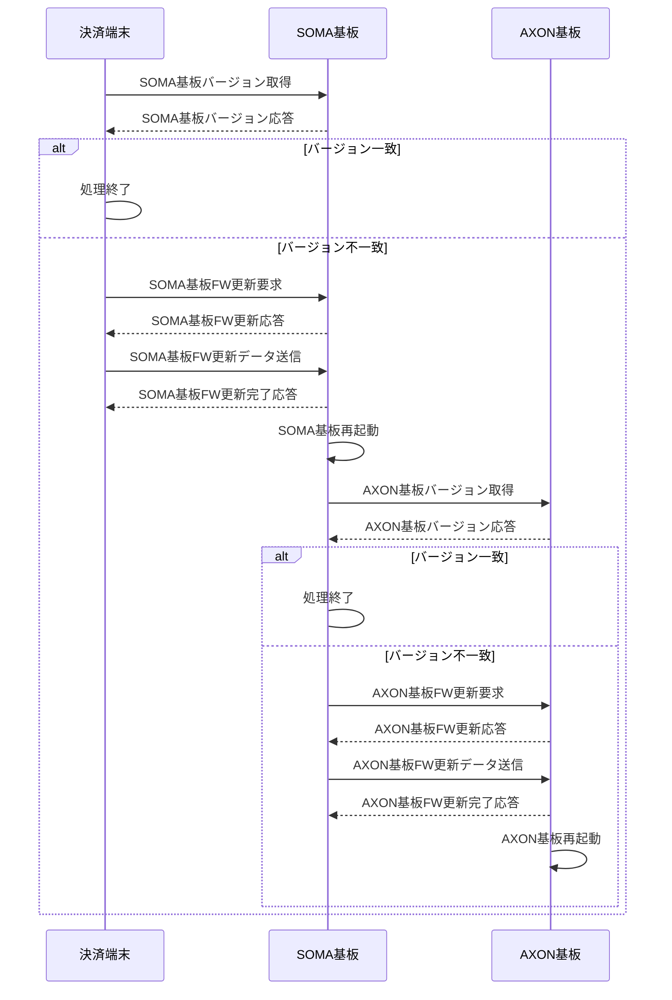
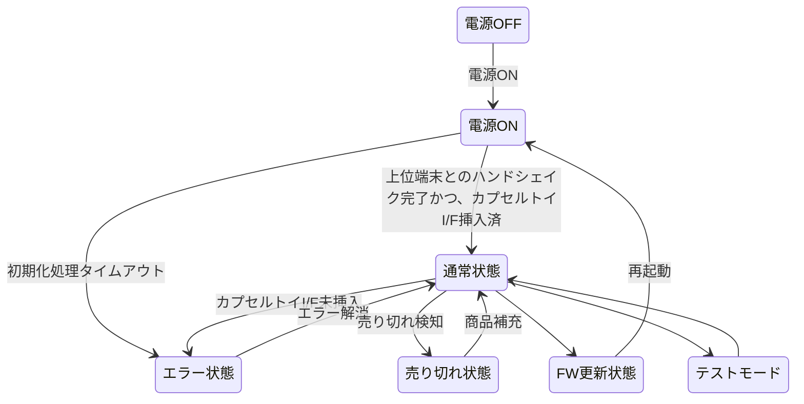
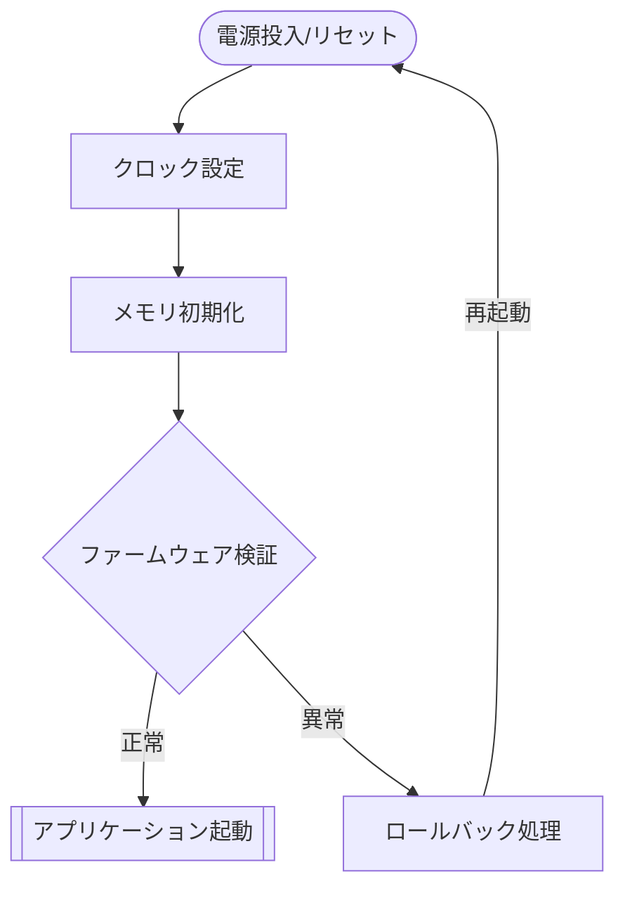
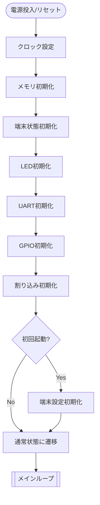
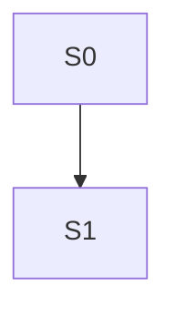

<!-- markdownlint-configure-file {"MD013": {"line_length": 160}} -->

<!-- markdownlint-disable MD025 -->
# カプセルトイ向け制御基板（仮称）基本設計書
<!-- markdownlint-enable MD025 -->

version: 0.1.3

---

## 目次

- [カプセルトイ向け制御基板（仮称）基本設計書](#カプセルトイ向け制御基板仮称基本設計書)
  - [目次](#目次)
  - [1. 目的](#1-目的)
  - [2. 用語・略語一覧](#2-用語略語一覧)
  - [3. 開発環境](#3-開発環境)
    - [3.1. 開発言語](#31-開発言語)
    - [3.2. IDE](#32-ide)
    - [3.3. SDK](#33-sdk)
    - [3.4. Compiler](#34-compiler)
    - [3.5. ソースコード管理](#35-ソースコード管理)
  - [4. システム構成](#4-システム構成)
  - [5. ハードウェア構成](#5-ハードウェア構成)
    - [5.1. SOMA基板](#51-soma基板)
    - [5.2. AXON基板](#52-axon基板)
    - [5.3. カプセルトイ制御IO](#53-カプセルトイ制御io)
  - [6. ソフトウェア構成](#6-ソフトウェア構成)
  - [7. 機能概要](#7-機能概要)
    - [7.1. 機能一覧](#71-機能一覧)
    - [7.2. 機能詳細](#72-機能詳細)
      - [7.2.1. LED制御](#721-led制御)
      - [7.2.2. ボタン制御](#722-ボタン制御)
      - [7.2.3. エスクロSW検出](#723-エスクロsw検出)
      - [7.2.4. 現金投入検知](#724-現金投入検知)
      - [7.2.5. 現金ブロック制御](#725-現金ブロック制御)
      - [7.2.6. カプセルトイI/F挿入検知](#726-カプセルトイif挿入検知)
      - [7.2.7. ダイヤル回転検知](#727-ダイヤル回転検知)
      - [7.2.8. 売り切れ検知](#728-売り切れ検知)
      - [7.2.9. 仮想現金制御](#729-仮想現金制御)
      - [金額設定](#金額設定)
      - [7.2.10. 決済端末-SOMA間通信](#7210-決済端末-soma間通信)
      - [7.2.11. SOMA-AXON基板間通信](#7211-soma-axon基板間通信)
      - [7.2.12. リモートアップデート](#7212-リモートアップデート)
      - [7.2.13. AXON基板情報保存](#7213-axon基板情報保存)
      - [7.2.14. 端末情報保存](#7214-端末情報保存)
      - [7.2.15. 初期化](#7215-初期化)
  - [8. 端末状態定義](#8-端末状態定義)
  - [9. 状態遷移図](#9-状態遷移図)
  - [10. 入出力I/F](#10-入出力if)
    - [10.1. SOMA基板](#101-soma基板)
    - [10.2. AXON基板](#102-axon基板)
    - [10.3. 割り込み処理](#103-割り込み処理)
      - [10.3.1. SOMA基板](#1031-soma基板)
      - [10.3.2. AXON基板](#1032-axon基板)
  - [11. データ構成](#11-データ構成)
    - [11.1. Flashメモリマップ](#111-flashメモリマップ)
      - [11.1.1. SOMA基板](#1111-soma基板)
      - [11.1.2. AXON基板](#1112-axon基板)
    - [11.2. ファームウェア](#112-ファームウェア)
      - [11.2.1. サイズ](#1121-サイズ)
      - [11.2.2. OTA情報](#1122-ota情報)
    - [11.3. 永続化領域](#113-永続化領域)
    - [11.4. FRAMメモリマップ](#114-framメモリマップ)
    - [11.5. Keystore](#115-keystore)
      - [11.5.1. 保存鍵情報](#1151-保存鍵情報)
  - [12. フローチャート](#12-フローチャート)
    - [12.1. BootLoader](#121-bootloader)
    - [12.2. Firmware](#122-firmware)
      - [12.2.1. 初期設定](#1221-初期設定)
      - [12.2.2. メインループ SOMA基板](#1222-メインループ-soma基板)
      - [12.2.3. メインループ AXON基板](#1223-メインループ-axon基板)
      - [12.2.4. 割り込み](#1224-割り込み)
  - [13. 改訂履歴](#13-改訂履歴)

---

## 1. 目的

本設計書は、対象ファームウェアの基本設計方針、構成、動作概要を明確にすることを目的とする。

## 2. 用語・略語一覧

| 用語・略語     | 説明                                                                  |
| -------------- | --------------------------------------------------------------------- |
| TI             | テキサス・インスツルメンツ社                                          |
| IDE            | 統合開発環境                                                          |
| SDK            | ソフトウェア開発キット                                                |
| MSPM0          | TI社製のマイコンMSPM0シリーズ                                         |
| MSPM0-SDK      | TI社製のMSPM0シリーズ用のソフトウェア開発キット                       |
| CCS            | TI社製のCode Composer Studio                                          |
| UART           | Universal Asynchronous Receiver/Transmitter（汎用非同期シリアル通信） |
| GPIO           | General Purpose Input/Output（汎用入出力）                            |
| SW             | Switch（スイッチ）                                                    |
| FW             | Firmware（ファームウェア）                                            |
| OTA            | Over The Air（無線/有線によるファームウェア更新）                     |
| CRC            | Cyclic Redundancy Check（巡回冗長検査）                               |
| FRAM           | Ferroelectric Random Access Memory（強誘電体RAM）                     |
| LED            | Light Emitting Diode（発光ダイオード）                                |
| DIPSW          | DIP Switch（ディップスイッチ）                                        |
| Bootloader     | 起動用プログラム                                                      |
| SOMA           | SOMA基板 AXON基板モジュールを最大9台制御する中央制御基板              |
| AXON           | AXON基板 各カプセルトイのIOを制御する基板                             |
| TG             | 決済端末(ThincaGate)                                                  |
| ソレノイド     | Solenoid（電磁石アクチュエータ）                                      |
| 7セグメントLED | 7 Segment LED（7セグメント表示器）                                    |
| Keystore       | 鍵情報の保存領域（セキュリティ機能）                                  |
| I/O            | Input/Output（入出力）                                                |

## 3. 開発環境

### 3.1. 開発言語

- C言語（C17準拠）

### 3.2. IDE

- Code Composer Studio (CCS)（version: 20.1.1）
   [Code Composer Studio 20.1.1 ダウンロード](https://dr-download.ti.com/software-development/ide-configuration-compiler-or-debugger/MD-J1VdearkvK/20.1.1/CCS_20.1.1.00008_win.zip)

### 3.3. SDK

- MSPM0-SDK（version: 2.04.00.06）
   [MSPM0 SDK 2.04.00.06 ダウンロード](https://dr-download.ti.com/secure/software-development/software-development-kit-sdk/MD-eCeyqJj7JC/2.04.00.06/mspm0_sdk_2_04_00_06.exe)

### 3.4. Compiler

- TI Compiler（version: 4.0.4.LTS）

### 3.5. ソースコード管理

- Github リポジトリ: [capsule_toy_control_board リポジトリ](https://github.com/tep-hardware/capsule_toy_control_board)

---

## 4. システム構成

製品のシステム構成は、以下となる。

## 5. ハードウェア構成

製品のハードウェア構成は、以下となる。

### 5.1. SOMA基板

### 5.2. AXON基板

### 5.3. カプセルトイ制御IO

---

## 6. ソフトウェア構成

製品のソフトウェア構成は、以下となる。

## 7. 機能概要

製品の機能概要は、以下となる。

### 7.1. 機能一覧

| No  | 機能名                  | 説明                                                                     |
| --- | ----------------------- | ------------------------------------------------------------------------ |
| 1   | LED制御                 | 赤色LED、3色LED、7セグメントLEDの消灯、点灯、点滅を制御する              |
| 2   | ボタン制御              | ボタンの押下を検出し、端末状態に応じて処理する                           |
| 3   | エスクロSW検出          | エスクロSWの押下を検出し、端末状態に応じて処理する                       |
| 4   | 現金投入検知            | 反射センサで現金投入を検知し、カウンタ値を更新する                       |
| 5   | 現金ブロック制御        | ソレノイドを制御して現金投入の可否を決定する                             |
| 6   | カプセルトイI/F挿入検知 | GPIOでカプセルトイI/Fの挿入を検知し、端末状態を制御する                  |
| 7   | ダイヤル回転検知        | SWでダイヤルの回転を検知し、端末状態を制御する                           |
| 8   | 売り切れ検知            | 磁気検知センサで売り切れを検知し、端末状態を制御する                     |
| 9   | 仮想現金制御            | 決済端末からのキャッシュレス決裁要求に応じて、ソレノイドを制御する       |
| 10  | 金額設定                | PUSH-SWで現金の設定金額を変更する                                        |
| 11  | 決済端末-SOMA間通信     | 決済端末と通信し、端末状態を制御する                                     |
| 12  | SOMA-AXON基板間通信     | SOMA基板とAXON基板間で通信し、端末状態を制御する                         |
| 13  | リモートアップデート    | 上位端末からのファームウェア更新要求に応じて、ファームウェアを更新する   |
| 14  | AXON基板情報保存        | 各AXON基板のシリアル番号、カウンタ値をFRAMに保存する（SOMA基板のみ対象） |
| 15  | 端末情報保存            | 端末のシリアル番号などの情報をバックアップメモリに保存する               |
| 16  | 初期化                  | 端末の初期化を行う                                                       |

### 7.2. 機能詳細

#### 7.2.1. LED制御

**機能説明:** 本製品の稼働状態をLEDで表現する機能です。

- **赤色LED**: 端末の電源状態および制御状態を表示する。
- **3色LED**: 端末の稼働状態を表示する。
- **7セグメントLED**: 景品獲得に必要な現金枚数または面番号を表示する。

**定義:**

- **赤色LED**

   | 点灯状態 | 説明    |
   | -------- | ------- |
   | 点灯     | 電源ON  |
   | 消灯     | 電源OFF |

- **3色LED（SOMA基板）**

   | 点灯状態 | 色   | 説明           |
   | -------- | ---- | -------------- |
   | 点灯     | 赤   | -              |
   | 点灯     | 青   | -              |
   | 点灯     | 緑   | -              |
   | 点灯     | 赤紫 | -              |
   | 点灯     | 黄色 | FW更新         |
   | 点灯     | 水色 | -              |
   | 点灯     | 白   | データリセット |
   | 点滅     | 赤   | エラー状態     |
   | 点滅     | 青   | 通常状態       |
   | 点滅     | 緑   | テストモード   |
   | 点滅     | 赤紫 | -              |
   | 点滅     | 黄色 | -              |
   | 点滅     | 水色 | -              |
   | 点滅     | 白   | -              |
   | -        | 消灯 | -              |

- **3色LED（AXON基板）**: 3色LEDの点灯状態はコマンドで設定し、エラー状態では赤色LEDが点灯する。

#### 7.2.2. ボタン制御

**機能説明:** Push-SWを使用して端末状態を遷移させる機能です。

**参考:** 詳細仕様は関連リンクを参照すること。

#### 7.2.3. エスクロSW検出

**機能説明:** エスクロSWの押下を検出し、端末状態に応じた処理を実施する。現金投入時にエスクロSWが押下された場合は現金が返却されたとみなす。

**波形:**

| 状態     | 説明                         |
| -------- | ---------------------------- |
| Idle     | エスクロSW未押下状態         |
| Pulse_1  | エスクロSW押下状態（1回目）  |
| Interval | エスクロSW未押下状態（間隔） |
| Pulse_2  | エスクロSW押下状態（2回目）  |

- エスクロ押下判定は10ms以上の押下で有効とする。
- 押下判定時に5～10msのデバウンス処理を行い、ノイズを除去する。
- 未押下状態が10ms以上続いた場合は未押下状態と扱う。

#### 7.2.4. 現金投入検知

**機能説明:** 反射センサで現金投入を検知し、端末状態を変更する。決済端末からのキャッシュレス決済要求は本機能でブロックする。設定金額分の現金が投入されるとセンサは常時検知状態となる。

**波形:**

| 状態     | 説明                     |
| -------- | ------------------------ |
| Idle     | センサ未検知状態         |
| Pulse_1  | センサ検知状態（1回目）  |
| Interval | センサ未検知状態（間隔） |
| Pulse_2  | センサ検知状態（2回目）  |

- センサ検知判定は10ms以上で有効とする。
- 検知判定時に5～10msのデバウンス処理を行い、ノイズを除去する。
- 未検知状態が10ms以上続いた場合は未検知状態と扱う。

#### 7.2.5. 現金ブロック制御

**機能説明:** ソレノイドを制御して現金投入の可否を決定する。TGからのSETAXONコマンドにより動作し、キャッシュレス決済時は現金投入を抑止するためにソレノイドを活性化する。

#### 7.2.6. カプセルトイI/F挿入検知

**機能説明:** GPIOでカプセルトイI/Fの挿入を検知し、未挿入の場合はエラー状態へ遷移する。

**波形:**

| 状態         | 説明                      |
| ------------ | ------------------------- |
| Not detected | カプセルトイI/F未挿入状態 |
| Detected     | カプセルトイI/F挿入状態   |

- 挿入判定は10ms以上で有効とする。
- 挿入判定時に5～10msのデバウンス処理を行い、ノイズを除去する。
- 未挿入状態が10ms以上続いた場合は未挿入状態と扱う。

#### 7.2.7. ダイヤル回転検知

**機能説明:** SWでダイヤルの回転を検知し、端末状態に応じた処理を行う。ダイヤル回転時に現金が投入されている場合は、設定した現金枚数分の現金が投入されたとみなしカウンタ値を更新する。

**波形:**

| 状態     | 説明                       |
| -------- | -------------------------- |
| Idle     | ダイヤル未回転状態         |
| Pulse_1  | ダイヤル回転状態（1回目）  |
| Interval | ダイヤル未回転状態（間隔） |
| Pulse_2  | ダイヤル回転状態（2回目）  |

- 回転判定は2ms以上で有効とする。
- 回転判定時に1msのデバウンス処理を行い、ノイズを除去する。
- 未回転状態が10ms以上続いた場合は未回転状態と扱う。

#### 7.2.8. 売り切れ検知

**機能説明:** 磁気検知センサで売り切れを検知し、現金ブロックを有効化してキャッシュレス決済要求に対しエラーを返す。

**波形:**

| 状態         | 説明               |
| ------------ | ------------------ |
| Not detected | 売り切れ未検知状態 |
| Detected     | 売り切れ検知状態   |

- 検知判定は10ms以上で有効とする。
- 検知判定時に5～10msのデバウンス処理を行い、ノイズを除去する。
- 未検知状態が10ms以上続いた場合は未検知状態と扱う。

#### 7.2.9. 仮想現金制御

**機能説明:** 決済端末からのキャッシュレス決済要求に応じてソレノイドを制御する。ソレノイド活性化後にダイヤルが回転した場合はソレノイドを非活性化する。TGからのSETAXONコマンドに従い動作する。

#### 金額設定

- PUSH-SWで設定金額を変更する。
- 設定範囲は1～5枚とする。
- 設定金額はAXON基板のSRAMで保持する。

#### 7.2.10. 決済端末-SOMA間通信

1. 機能説明
   UART通信で決済端末と通信し、端末状態に応じて処理する。
1. 通信規格
   参照
1. UART設定
   1. ボーレート: 115200bps
   2. データビット: 8bit
   3. ストップビット: 1bit
   4. パリティ: None
   5. フロー制御: None

1. 通信タイミング仕様
   1. **STATUS送信周期**: 20ms（仕様書 7.7.1 状態通知）
   2. **パケットサイズ**: 36バイト（固定）
   3. **T0/T1タイムアウト**: 1000ms（仕様書 3.2.7 通信タイミング）
      - **T0**: TGコマンド送信完了 → SOMA応答送信開始までの最大時間
      - **T1**: SOMA応答送信完了 → TG次コマンド送信開始までの最大時間
   4. **応答タイミング**: SOMA側はコマンド受信後、即座に応答（50ms以内）
   5. **CRC検証**: CRC16 ISO/IEC 13239（ESP32-C6 ROM関数使用）

1. コマンド一覧
   - ACKコマンド（正常レスポンス）
     - ヘッダ: 0x10
     - ID: 0x00
     - 通信方向: SOMA→TG
   - NACKコマンド（異常レスポンス、エラーコード付与）
     - ヘッダ: 0x90
     - ID: エラー内容に準ずる
     - 通信方向: SOMA→TG
   - STATUSコマンド（端末状態通知）
     - ヘッダ: 0x10
     - ID: 0x01
     - 通信方向: SOMA→TG
   - NOPコマンド（No Operation、応答確認）
     - ヘッダ: 0x10
     - ID: 0x10
     - 通信方向: TG→SOMA
  - STPコマンド（状態通知を停止する要求）
     - ヘッダ: 0x10
     - ID: 0x11
     - 通信方向: TG→SOMA
   - MSNコマンド（SOMA基板シリアル番号確認要求）
     - ヘッダ: 0x10
     - ID: 0x12
     - 通信方向: TG→SOMA
   - ATMSNコマンド（MSNコマンド応答、シリアル番号返却）
     - ヘッダ: 0x10
     - ID: 0x23
     - 通信方向: SOMA→TG
   - SSNコマンド（AXON基板シリアル番号・FWバージョン確認要求）
     - ヘッダ: 0x10
     - ID: 0x13
     - 通信方向: TG→SOMA
   - ATSSNコマンド（SSNコマンド応答、AXON情報返却）
     - ヘッダ: 0x10
     - ID: 0x24
     - 通信方向: SOMA→TG
   - SETAXONコマンド（AXON基板設定）
     - ヘッダ: 0x10
     - ID: 0x14
     - 通信方向: TG→SOMA
  - CHKAXONコマンド（AXON基板の状態を確認する要求）
     - ヘッダ: 0x10
     - ID: 0x15
     - 通信方向: TG→SOMA
   - ATCKSBコマンド（CHKAXON応答、AXON状態返却）
     - ヘッダ: 0x10
     - ID: 0x26
     - 通信方向: SOMA→TG
   - WUMコマンド（ユーザーメモリ書き込み）
     - ヘッダ: 0x10
     - ID: 0x16
     - 通信方向: TG→SOMA
   - RUMコマンド（ユーザーメモリ読み出し）
     - ヘッダ: 0x10
     - ID: 0x17
     - 通信方向: TG→SOMA
   - ATRUMコマンド（RUM応答、データ返却）
     - ヘッダ: 0x10
     - ID: 0x28
     - 通信方向: SOMA→TG
   - MFWUPコマンド（SOMA基板FWアップデート要求）
     - ヘッダ: 0x10
     - ID: 0x18
     - 通信方向: TG→SOMA
   - SETOKEYコマンド（運用鍵設定）
     - ヘッダ: 0x11
     - 通信方向: TG→SOMA
  - SOMARBTコマンド（SOMA基板を再起動する要求）
     - ヘッダ: 0x10
     - ID: 0x3F
     - 通信方向: TG→SOMA
   - CODEPKTコマンド（FWアップデート用コード送信）
     - ヘッダ: 0xA1
     - 通信方向: TG→SOMA
   - CODEOKコマンド（コード受信OK応答）
     - ヘッダ: 0xB0
     - 通信方向: SOMA→TG
   - CODENGコマンド（コード受信NG応答）
     - ヘッダ: 0xB9
     - 通信方向: SOMA→TG
   - ERRCHKコマンド（エラー確認要求）
     - ヘッダ: 0xC0
     - 通信方向: TG→SOMA
   - CODEFINコマンド（コード完了応答）
     - ヘッダ: 0xD0
     - 通信方向: SOMA→TG

#### 7.2.11. SOMA-AXON基板間通信

1. 機能説明
   UART通信でSOMA基板とAXON基板が通信し、端末状態に応じて処理する。

2. 通信規格
   参照

3. UART設定
   1. ボーレート: 115200bps
   2. データビット: 8bit
   3. ストップビット: 1bit
   4. パリティ: None
   5. フロー制御: None

#### 7.2.12. リモートアップデート

1. 機能説明
   上位端末からのファームウェア更新要求に応じてファームウェアを更新する。

2. 更新手順

#### 7.2.13. AXON基板情報保存

1. 機能説明
   各AXON基板のシリアル番号とカウンタ値をFRAMに保存する。

#### 7.2.14. 端末情報保存

1. 機能説明
   端末のシリアル番号などの情報を永続化領域に保存する。
   工場検査時にのみシリアル番号を保存する（初期化では消えない）。

#### 7.2.15. 初期化

1. 機能説明
   端末を初期化する。
   1. バックアップメモリ内のシリアル番号を除いた情報
   2. FRAM内の情報（SOMA基板のみ）

---

## 8. 端末状態定義

| No  | 端末状態           | 説明                                                         |
| --- | ------------------ | ------------------------------------------------------------ |
| 1   | 電源OFF            | 電源が供給されていない、またはシステムが停止している状態     |
| 2   | 電源ON             | 電源投入直後の初期化中または待機状態                         |
| 3   | 通常状態           | システムが正常に稼働し、ユーザ操作や現金投入を受け付ける状態 |
| 4   | エラー状態         | 異常やエラーが発生し、動作が制限されている状態               |
| 5   | FW更新状態         | ファームウェアの更新処理中の状態                             |
| 6   | データリセット状態 | データリセット処理中の状態                                   |
| 7   | 売り切れ状態       | 商品が売り切れ、現金投入や操作が制限されている状態           |
| 8   | テストモード       | メンテナンスや検査用のテスト動作を行う状態                   |

## 9. 状態遷移図

---

## 10. 入出力I/F

### 10.1. SOMA基板

| Pin  |  I/O  |      説明      |
| ---- | :---: | :------------: |
| PA0  |   I   |     IRQ_1      |
| PA1  |   I   |     IRQ_2      |
| PA2  |   -   |      GND       |
| PA3  |   -   |       -        |
| PA4  |   -   |       -        |
| PA5  |   -   |      XTAL      |
| PA6  |   -   |      XTAL      |
| PA7  |   -   |       -        |
| PA8  |   O   |    FRAM_CS     |
| PA9  |   I   |     IRQ_3      |
| PA10 |   O   |  AXON_UART_TX  |
| PA11 |   I   |  AXON_UART_RX  |
| PA12 |   O   |    FRAM_SCK    |
| PA13 |   I   |    FRAM_SO     |
| PA14 |   O   |    FRAM_SI     |
| PA15 |   I   |     IRQ_4      |
| PA16 |   I   |     IRQ_5      |
| PA17 |   -   |       -        |
| PA18 |   -   |      GND       |
| PA19 |   -   |  Debugger_DIO  |
| PA20 |   -   | Debugger_SWCLK |
| PA21 |   -   |      GND       |
| PA22 |   -   |       -        |
| PA23 |   -   |      GND       |
| PA24 |   -   |       -        |
| PA25 |   I   | ESP32_UART_RX  |
| PA26 |   O   | ESP32_UART_TX  |
| PA27 |   I   |     IRQ_6      |
| PA28 |   I   |     IRQ_7      |
| PA29 |   I   |     IRQ_8      |
| PA30 |   I   |     IRQ_9      |
| PA31 |   -   |       -        |
| PB0  |   O   |    3色LED_R    |
| PB1  |   O   |    3色LED_G    |
| PB2  |   O   |    3色LED_B    |
| PB3  |   O   |   LED_PORT_1   |
| PB4  |   O   |   LED_PORT_2   |
| PB5  |   O   |   LED_PORT_3   |
| PB6  |   O   |   LED_PORT_4   |
| PB7  |   O   |   LED_PORT_5   |
| PB8  |   O   |   LED_PORT_6   |
| PB9  |   O   |   LED_PORT_7   |
| PB10 |   O   |   LED_PORT_8   |
| PB11 |   O   |   LED_PORT_9   |
| PB12 |   O   |   MUX_ENABLE   |
| PB13 |   O   |     MUX_S0     |
| PB14 |   O   |     MUX_S1     |
| PB15 |   O   |     MUX_S2     |
| PB16 |   O   |     MUX_S3     |
| PB17 |   O   |   TG_UART_TX   |
| PB18 |   I   |   TG_UART_RX   |
| PB19 |   I   |    PUSH_SW     |
| PB20 |   -   |       -        |
| PB21 |   I   |    HW_VER_1    |
| PB22 |   I   |    HW_VER_2    |
| PB23 |   I   |    HW_VER_3    |
| PB24 |   I   |    DIPSW_1     |
| PB25 |   I   |    DIPSW_2     |
| PB26 |   I   |    DIPSW_3     |
| PB27 |   I   |    DIPSW_4     |

---

### 10.2. AXON基板

| Pin  |      I/O      |        説明         |
| ---- | :-----------: | :-----------------: |
| PA0  | I(open drain) |     エスクロSW      |
| PA1  | I(open drain) |   現金検知センサ    |
| PA2  |       -       |         GND         |
| PA3  |       -       |          -          |
| PA4  |       -       |          -          |
| PA5  |       -       |        XTAL         |
| PA6  |       -       |        XTAL         |
| PA7  |       O       | ブロックソレノイド  |
| PA8  |       -       |          -          |
| PA9  |       I       |  コネクタ挿入検知   |
| PA10 |       O       |       UART_TX       |
| PA11 |       I       |       UART_RX       |
| PA12 |       -       |          -          |
| PA13 |       -       |          -          |
| PA14 |       -       |          -          |
| PA15 |       I       |  ダイヤル回転検知   |
| PA16 |       I       |    売り切れ検知     |
| PA17 |       O       | 仮想現金ソレノイド  |
| PA18 |       -       | Bootloader_disabled |
| PA19 |       -       |    Debugger_DIO     |
| PA20 |       -       |   Debugger_SWCLK    |
| PA21 |       -       |         GND         |
| PA22 |       O       |      予備GPIO       |
| PA23 |       -       |         GND         |
| PA24 |       O       |       IRQ_OUT       |
| PA25 |       -       |          -          |
| PA26 |       -       |          -          |
| PA27 |       -       |          -          |
| PA28 |       -       |          -          |
| PA29 |       -       |          -          |
| PA30 |       -       |          -          |
| PA31 |       -       |          -          |
| PB0  |       O       | 7セグメントLED_1_A  |
| PB1  |       O       | 7セグメントLED_1_B  |
| PB2  |       O       | 7セグメントLED_1_C  |
| PB3  |       O       | 7セグメントLED_1_D  |
| PB4  |       O       | 7セグメントLED_1_E  |
| PB5  |       O       | 7セグメントLED_1_F  |
| PB6  |       O       | 7セグメントLED_1_G  |
| PB7  |       O       |      3色LED_R       |
| PB8  |       O       |      3色LED_G       |
| PB9  |       O       |      3色LED_B       |
| PB10 |       O       | 7セグメントLED_2_A  |
| PB11 |       O       | 7セグメントLED_2_B  |
| PB12 |       O       | 7セグメントLED_2_C  |
| PB13 |       O       | 7セグメントLED_2_D  |
| PB14 |       O       | 7セグメントLED_2_E  |
| PB15 |       O       | 7セグメントLED_2_F  |
| PB16 |       O       | 7セグメントLED_2_G  |
| PB17 |       -       |          -          |
| PB18 |       -       |          -          |
| PB19 |       I       |      PUSH-SW_1      |
| PB20 |       I       |      PUSH-SW_2      |
| PB21 |       I       |      HW_VER_1       |
| PB22 |       I       |      HW_VER_2       |
| PB23 |       I       |      HW_VER_3       |
| PB24 |       I       |       DIPSW_1       |
| PB25 |       I       |       DIPSW_2       |
| PB26 |       I       |       DIPSW_3       |
| PB27 |       I       |       DIPSW_4       |

---

### 10.3. 割り込み処理

各割り込み処理は負荷軽減のため、割り込みフラグを立ち上げるだけの処理に限定する。

- LED制御は、割り込み処理内で行う。

#### 10.3.1. SOMA基板

| 名称    | IO   | 説明                                                            |
| ------- | ---- | --------------------------------------------------------------- |
| IRQ_1   | PA0  | PORT_1に接続されたAXON基板のIRQ信号を検知し、フラグを立ち上げる |
| IRQ_2   | PA1  | PORT_2に接続されたAXON基板のIRQ信号を検知し、フラグを立ち上げる |
| IRQ_3   | PA9  | PORT_3に接続されたAXON基板のIRQ信号を検知し、フラグを立ち上げる |
| IRQ_4   | PA15 | PORT_4に接続されたAXON基板のIRQ信号を検知し、フラグを立ち上げる |
| IRQ_5   | PA16 | PORT_5に接続されたAXON基板のIRQ信号を検知し、フラグを立ち上げる |
| IRQ_6   | PA27 | PORT_6に接続されたAXON基板のIRQ信号を検知し、フラグを立ち上げる |
| IRQ_7   | PA28 | PORT_7に接続されたAXON基板のIRQ信号を検知し、フラグを立ち上げる |
| IRQ_8   | PA29 | PORT_8に接続されたAXON基板のIRQ信号を検知し、フラグを立ち上げる |
| IRQ_9   | PA30 | PORT_9に接続されたAXON基板のIRQ信号を検知し、フラグを立ち上げる |
| PUSH-SW | PB19 | PUSH-SWが押下されたことを検知し、フラグを立ち上げる             |

#### 10.3.2. AXON基板

| 名称             | IO   | 説明                                                         |
| ---------------- | ---- | ------------------------------------------------------------ |
| エスクロSW       | PA0  | エスクロSWの状態が変更されたことを検知し、フラグを立ち上げる |
| 現金検知センサ   | PA1  | 現金が投入されたことを検知し、フラグを立ち上げる             |
| ダイヤル回転検知 | PA15 | ダイヤルが回転されたことを検知し、フラグを立ち上げる         |
| 売り切れ検知     | PA16 | 売り切れが発生したことを検知し、フラグを立ち上げる           |
| PUSH-SW1         | PB19 | PUSH-SW1が押下されたことを検知し、フラグを立ち上げる         |
| PUSH-SW2         | PB20 | PUSH-SW2が押下されたことを検知し、フラグを立ち上げる         |
| LED_タイマ       | -    | 指定時間が経過した後に発火し、3色LEDの状態を変化させる       |

## 11. データ構成

### 11.1. Flashメモリマップ

#### 11.1.1. SOMA基板

| アドレス範囲 | サイズ | 説明             |
| ------------ | ------ | ---------------- |
| 0x00000000   | 8KB    | Bootloader       |
| 0x00002000   | 48KB   | ファームウェア_1 |
| 0x0000E000   | 48KB   | ファームウェア_2 |
| 0x0001A000   | 16KB   | 永続化領域       |

- 各ファームウェアには、AXON基板のファームウェアも含まれる。

#### 11.1.2. AXON基板

| アドレス範囲 | サイズ | 説明             |
| ------------ | ------ | ---------------- |
| 0x00000000   | 8KB    | Bootloader       |
| 0x00002000   | 24KB   | ファームウェア_1 |
| 0x00008000   | 24KB   | ファームウェア_2 |
| 0x0000E000   | 16KB   | 永続化領域       |

### 11.2. ファームウェア

各ファームウェアの先頭領域には、OTA情報が格納される。
SOMA基板のファームウェアには、アプリケーション領域にAXON基板のファームウェアが格納される。

#### 11.2.1. サイズ

- SOMA基板
  - 48KB
- AXON基板
  - 24KB

#### 11.2.2. OTA情報

| アドレス範囲 | サイズ | 説明                       |
| ------------ | ------ | -------------------------- |
| 0x00000000   | 4B     | マジックナンバー           |
| 0x00000004   | 16B    | 予約領域                   |
| 0x00000014   | 4B     | バージョン番号             |
| 0x00000017   | 8B     | コンパイル日時（UNIX時間） |
| 0x0000001F   | 4B     | CRC32(include ota_info)    |
| 0x00000023   | 4B     | CRC32(Firmware only)       |
| 0x00000027   | 8B     | 予約領域                   |

### 11.3. 永続化領域

| アドレス範囲 | サイズ | 説明         |
| ------------ | ------ | ------------ |
| 0x00000000   | 10B    | シリアル番号 |
| 0x0000000A   | 1B     | OTAフラグ    |
| 0x0000000B   | 4B     | 稼働FW_CRC   |

### 11.3.1. ユーザーメモリ領域 (Flash)

**用途**: WUM/RUMコマンド用の汎用ストレージ

| 項目 | 値 |
|------|-----|
| パーティション名 | `user_memory` |
| タイプ | `data` (0x40) |
| サイズ | 256バイト (4KB セクタ) |
| アドレス範囲 | 0x0000 - 0x00FF |
| アクセス | WUM (書き込み) / RUM (読み出し) |

**特性**:
- 電源OFF後もデータ保持
- 書き込み回数制限: 約10万回
- セクタ単位消去 (4KB)

### 11.4. FRAMメモリマップ

| PORT番号 | アドレス範囲 | サイズ | 項目                 | 説明                                         |
| -------- | ------------ | ------ | -------------------- | -------------------------------------------- |
| PORT1    | 0x00000000   | 1B     | PORT-FLG_1           | ポート有効フラグ (0=無効, 1=有効)            |
|          | 0x00000001   | 1B     | FACE番号_1           | カプセルトイ面番号 (0-9)                     |
|          | 0x00000002   | 2B     | タイムアウト_1       | ソレノイドON時間タイムアウト (秒単位)        |
|          | 0x00000004   | 2B     | 設定金額_1           | FACE設定金額 (100円単位、0x01=100円)         |
|          | 0x00000006   | 2B     | 現金カウンタ値_1     | 現金投入回転カウンタ（工場出荷から累積）     |
|          | 0x00000008   | 2B     | プライズカウンタ値_1 | プライズ投入回転カウンタ（工場出荷から累積） |
|          | 0x0000000A   | 10B    | AXON基板シリアル_1   | ATIRQ STATUS(0x6A)のSSNから取得              |
| PORT2    | 0x00000014   | 1B     | PORT-FLG_2           | ポート有効フラグ (0=無効, 1=有効)            |
|          | 0x00000015   | 1B     | FACE番号_2           | カプセルトイ面番号 (0-9)                     |
|          | 0x00000016   | 2B     | タイムアウト_2       | ソレノイドON時間タイムアウト (秒単位)        |
|          | 0x00000018   | 2B     | 設定金額_2           | FACE設定金額 (100円単位、0x01=100円)         |
|          | 0x0000001A   | 2B     | 現金カウンタ値_2     | 現金投入回転カウンタ（工場出荷から累積）     |
|          | 0x0000001C   | 2B     | プライズカウンタ値_2 | プライズ投入回転カウンタ（工場出荷から累積） |
|          | 0x0000001E   | 10B    | AXON基板シリアル_2   | ATIRQ STATUS(0x6A)のSSNから取得              |
| PORT3    | 0x00000028   | 1B     | PORT-FLG_3           | ポート有効フラグ (0=無効, 1=有効)            |
|          | 0x00000029   | 1B     | FACE番号_3           | カプセルトイ面番号 (0-9)                     |
|          | 0x0000002A   | 2B     | タイムアウト_3       | ソレノイドON時間タイムアウト (秒単位)        |
|          | 0x0000002C   | 2B     | 設定金額_3           | FACE設定金額 (100円単位、0x01=100円)         |
|          | 0x0000002E   | 2B     | 現金カウンタ値_3     | 現金投入回転カウンタ（工場出荷から累積）     |
|          | 0x00000030   | 2B     | プライズカウンタ値_3 | プライズ投入回転カウンタ（工場出荷から累積） |
|          | 0x00000032   | 10B    | AXON基板シリアル_3   | ATIRQ STATUS(0x6A)のSSNから取得              |
| PORT4    | 0x0000003C   | 1B     | PORT-FLG_4           | ポート有効フラグ (0=無効, 1=有効)            |
|          | 0x0000003D   | 1B     | FACE番号_4           | カプセルトイ面番号 (0-9)                     |
|          | 0x0000003E   | 2B     | タイムアウト_4       | ソレノイドON時間タイムアウト (秒単位)        |
|          | 0x00000040   | 2B     | 設定金額_4           | FACE設定金額 (100円単位、0x01=100円)         |
|          | 0x00000042   | 2B     | 現金カウンタ値_4     | 現金投入回転カウンタ（工場出荷から累積）     |
|          | 0x00000044   | 2B     | プライズカウンタ値_4 | プライズ投入回転カウンタ（工場出荷から累積） |
|          | 0x00000046   | 10B    | AXON基板シリアル_4   | ATIRQ STATUS(0x6A)のSSNから取得              |
| PORT5    | 0x00000050   | 1B     | PORT-FLG_5           | ポート有効フラグ (0=無効, 1=有効)            |
|          | 0x00000051   | 1B     | FACE番号_5           | カプセルトイ面番号 (0-9)                     |
|          | 0x00000052   | 2B     | タイムアウト_5       | ソレノイドON時間タイムアウト (秒単位)        |
|          | 0x00000054   | 2B     | 設定金額_5           | FACE設定金額 (100円単位、0x01=100円)         |
|          | 0x00000056   | 2B     | 現金カウンタ値_5     | 現金投入回転カウンタ（工場出荷から累積）     |
|          | 0x00000058   | 2B     | プライズカウンタ値_5 | プライズ投入回転カウンタ（工場出荷から累積） |
|          | 0x0000005A   | 10B    | AXON基板シリアル_5   | ATIRQ STATUS(0x6A)のSSNから取得              |
| PORT6    | 0x00000064   | 1B     | PORT-FLG_6           | ポート有効フラグ (0=無効, 1=有効)            |
|          | 0x00000065   | 1B     | FACE番号_6           | カプセルトイ面番号 (0-9)                     |
|          | 0x00000066   | 2B     | タイムアウト_6       | ソレノイドON時間タイムアウト (秒単位)        |
|          | 0x00000068   | 2B     | 設定金額_6           | FACE設定金額 (100円単位、0x01=100円)         |
|          | 0x0000006A   | 2B     | 現金カウンタ値_6     | 現金投入回転カウンタ（工場出荷から累積）     |
|          | 0x0000006C   | 2B     | プライズカウンタ値_6 | プライズ投入回転カウンタ（工場出荷から累積） |
|          | 0x0000006E   | 10B    | AXON基板シリアル_6   | ATIRQ STATUS(0x6A)のSSNから取得              |
| PORT7    | 0x00000078   | 1B     | PORT-FLG_7           | ポート有効フラグ (0=無効, 1=有効)            |
|          | 0x00000079   | 1B     | FACE番号_7           | カプセルトイ面番号 (0-9)                     |
|          | 0x0000007A   | 2B     | タイムアウト_7       | ソレノイドON時間タイムアウト (秒単位)        |
|          | 0x0000007C   | 2B     | 設定金額_7           | FACE設定金額 (100円単位、0x01=100円)         |
|          | 0x0000007E   | 2B     | 現金カウンタ値_7     | 現金投入回転カウンタ（工場出荷から累積）     |
|          | 0x00000080   | 2B     | プライズカウンタ値_7 | プライズ投入回転カウンタ（工場出荷から累積） |
|          | 0x00000082   | 10B    | AXON基板シリアル_7   | ATIRQ STATUS(0x6A)のSSNから取得              |
| PORT8    | 0x0000008C   | 1B     | PORT-FLG_8           | ポート有効フラグ (0=無効, 1=有効)            |
|          | 0x0000008D   | 1B     | FACE番号_8           | カプセルトイ面番号 (0-9)                     |
|          | 0x0000008E   | 2B     | タイムアウト_8       | ソレノイドON時間タイムアウト (秒単位)        |
|          | 0x00000090   | 2B     | 設定金額_8           | FACE設定金額 (100円単位、0x01=100円)         |
|          | 0x00000092   | 2B     | 現金カウンタ値_8     | 現金投入回転カウンタ（工場出荷から累積）     |
|          | 0x00000094   | 2B     | プライズカウンタ値_8 | プライズ投入回転カウンタ（工場出荷から累積） |
|          | 0x00000096   | 10B    | AXON基板シリアル_8   | ATIRQ STATUS(0x6A)のSSNから取得              |
| PORT9    | 0x000000A0   | 1B     | PORT-FLG_9           | ポート有効フラグ (0=無効, 1=有効)            |
|          | 0x000000A1   | 1B     | FACE番号_9           | カプセルトイ面番号 (0-9)                     |
|          | 0x000000A2   | 2B     | タイムアウト_9       | ソレノイドON時間タイムアウト (秒単位)        |
|          | 0x000000A4   | 2B     | 設定金額_9           | FACE設定金額 (100円単位、0x01=100円)         |
|          | 0x000000A6   | 2B     | 現金カウンタ値_9     | 現金投入回転カウンタ（工場出荷から累積）     |
|          | 0x000000A8   | 2B     | プライズカウンタ値_9 | プライズ投入回転カウンタ（工場出荷から累積） |
|          | 0x000000AA   | 10B    | AXON基板シリアル_9   | ATIRQ STATUS(0x6A)のSSNから取得              |
| -        | 0x000000B4   | 10B    | ユーザーメモリ       | TG端末から読み書き可能な汎用領域             |

**注意事項**:
- FRAMは、SOMA基板のみ搭載している
- 各PORTは20バイト構成: PORT-FLG(1B) + FACE番号(1B) + タイムアウト(2B) + 設定金額(2B) + 現金カウンタ(2B) + プライズカウンタ(2B) + シリアル(10B)
- **PORT番号**: SOMA基板上のPORTの番号を示す。カプセルトイのFACE番号（面番号）ではない。
- **PORT-FLG**: SOMA基板上のPORTが物理的に有効か無効かを示すフラグ。PORTコネクタのPIN-10のショートでCPUが判断
- **FACE番号**: カプセルトイの面番号 (0-9)。SOMA基板ではAXON基板の面番号が重複しないように管理する
- **タイムアウト**: 仮想現金のソレノイドON時間のタイムアウト設定値 (秒単位)
- **設定金額**: FACE番号の設定金額 (100円単位)。0円設定は不可
- **カウンタ値**: 工場出荷からリセットされることはなく、累積値として保持される。AXON基板の面番号変更時には面番の金額情報とカウンタ情報が引き継がれる
- **AXON基板シリアル番号**: SOMA-AXONプロトコルのATIRQ STATUS (0x6A)応答のSSNフィールド（6バイト形式：製造年+製造月+製品番号+オプション+ロット番号）から取得し、10バイト形式で保存
  - 例: `25L6100001` → `0x19_0C_3D_00_E8_03` (6バイト) → 10バイト形式でFRAM保存
- **FACE番号**: カプセルトイの面番号 (0-9)。SOMA基板ではAXON基板の面番号が重複しないように管理する
- **設定金額**: FACE番号の設定金額 (100円単位)。0円設定は不可
- **カウンタ値**: 工場出荷からリセットされることはなく、累積値として保持される。AXON基板の面番号変更時には面番の金額情報とカウンタ情報が引き継がれる

### 11.5. Keystore

本製品は、端末-基板間および基板-基板間の通信で、Keystoreに保存された鍵情報を用いて暗号化通信を実現する。
KeystoreはTI社製MSPM0シリーズに搭載されたセキュリティ機能であり、AES256ビット暗号化をサポートする。

#### 11.5.1. 保存鍵情報

- 設定鍵
  - 鍵長: 256bit
  - 鍵値: 0x
- 運用鍵
  - 鍵長: 256bit
  - 鍵値: 0x
  - この鍵はAXON基板のみで保存する。

## 12. フローチャート

### 12.1. BootLoader

### 12.2. Firmware

#### 12.2.1. 初期設定

#### 12.2.2. メインループ SOMA基板

#### 12.2.3. メインループ AXON基板

#### 12.2.4. 割り込み

---

## 13. 改訂履歴

| 版数  | 日付       | 作成者 | 変更内容                                                                                                                     |
| ----- | ---------- | ------ | ---------------------------------------------------------------------------------------------------------------------------- |
| 1.3.0 | 2026-03-15 | 滝口   | ti arm compilerをv4.0.4に更新                                                                                                |
| 0.1.2 | 2025-09-29 | 滝口   | 文言の統一と用語修正（textlint指摘への対応）                                                                                 |
| 0.1.1 | 2025-05-20 | 滝口   | 端末状態定義の追加 基板名をメイン基板とサブ基板からSOMA基板とAXON基板に変更し、関連する機能や通信内容を更新 Githubリンク追加 |
| 0.1.0 | 2025-05-13 | 滝口   | 新規作成                                                                                                                     |
