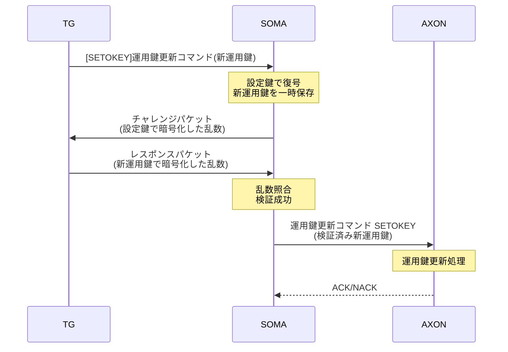

# AXON運用鍵更新実装計画書

**作成日**: 2026年1月24日  
**対象基板**: AXON基板 (TI MSPM0G3507)  
**プロジェクト**: SOMA-AXON運用鍵更新機能  
**ベース仕様**: 通信シーケンス仕様書 第15章「運用鍵更新シーケンス」  

---

## 📋 目次

1. [現状分析](#1-現状分析)
2. [要求仕様](#2-要求仕様)
3. [設計方針](#3-設計方針)
4. [実装計画](#4-実装計画)
5. [リスク評価](#5-リスク評価)
6. [テスト計画](#6-テスト計画)

---

## 1. 現状分析

### 1.1. 仕様書の要求事項

**通信シーケンス仕様書 15章の定義:**



**重要な発見:**
- ✅ **チャレンジ・レスポンスはTG-SOMA間のみで実施**
- ✅ **AXON側はSOMAから検証済みの新運用鍵を受信するのみ**
- ✅ **AXON側にチャレンジ・レスポンス機能は不要**

### 1.2. 現在の実装状況（AXON側）

**実装ファイル:** [s2a_packet.c#L1141](../../../axon_board/protocol/src/s2a_packet.c#L1141)

```c
bool axon_handle_setokey(const uint8_t* frame)
{
    // 現在の実装:
    // - Header: 0x15
    // - LEN: 0x10 (16バイト)
    // - フレーム長: 18バイト (HD + LEN + 16byte key)
    // - 暗号化: なし（平文処理）
    // - CRC16: なし
}
```

**問題点:**
1. ❌ 鍵長が16バイト（仕様は**32バイト**）
2. ❌ 暗号化処理なし（仕様は**設定鍵で暗号化**）
3. ❌ CRC16検証なし（仕様は**必須**）
4. ❌ 鍵管理機構なし（設定鍵・運用鍵の区別なし）

---

## 2. 要求仕様

### 2.1. SETOKEYコマンド仕様（SOMA→AXON）

**パケット構造:**

| フィールド | バイト位置 | サイズ | 値 | 説明 |
|-----------|-----------|--------|-----|------|
| Header | 1st | 1 byte | 0x15 | コマンド識別子 |
| LEN | 2nd | 1 byte | 0x20 | データ長(32バイト) |
| OKEY | 3rd ~ 34th | 32 bytes | [暗号化データ] | 新運用鍵（設定鍵で暗号化） |
| CRC16 | 35th ~ 36th | 2 bytes | [0:65535] | CRC16（Data部のみ） |

**総フレーム長:** 36バイト

**暗号化方式:**
- **アルゴリズム**: AES-256 ECB
- **暗号化対象**: 3rd Byte ~ 34th Byte（32バイトの新運用鍵）
- **使用鍵**: 設定鍵（32バイト、事前共有）

**処理フロー:**
1. フレーム受信（36バイト）
2. Header/LEN検証
3. CRC16検証（Data部: 3rd~34th Byte）
4. 暗号化データ（3rd~34th Byte）を設定鍵で**復号**
5. 復号結果を新運用鍵として保存
6. ACK応答送信

### 2.2. 鍵管理要件

**鍵の種類:**
- **設定鍵（Setup Key）**: 32バイト
  - 工場出荷時に設定
  - FRAMに永続保存
  - 変更不可（または管理者のみ）
  - 用途: SETOKEYコマンドの復号

- **運用鍵（Operation Key）**: 32バイト
  - SETOKEYコマンドで更新可能
  - FRAMに永続保存
  - 通常通信の暗号化に使用（将来実装）

**鍵のライフサイクル:**
```
[工場出荷] → 設定鍵プログラム → [運用開始]
                                    ↓
                          運用鍵初期設定（SETOKEY）
                                    ↓
                          [通常運用] ←→ 運用鍵更新（SETOKEY）
```

---

## 3. 設計方針

### 3.1. アーキテクチャ

```
┌─────────────────────────────────────────────────┐
│              AXON Application Layer             │
│        (axon_routine.c, s2a_packet.c)          │
└────────────────┬────────────────────────────────┘
                 │ API呼び出し
┌────────────────▼────────────────────────────────┐
│           Key Manager Module                    │
│         (key_manager.h/c)                      │
│  - 設定鍵・運用鍵の管理                          │
│  - FRAM永続化                                   │
│  - 鍵検証・更新処理                              │
└────────────────┬────────────────────────────────┘
                 │ 暗号化API
┌────────────────▼────────────────────────────────┐
│         AES-256 Crypto Module                   │
│            (aes256.h/c)                        │
│  - AES-256 ECBモード                            │
│  - TI Driverlib AES or Tiny-AES-c              │
└─────────────────────────────────────────────────┘
```

### 3.2. モジュール設計

#### 3.2.1. AES-256 Crypto Module

**責務:**
- AES-256 ECBモード暗号化・復号化
- ハードウェアアクセラレータの利用（利用可能な場合）

**API:**
```c
// aes256.h
typedef enum {
    AES256_SUCCESS = 0,
    AES256_ERROR_NULL_POINTER,
    AES256_ERROR_INVALID_KEY_SIZE,
    AES256_ERROR_HARDWARE_FAILURE
} aes256_status_t;

/**
 * @brief AES-256 ECBモード暗号化
 * @param plaintext 平文データ（32バイト）
 * @param key 暗号鍵（32バイト）
 * @param ciphertext 暗号化データ出力（32バイト）
 * @return aes256_status_t
 */
aes256_status_t aes256_encrypt_ecb(
    const uint8_t* plaintext,
    const uint8_t* key,
    uint8_t* ciphertext
);

/**
 * @brief AES-256 ECBモード復号化
 * @param ciphertext 暗号化データ（32バイト）
 * @param key 暗号鍵（32バイト）
 * @param plaintext 平文データ出力（32バイト）
 * @return aes256_status_t
 */
aes256_status_t aes256_decrypt_ecb(
    const uint8_t* ciphertext,
    const uint8_t* key,
    uint8_t* plaintext
);
```

#### 3.2.2. Key Manager Module

**責務:**
- 設定鍵・運用鍵の保存・読み出し
- FRAM永続化処理
- 鍵の検証・更新処理

**データ構造:**
```c
// key_manager.h
#define KEY_SIZE_BYTES 32

typedef struct {
    uint8_t setup_key[KEY_SIZE_BYTES];       // 設定鍵（読取専用）
    uint8_t operation_key[KEY_SIZE_BYTES];   // 運用鍵（更新可能）
    uint32_t operation_key_version;          // 運用鍵バージョン
    uint16_t crc16;                          // データ整合性チェック
} key_storage_t;
```

**API:**
```c
/**
 * @brief 鍵管理モジュール初期化
 * @details FRAMから設定鍵・運用鍵を読み込み
 * @return true: 成功, false: 失敗
 */
bool key_manager_init(void);

/**
 * @brief 設定鍵取得
 * @param key_out 設定鍵出力バッファ（32バイト）
 * @return true: 成功, false: 失敗
 */
bool key_manager_get_setup_key(uint8_t* key_out);

/**
 * @brief 運用鍵取得
 * @param key_out 運用鍵出力バッファ（32バイト）
 * @return true: 成功, false: 失敗
 */
bool key_manager_get_operation_key(uint8_t* key_out);

/**
 * @brief 運用鍵更新
 * @param new_key 新しい運用鍵（32バイト）
 * @return true: 成功, false: 失敗
 */
bool key_manager_update_operation_key(const uint8_t* new_key);

/**
 * @brief 設定鍵プログラム（工場出荷時のみ）
 * @param setup_key 設定鍵（32バイト）
 * @return true: 成功, false: 失敗
 */
bool key_manager_program_setup_key(const uint8_t* setup_key);
```

#### 3.2.3. SETOKEY Handler (s2a_packet.c)

**拡張後の処理フロー:**
```c
bool axon_handle_setokey(const uint8_t* frame)
{
    // 1. 基本検証
    if (!frame || frame[0] != 0x15 || frame[1] != 0x20) {
        return send_nack_frame(0x02);
    }

    // 2. CRC16検証
    uint16_t crc_recv = frame[34] | (frame[35] << 8);
    uint16_t crc_calc = crc16_tep(&frame[2], 32);
    if (crc_recv != crc_calc) {
        return send_nack_frame(0x04);
    }

    // 3. 設定鍵取得
    uint8_t setup_key[32];
    if (!key_manager_get_setup_key(setup_key)) {
        return send_nack_frame(0x05);
    }

    // 4. 暗号化データ復号（設定鍵使用）
    uint8_t new_operation_key[32];
    const uint8_t* encrypted_key = &frame[2];
    if (aes256_decrypt_ecb(encrypted_key, setup_key, new_operation_key) != AES256_SUCCESS) {
        return send_nack_frame(0x06);
    }

    // 5. 運用鍵更新
    if (!key_manager_update_operation_key(new_operation_key)) {
        return send_nack_frame(0x07);
    }

    // 6. ACK応答
    return send_ack_frame();
}
```

---

## 4. 実装計画

### 4.1. 実装フェーズ

#### **Phase 1: AES-256暗号化ライブラリの選定・統合**

**目標:** AES-256 ECBモード暗号化・復号化機能を提供

**タスク:**
1. ライブラリ選定
   - Option A: TI Driverlib内蔵AESハードウェアアクセラレータ
   - Option B: Tiny-AES-c（軽量ソフトウェア実装）
   - 推奨: Option Bを優先、Option Aは将来の最適化として

2. ライブラリ統合
   - `axon_board/driver/crypto/` ディレクトリ作成
   - aes256.h/c ファイル作成
   - ECBモードの暗号化・復号化関数実装

3. 単体テスト
   - 既知のテストベクターで検証
   - NIST AES-256テストケースを使用

**成果物:**
- `axon_board/driver/crypto/aes256.h`
- `axon_board/driver/crypto/aes256.c`
- `axon_board/driver/crypto/aes256_test.c`（テストコード）

**所要時間:** 1-2日

---

#### **Phase 2: 鍵管理モジュールの実装**

**目標:** 設定鍵・運用鍵の管理とFRAM永続化

**タスク:**
1. データ構造定義
   - `key_storage_t` 構造体
   - FRAMアドレスマッピング

2. FRAM I/Oライブラリの確認
   - 既存のFRAMドライバの有無確認
   - 未実装の場合は簡易版作成

3. 鍵管理API実装
   - 初期化処理
   - 読み出し処理
   - 更新処理（運用鍵のみ）
   - CRC16検証

4. 単体テスト
   - 鍵の保存・読み出し検証
   - 電源断シミュレーション

**成果物:**
- `axon_board/driver/crypto/key_manager.h`
- `axon_board/driver/crypto/key_manager.c`
- `axon_board/driver/crypto/key_manager_test.c`

**所要時間:** 1-2日

---

#### **Phase 3: SETOKEY処理の拡張**

**目標:** 仕様準拠のSETOKEYコマンド処理

**タスク:**
1. パケット構造定義更新
   ```c
   // s2a_packet.h
   #define S2A_HEADER_SETOKEY 0x15
   #define S2A_SETOKEY_LEN    0x20  // 32バイト
   #define S2A_SETOKEY_FRAME_SIZE 36  // HD + LEN + Data + CRC
   ```

2. `axon_handle_setokey()` 拡張
   - 36バイトフレーム対応
   - CRC16検証追加
   - AES-256復号処理統合
   - 鍵管理API呼び出し

3. 可変長フレーム受信処理の更新
   ```c
   // axon_routine.c
   if (header == 0x15 && length == 0x20 && rx_variable_length == 36) {
       handled = axon_handle_setokey(rx_variable_frame);
   }
   ```

4. エラーハンドリング強化
   - NACKエラーコード追加
   - デバッグログ出力

**成果物:**
- `axon_board/protocol/src/s2a_packet.h`（更新）
- `axon_board/protocol/src/s2a_packet.c`（更新）
- `axon_board/axon_routine.c`（更新）

**所要時間:** 1日

---

#### **Phase 4: 統合テスト**

**目標:** 実機での動作検証

**タスク:**
1. テスト環境準備
   - Python テストスクリプト作成
   - UART通信によるSETOKEYコマンド送信

2. 機能テスト
   - 正常系: 有効なSETOKEYコマンド受信
   - 異常系: CRC不一致、暗号化エラー
   - 境界値: 鍵長異常、Header/LEN不正

3. 性能測定
   - SETOKEY処理時間測定
   - メモリ使用量確認

4. リグレッションテスト
   - 既存コマンド（CHKIRQ, SETAXON等）の動作確認

**成果物:**
- `tools/test_setokey.py`（テストスクリプト）
- テストレポート

**所要時間:** 1-2日

---

### 4.2. ファイル構成

```
axon_board/
├── driver/
│   └── crypto/
│       ├── aes256.h                    ← 新規作成
│       ├── aes256.c                    ← 新規作成
│       ├── aes256_test.c               ← 新規作成（単体テスト）
│       ├── key_manager.h               ← 新規作成
│       ├── key_manager.c               ← 新規作成
│       └── key_manager_test.c          ← 新規作成（単体テスト）
├── protocol/src/
│   ├── s2a_packet.h                    ← 更新
│   └── s2a_packet.c                    ← 更新
└── axon_routine.c                      ← 更新

tools/
└── test_setokey.py                     ← 新規作成（統合テスト）

docs/仕様書/暗号化/
├── AXON運用鍵更新実装計画.md           ← 本ドキュメント
├── AXON運用鍵更新実装仕様書.md         ← 詳細設計書
└── AXON運用鍵更新テスト計画.md         ← テスト仕様書
```

---

## 5. リスク評価

### 5.1. 技術的リスク

| リスク | 影響 | 発生確率 | 対策 |
|--------|------|---------|------|
| AES暗号化のFlash/RAM不足 | 高 | 中 | Tiny-AES-c採用（約2KB Flash） |
| FRAM容量不足 | 高 | 低 | 必要容量64バイトのみ（問題なし） |
| 暗号化処理時間オーバーヘッド | 中 | 低 | 5ms以内を目標、測定必須 |
| 設定鍵の漏洩 | 高 | 低 | デバッグ出力禁止、メモリクリア |

### 5.2. スケジュールリスク

| リスク | 影響 | 発生確率 | 対策 |
|--------|------|---------|------|
| AESライブラリ統合遅延 | 中 | 低 | 事前検証済みライブラリ使用 |
| FRAM実装遅延 | 中 | 中 | 既存ドライバ流用 |
| テストケース不足 | 高 | 中 | Phase 1から並行してテスト作成 |

### 5.3. セキュリティリスク

| リスク | 影響 | 対策 |
|--------|------|------|
| 平文鍵のメモリ残留 | 高 | 使用後に明示的にゼロクリア |
| デバッグ出力からの鍵漏洩 | 高 | Release buildでは鍵出力禁止 |
| サイドチャネル攻撃 | 中 | ソフトウェアレベルでは対策困難 |

---

## 6. テスト計画

### 6.1. 単体テスト

#### 6.1.1. AES-256モジュール

**テストケース:**
1. NIST AES-256テストベクター検証
2. NULL ポインタ処理
3. 不正な鍵長処理

**合格基準:**
- 全テストベクター通過
- エラーハンドリング正常動作

#### 6.1.2. 鍵管理モジュール

**テストケース:**
1. 初期化処理（FRAM読み出し）
2. 運用鍵更新・読み出し
3. CRC検証（正常/異常）
4. 電源断復旧シミュレーション

**合格基準:**
- データ永続性確認
- CRC検証100%成功

### 6.2. 統合テスト

#### 6.2.1. SETOKEYコマンド処理

**テストケース:**
1. 正常系: 有効なSETOKEYコマンド受信
   - 36バイトフレーム送信
   - CRC正常
   - 暗号化データ復号成功
   - ACK応答確認

2. 異常系: Header/LEN不正
   - Header ≠ 0x15 → NACK(0x02)
   - LEN ≠ 0x20 → NACK(0x03)

3. 異常系: CRC不一致
   - 故意にCRCを改ざん → NACK(0x04)

4. 異常系: 復号失敗
   - 不正な設定鍵で暗号化 → NACK(0x06)

**合格基準:**
- 全テストケースで期待通りのACK/NACK応答
- 運用鍵が正しく更新される

### 6.3. 性能テスト

**測定項目:**
1. SETOKEY処理時間（受信～ACK送信）
   - 目標: 10ms以内
2. メモリ使用量
   - Flash増加: 5KB以内
   - RAM増加: 1KB以内

---

## 7. マイルストーン

| Phase | タスク | 期間 | 完了日（予定） |
|-------|--------|------|---------------|
| Phase 1 | AES-256ライブラリ統合 | 1-2日 | 2026/1/26 |
| Phase 2 | 鍵管理モジュール実装 | 1-2日 | 2026/1/28 |
| Phase 3 | SETOKEY処理拡張 | 1日 | 2026/1/29 |
| Phase 4 | 統合テスト | 1-2日 | 2026/1/31 |
| - | **総計** | **4-7日** | **2026/1/31** |

---

## 8. 承認

| 役割 | 氏名 | 承認日 |
|------|------|--------|
| 計画作成 | GitHub Copilot | 2026/1/24 |
| 技術レビュー | - | - |
| 承認 | - | - |

---

## 変更履歴

| 版 | 日付 | 変更内容 | 作成者 |
|----|------|---------|--------|
| 1.0 | 2026/1/24 | 初版作成 | GitHub Copilot |

---

**次のステップ:**
1. 本計画書のレビュー・承認
2. AES-256ライブラリの選定・評価
3. Phase 1実装開始
