# TG-SOMA, SOMA-AXON通信シーケンス仕様書

**TEP-SOMA-TG-1: 2025**
**作成日**: 2025年12月22日

---

## 目次
- [1. 起動シーケンス & PORT確認シーケンス](#1-起動シーケンス--port確認シーケンス)
- [2. FWアップデート確認シーケンス](#2-fwアップデート確認シーケンス)
- [3. 金額設定 or 面番号変更の事前準備](#3-金額設定-or-面番号変更の事前準備)
- [4. 面番号変更シーケンス（保存データ有無）](#4-面番号変更シーケンス保存データ有無)
- [5. 面番号変更シーケンス（0面利用）](#5-面番号変更シーケンス0面利用)
- [6. ダイヤル回転サブルーチン](#6-ダイヤル回転サブルーチン)
- [7. 通常動作（購入） - 現金決済](#7-通常動作購入---現金決済)
- [8. 通常動作（購入） - キャッシュレス決済](#8-通常動作購入---キャッシュレス決済)
- [9. 通常動作（購入以外） - 返金](#9-通常動作購入以外---返金)
- [10. 通常動作（購入以外） - 中止](#10-通常動作購入以外---中止)
- [11. 通常動作（購入以外） - 処理未了](#11-通常動作購入以外---処理未了)
- [12. ドアOPEN時の全PORT解除](#12-ドアOPEN時の全PORT解除)
- [13. 運用動作 - 0円設定](#13-運用動作---0円設定)
- [14. 運用動作 - 売り切れ時](#14-運用動作---売り切れ時)
- [15. 運用鍵更新シーケンス](#15-運用鍵更新シーケンス)
- [16. FWアップデートシーケンス（TG-SOMA間）](#16-ファームウェアアップデートシーケンスtg-soma間)
- [17. AXON ファームウェアアップデートシーケンス（SOMA-AXON間）](#17-axon-ファームウェアアップデートシーケンスsoma-axon間)

---
## 1. 起動シーケンス

### 1.1. 概要

SOMAとAXONの起動時の通信シーケンスを以下に示します。
SOMAの電源投入後、全PORT（1～9番）に接続されたAXONを順次確認し、各AXONに設定を伝搬します。

### 1.2. 起動シーケンス（全PORT確認 & AXON設定伝搬）

SOMA起動時に全PORT（1～9番）に接続されたAXONを順次確認し、各AXONに設定を伝搬します。
各PORTで以下の処理を実行し、接続されているAXONを検出・設定します。

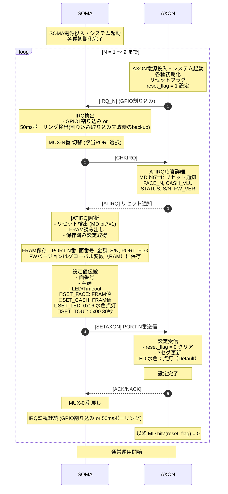
```mermaid
sequenceDiagram
    autonumber

    participant SOMA as SOMA
    participant AXON as AXON

    Note over SOMA: SOMA電源投入・システム起動<br>各種初期化完了

    loop N = 1 ～ 9 まで
        Note over AXON: AXON電源投入・システム起動<br>各種初期化<br>リセットフラグ<br>reset_flag = 1 設定

        AXON->>SOMA: [IRQ_N] (GPIO割り込み)

        Note over SOMA: IRQ検出<br>- GPIO1割り込み or <br>50msポーリング検出(割り込み取り込み失敗時のbackup)

        Note over SOMA: MUX-N番 切替 (該当PORT選択)
        SOMA->>AXON: [CHKIRQ]

        Note over AXON: ATIRQ応答詳細:<br>MD bit7=1: リセット通知<br>FACE_N, CASH_VLU<br>STATUS, S/N, FW_VER
        AXON-->>SOMA: [ATIRQ] リセット通知

        Note over SOMA: [ATIRQ]解析<br>- リセット検出 (MD bit7=1)<br>- FRAM読み出し<br>- 保存済み設定取得
        Note over SOMA: FRAM保存　PORT-N番: 面番号, 金額, S/N, PORT_FLG<br>FWバージョンはグローバル変数（RAM）に保存

        Note over SOMA: 設定値伝搬<br>- 面番号<br>- 金額<br>- LED/Timeout<br>🔵SET_FACE: FRAM値<br>🔵SET_CASH: FRAM値<br>🔵SET_LED: 0x16 水色点灯<br>🔵SET_TOUT: 0x00 30秒
        SOMA->>AXON: [SETAXON] PORT-N番送信

        Note over AXON: 設定受信<br>- reset_flag = 0 クリア<br>- 7セグ更新<br>LED 水色：点灯（Default）
        Note over AXON: 設定完了
        AXON-->>SOMA: [ACK/NACK]

        Note over SOMA: MUX-0番 戻し
        Note over SOMA: IRQ監視継続 (GPIO割り込み or 50msポーリング)
        Note over AXON: 以降 MD bit7(reset_flag) = 0
    end

    Note over SOMA,AXON: 通常運用開始
```

---

## 2. FWアップデート確認シーケンス

### 2.1. 概要

AXONから取得したFWバージョンを基に、SOMA側で最新FWか確認し、必要に応じてFWアップデートシーケンスへ移行する。
FWアップデートシーケンスの詳細については、以下を参照。
    - [15. FWアップデートシーケンス（TG-SOMA間）](#15-ファームウェアアップデートシーケンスtg-soma間)
    - [16. AXON ファームウェアアップデートシーケンス（SOMA-AXON間）](#16-axon-ファームウェアアップデートシーケンスsoma-axon間)

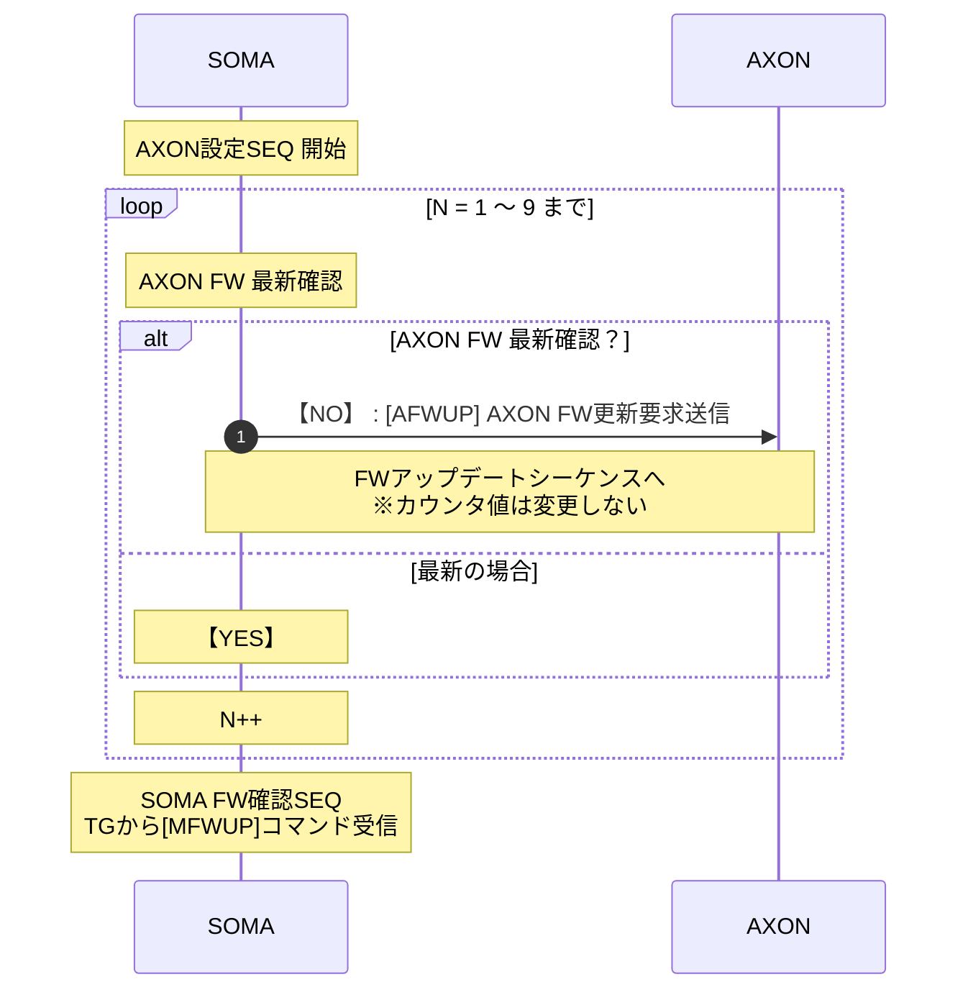
```mermaid
sequenceDiagram
    autonumber

    participant SOMA as SOMA
    participant AXON as AXON

    Note over SOMA: AXON設定SEQ 開始

    loop N = 1 ～ 9 まで
        Note over SOMA: AXON FW 最新確認
        alt AXON FW 最新確認？
            SOMA->>AXON: 【NO】 : [AFWUP] AXON FW更新要求送信
            Note over SOMA,AXON : FWアップデートシーケンスへ<br/>※カウンタ値は変更しない
        else 最新の場合
            Note over SOMA: 【YES】
        end
        Note over SOMA: N++
    end

    Note over SOMA: SOMA FW確認SEQ<br>TGから[MFWUP]コマンド受信
```

---

## 3. 金額設定 or 面番号変更の事前準備

### 3.1. 概要

AXONの金額設定や面番号を変更するための事前準備シーケンスになります。

面番号変更、金額変更シーケンス変更


今まで、面番号変更ボタン or 金額変更ボタンのどちらかが押されたときに、AXOＮからＩＲＱが来ていたがこれをやめた


面番号変更、金額変更完了後、両ボタン同時に3秒間押下したあとに、IRQが到着し、その後、CHKIRQ、ATIRQで、面番号の確認を実施し、SETAXOＮを送信するながれになります。
AXONからCHKIRQを受信した際、MD bit2(金額設定中）or bit3(面番号設定中）を確認します。
　MD bit2=1のときは、金額設定中のため、SETAXONのSET_CASH_VLUの値にAXOＮからの金額を設定し送信します。SET_CASH_VALU以外のフィールドは、ＡＴＩＲＱで取得した現在ＡＸＯＮが設定している値を設定してください。そうしないとＡＸＯＮ側の設定が変更されていまいます。ＳＥＴＡＸＯＮ送信後、ＡＣＫの到着したらFRAMの該当のPORTのCASＨを更新します。

　MD bit3=1のときは、面番号設定のため、面番号のチェック（既存と同様のチェック）を実施（実装済み）して、その結果により、FRAMの該当のポートのＦＡＣＥの値を更新します。
SETAXONのSET_FACE_Nの値には、重複時はFRAMに設定している該当の面番号を、重複していない場合は、AXONからきたATIRQの面番号を設定し送信します。SET_CASH_VALU以外のフィールドは、ＡＴＩＲＱで取得した現在ＡＸＯＮが設定している値を設定してください。そうしないとＡＸＯＮ側の設定が変更されていまいます。ＳＥＴＡＸＯＮ送信後、ＡＣＫの到着したらFRAMの該当のPORTのFACEを更新します。


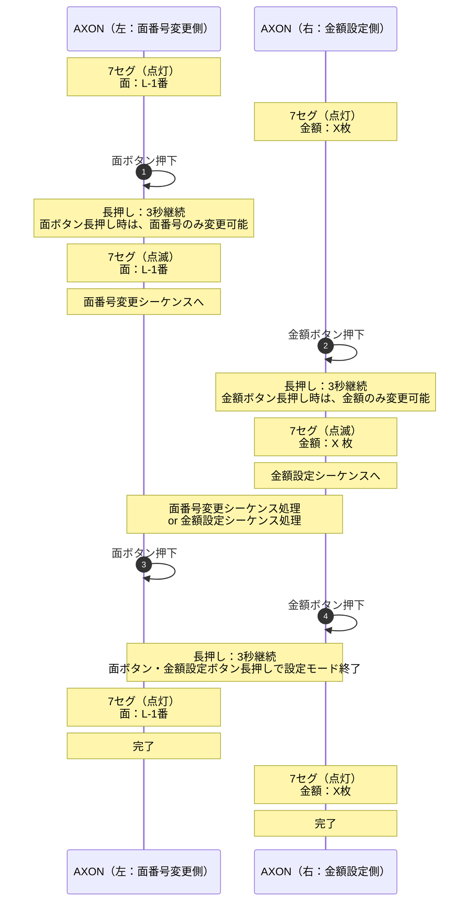
```mermaid
sequenceDiagram
    autonumber

    participant L as AXON（左：面番号変更側）
    participant R as AXON（右：金額設定側）

    %% 初期状態
    Note over L: 7セグ（点灯）<br/>面：L-1番
    Note over R: 7セグ（点灯）<br/>金額：X枚

    %% --- 左側：面番号変更シーケンスの準備 ---
    L->>L: 面ボタン押下
    Note over L: 長押し：3秒継続<br>面ボタン長押し時は、面番号のみ変更可能
    Note over L: 7セグ（点滅）<br/>面：L-1番
    Note over L: 面番号変更シーケンスへ

    %% --- 右側：金額設定シーケンスの準備 ---
    R->>R: 金額ボタン押下
    Note over R: 長押し：3秒継続<br>金額ボタン長押し時は、金額のみ変更可能
    Note over R: 7セグ（点滅）<br/>金額：X 枚
    Note over R: 金額設定シーケンスへ

    %% --- 次のシーケンスへの遷移 ---
    Note over L,R: 面番号変更シーケンス処理<br> or 金額設定シーケンス処理

    %% --- 変更確定側の処理 ---
    L->>L: 面ボタン押下
    R->>R: 金額ボタン押下
    Note over L,R: 長押し：3秒継続<br>面ボタン・金額設定ボタン長押しで設定モード終了
    Note over L: 7セグ（点灯）<br/>面：L-1番
    Note over L: 完了

    Note over R: 7セグ（点灯）<br/>金額：X枚
    Note over R: 完了
```

---

## 4. 面番号変更シーケンス（保存データ有無）

### 4.1. 概要

SOMAに保存してあるFRAM設定TableをAXONに伝搬させるシーケンスになります。

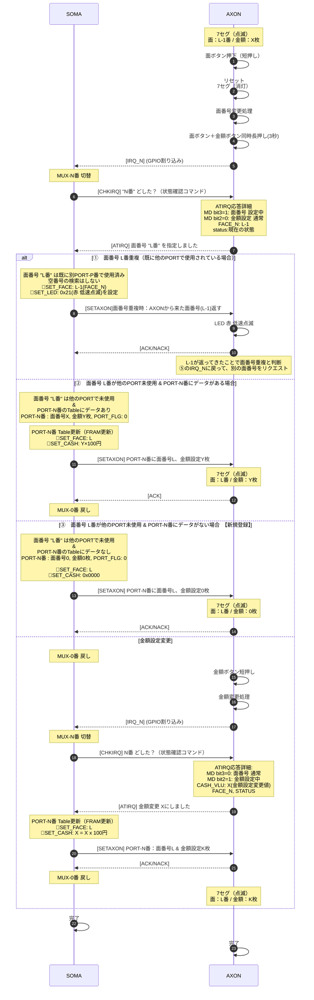
```mermaid
sequenceDiagram
    autonumber
    participant SOMA as SOMA
    participant AXON as AXON

    %% --- 初期状態 ---
    Note over AXON: 7セグ（点滅）<br/>面：L-1番 / 金額：X枚

    %% --- 面ボタン押下（変更開始） ---
    AXON->>AXON: 面ボタン押下（短押し）

    AXON->>AXON: リセット<br/>7セグ（消灯）
    AXON->>AXON: 面番号変更処理
    AXON->>AXON: 面ボタン＋金額ボタン同時長押し(3秒)

    %% --- 割り込み通知 ---
    AXON-->>SOMA: [IRQ_N] (GPIO割り込み)

    %% --- MUX 切り替え ---
    Note over SOMA: MUX-N番 切替

    %% --- 状態確認コマンド ---
    SOMA->>AXON: [CHKIRQ] "N番" どした？（状態確認コマンド）
    Note over AXON: ATIRQ応答詳細<br> MD bit3=1: 面番号 設定中<br>MD bit2=0: 金額設定 通常<br>FACE_N: L-1<br>status:現在の状態

    AXON-->>SOMA: [ATIRQ] 面番号 "L番" を指定しました

  alt ①　面番号 L番重複（既に他のPORTで使用されている場合）
      %% --- 面番号 L番 の使用状況確認 ---
      Note over SOMA: 面番号 "L番" は既に別PORT-P番で使用済み<br>空番号の検索はしない<br>🔵SET_FACE: L-1(FACE_N)<br>🔵SET_LED: 0x21(赤 低速点滅)を設定
      SOMA->>AXON: [SETAXON]面番号重複時：AXONから来た面番号(L-1)返す

      AXON->>AXON: LED 赤 低速点滅
      %% --- AXONの判定処理 ---
      AXON-->>SOMA: [ACK/NACK]
      Note over AXON: L-1が返ってきたことで面番号重複と判断<br>⑤のIRQ_Nに戻って、別の面番号をリクエスト

  else ②　面番号 L番が他のPORT未使用 & PORT-N番にデータがある場合
      %% --- 面番号 L番 の使用状況確認 ---
      Note over SOMA: 面番号 "L番" は他のPORTで未使用<br>&<br>PORT-N番のTableにデータあり<br>PORT-N番 : 面番号X, 金額Y枚, PORT_FLG: 0
      Note over SOMA: PORT-N番 Table更新（FRAM更新）<br>🔵SET_FACE: L<br>🔵SET_CASH: Y×100円
      SOMA->>AXON: [SETAXON] PORT-N番に面番号L、金額設定Y枚

      %% --- AXONの判定処理 ---
      Note over AXON: 7セグ（点滅）<br>面：L番 / 金額：Y枚
      AXON-->>SOMA: [ACK]
      Note over SOMA: MUX-0番 戻し

  else ③　面番号 L番が他のPORT未使用 & PORT-N番にデータがない場合　【新規登録】
      %% --- 面番号 L番 の使用状況確認 ---
      Note over SOMA: 面番号 "L番" は他のPORTで未使用<br>&<br>PORT-N番のTableにデータなし<br>PORT-N番 : 面番号0, 金額0枚, PORT_FLG: 0<br><br>🔵SET_FACE: L<br>🔵SET_CASH: 0x0000
      SOMA->>AXON: [SETAXON] PORT-N番に面番号L、金額設定0枚

      %% --- AXONの判定処理 ---
      Note over AXON: 7セグ（点滅）<br>面：L番 / 金額：0枚
      AXON-->>SOMA: [ACK/NACK]

  else 金額設定変更
      Note over SOMA: MUX-0番 戻し
      AXON->>AXON: 金額ボタン短押し
      AXON->>AXON: 金額変更処理

      AXON-->>SOMA: [IRQ_N] (GPIO割り込み)
      Note over SOMA: MUX-N番 切替
      SOMA->>AXON: [CHKIRQ] N番 どした？（状態確認コマンド）
      Note over AXON: ATIRQ応答詳細:<br>MD bit3=0: 面番号 通常<br>MD bit2=1: 金額設定中<br>CASH_VLU: X(金額設定変更値)<br>FACE_N, STATUS
      AXON-->>SOMA: [ATIRQ] 金額変更 Xにしました
      Note over SOMA: PORT-N番 Table更新（FRAM更新）<br>🔵SET_FACE: L<br>🔵SET_CASH: X = X x 100円
      SOMA->>AXON: [SETAXON] PORT-N番：面番号L & 金額設定K枚
      AXON-->>SOMA: [ACK/NACK]
      Note over SOMA: MUX-0番 戻し
      Note over AXON: 7セグ（点滅）<br>面：L番 / 金額：K枚
  end
    %% --- 終了 ---
    SOMA->>SOMA: 完了
    AXON->>AXON: 完了
```

---

## 5. 面番号変更シーケンス（0面利用）

### 5.1. 概要

面番号を変更したいときのシーケンスになります。

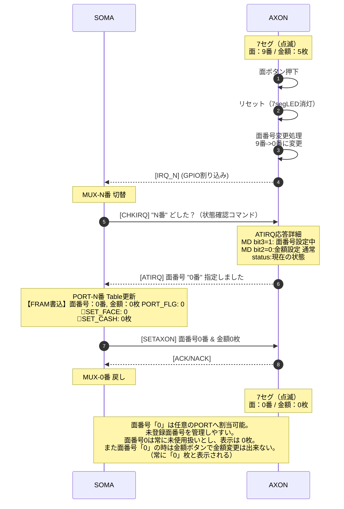
```mermaid
sequenceDiagram
    autonumber
    participant SOMA as SOMA
    participant AXON as AXON

    %% --- 初期状態 ---
    Note over AXON: 7セグ（点滅）<br>面：9番 / 金額：5枚

    %% --- 面ボタン押下 ---
    AXON->>AXON: 面ボタン押下
    AXON->>AXON: リセット（7segLED消灯）
    AXON->>AXON: 面番号変更処理 <br>9番->0番に変更

    %% --- 割り込み通知 ---
    AXON-->>SOMA: [IRQ_N] (GPIO割り込み)

    %% --- MUX 切替 ---
    Note over SOMA: MUX-N番 切替

    %% --- 状態確認 ---
    SOMA->>AXON: [CHKIRQ] "N番" どした？（状態確認コマンド）
    Note over AXON: ATIRQ応答詳細<br> MD bit3=1: 面番号設定中<br>MD bit2=0:金額設定 通常<br>status:現在の状態
    AXON-->>SOMA: [ATIRQ] 面番号 "0番" 指定しました

    %% --- 面番号0の設定 ---
    Note over SOMA: PORT-N番 Table更新<br>【FRAM書込】面番号：0番, 金額：0枚 PORT_FLG: 0<br>🔵SET_FACE: 0<br>🔵SET_CASH: 0枚
    SOMA->>AXON: [SETAXON] 面番号0番 & 金額0枚
    AXON-->>SOMA: [ACK/NACK]

    %% --- MUX戻し ---
    Note over SOMA: MUX-0番 戻し

    %% --- LED更新 ---
    Note over AXON: 7セグ（点滅）<br> 面：0番 / 金額：0枚

    %% --- 注記 ---
    Note over SOMA,AXON: 面番号「0」は任意のPORTへ割当可能。<br>未登録面番号を管理しやすい。<br>面番号0は常に未使用扱いとし、表示は 0枚。<br>また面番号「0」の時は金額ボタンで金額変更は出来ない。<br>（常に「0」枚と表示される）
```

---

## 6. ダイヤル回転サブルーチン

### 6.1. 概要

AXONとの接続の自由度を向上させるために以下のシーケンスのPORT確認を基本とする。

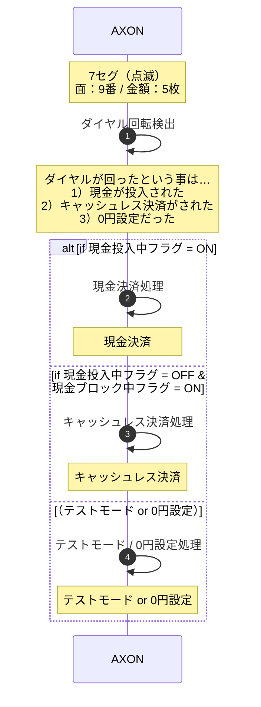
```mermaid
sequenceDiagram
    autonumber
    participant AXON as AXON

    %% 初期状態
    Note over AXON: 7セグ（点滅）<br>面：9番 / 金額：5枚

    %% ダイヤル回転
    AXON->>AXON: ダイヤル回転検出

    %% ダイヤル理由（複数行）
    Note over AXON: ダイヤルが回ったという事は…<br>1）現金が投入された<br>2）キャッシュレス決済がされた<br>3）0円設定だった

    %% 条件分岐（if-else if-else形式）
    alt if 現金投入中フラグ = ON
        AXON->>AXON: 現金決済処理
        Note over AXON: 現金決済

    else if 現金投入中フラグ = OFF &<br> 現金ブロック中フラグ = ON
        AXON->>AXON: キャッシュレス決済処理
        Note over AXON: キャッシュレス決済

    else （テストモード or 0円設定）
        AXON->>AXON: テストモード / 0円設定処理
        Note over AXON: テストモード or 0円設定
    end
```

---

## 7. 通常動作（購入） - 現金決済

### 7.1. 概要

現金決済時（現金投入 ⇒ ダイヤル回転）のシーケンスです。

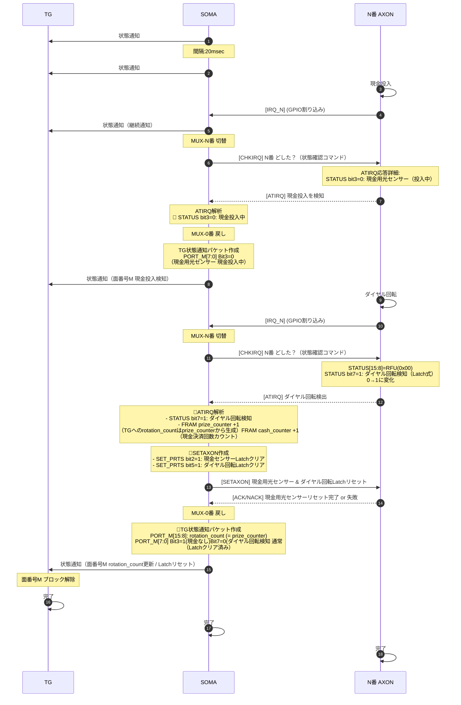
```mermaid
sequenceDiagram
    autonumber
    participant TG as TG
    participant SOMA as SOMA
    participant AXON as N番 AXON

    SOMA->>TG: 状態通知
    Note over SOMA: 間隔:20msec
    SOMA->>TG: 状態通知

    %% --- 現金投入 ---
    AXON->>AXON: 現金投入
    AXON->>SOMA: [IRQ_N] (GPIO割り込み)

    %% --- 状態通知 ---
    SOMA->>TG: 状態通知（継続通知）

    %% --- MUX切替 ---
    Note over SOMA: MUX-N番 切替
    SOMA->>AXON: [CHKIRQ] N番 どした？（状態確認コマンド）
    Note over AXON: ATIRQ応答詳細:<br>STATUS bit3=0: 現金用光センサー（投入中）
    AXON-->>SOMA: [ATIRQ] 現金投入を検知

    %% --- ATIRQ解析 ---
    Note over SOMA: ATIRQ解析<br>🔵 STATUS bit3=0: 現金投入中

    %% --- MUX-0戻し ---
    Note over SOMA: MUX-0番 戻し
    Note over SOMA: TG状態通知パケット作成<br>PORT_M[7:0] Bit3=0<br>（現金用光センサー 現金投入中）
    SOMA->>TG: 状態通知（面番号M 現金投入検知）

    %% --- ダイヤル回転 ---
    AXON->>AXON: ダイヤル回転
    AXON->>SOMA: [IRQ_N] (GPIO割り込み)

    %% --- 再度 MUX-N番 切替 ---
    Note over SOMA: MUX-N番 切替
    SOMA->>AXON: [CHKIRQ] N番 どした？（状態確認コマンド）
    Note over AXON: STATUS[15:8]=RFU(0x00)<br>STATUS bit7=1: ダイヤル回転検知（Latch式）<br>0→1に変化
    AXON-->>SOMA: [ATIRQ] ダイヤル回転検出

    Note over SOMA: 🔵ATIRQ解析<br>- STATUS bit7=1: ダイヤル回転検知<br>- FRAM prize_counter +1<br>（TGへのrotation_countはprize_counterから生成）FRAM cash_counter +1<br>（現金決済回数カウント）

    %% --- 現金センサーリセット ---
    Note over SOMA: 🔵SETAXON作成<br>- SET_PRTS bit2=1: 現金センサーLatchクリア<br>- SET_PRTS bit5=1: ダイヤル回転Latchクリア
    SOMA->>AXON: [SETAXON] 現金用光センサー & ダイヤル回転Latchリセット
    AXON-->>SOMA: [ACK/NACK] 現金用光センサーリセット完了 or 失敗

    %% --- MUX-0戻し ---
    Note over SOMA: MUX-0番 戻し
    Note over SOMA: 🔵TG状態通知パケット作成<br>PORT_M[15:8]: rotation_count (= prize_counter)<br>PORT_M[7:0] Bit3=1(現金なし)Bit7=0(ダイヤル回転検知 通常<br>（Latchクリア済み）
    SOMA->>TG: 状態通知（面番号M rotation_count更新 / Latchリセット）

    %% --- 面番号ブロック解除 ---
    Note over TG: 面番号M ブロック解除

    %% --- 完了 ---
    TG->>TG: 完了
    SOMA->>SOMA: 完了
    AXON->>AXON: 完了
```

---

## 8. 通常動作（購入） - キャッシュレス決済

### 8.1. 概要

キャッシュレス決済時（キャッシュレス決済 ⇒ ダイヤル回転）のシーケンスです。

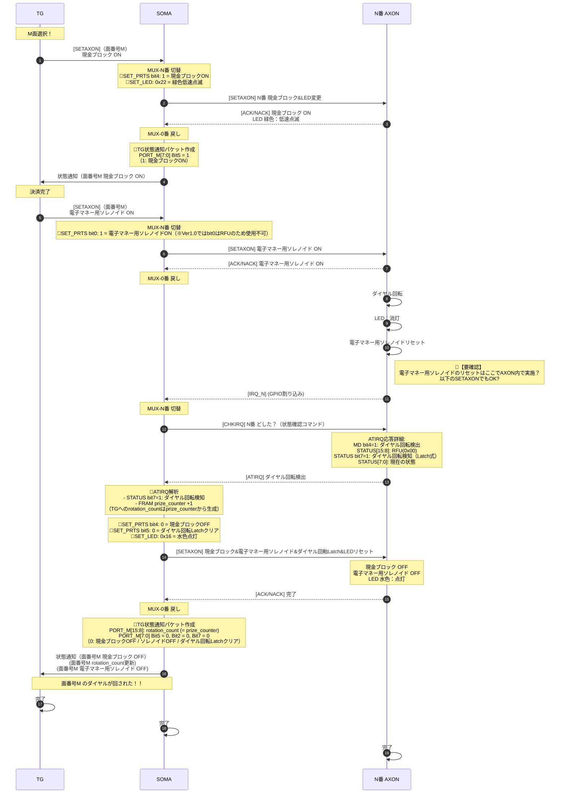
```mermaid
sequenceDiagram
    autonumber
    participant TG as TG
    participant SOMA as SOMA
    participant AXON as N番 AXON

    %% --- 決済開始（FACE-M 面選択） ---
    Note over TG: M面選択！
    TG->>SOMA: [SETAXON]（面番号M）<br>現金ブロック ON

    %% --- MUX切替して設定反映 ---
    Note over SOMA: MUX-N番 切替<br>🔵SET_PRTS bit4: 1 = 現金ブロックON<br>🔵SET_LED: 0x22 = 緑色低速点滅
    SOMA->>AXON: [SETAXON] N番 現金ブロック&LED変更
    AXON-->>SOMA: [ACK/NACK] 現金ブロック ON<br>LED 緑色：低速点滅

    %% --- MUX戻し ---
    Note over SOMA: MUX-0番 戻し
    Note over SOMA: 🔵TG状態通知パケット作成<br>PORT_M[7:0] Bit5 = 1<br>（1: 現金ブロックON）
    SOMA->>TG: 状態通知（面番号M 現金ブロック ON）

    %% --- キャッシュレス決済完了（ソレノイドON指示） ---
    Note over TG: 決済完了
    TG->>SOMA: [SETAXON]（面番号M）<br>電子マネー用ソレノイド ON

    %% --- ソレノイド動作 ---
    Note over SOMA: MUX-N番 切替<br>🔵SET_PRTS bit0: 1 = 電子マネー用ソレノイドON（※Ver1.0ではbit0はRFUのため使用不可）
    SOMA->>AXON: [SETAXON] 電子マネー用ソレノイド ON
    AXON-->>SOMA: [ACK/NACK] 電子マネー用ソレノイド ON

    %% --- MUX戻し ---
    Note over SOMA: MUX-0番 戻し

    %% --- ここから後半：ダイヤル回転発生 ---
    AXON->>AXON: ダイヤル回転
    AXON->>AXON: LED：消灯
    AXON->>AXON: 電子マネー用ソレノイドリセット
    Note right of AXON:🔴【要確認】<br>電子マネー用ソレノイドのリセットはここでAXON内で実施？<br>以下のSETAXONでもOK?

    %% --- 割り込み通知 ---
    AXON-->>SOMA: [IRQ_N] (GPIO割り込み)

    %% --- MUX切替 ---
    Note over SOMA: MUX-N番 切替
    SOMA->>AXON: [CHKIRQ] N番 どした？（状態確認コマンド）
    Note over AXON: ATIRQ応答詳細:<br>MD bit4=1: ダイヤル回転検出<br>STATUS[15:8]: RFU(0x00)<br>STATUS bit7=1: ダイヤル回転検知（Latch式）<br>STATUS[7:0]: 現在の状態
    AXON-->>SOMA: [ATIRQ] ダイヤル回転検出

    Note over SOMA: 🔵ATIRQ解析<br>- STATUS bit7=1: ダイヤル回転検知<br>- FRAM prize_counter +1<br>（TGへのrotation_countはprize_counterから生成）

    %% --- リセット処理要求 ---
    Note over SOMA: 🔵SET_PRTS bit4: 0 = 現金ブロックOFF<br>🔵SET_PRTS bit5: 0 = ダイヤル回転Latchクリア<br>🔵SET_LED: 0x16 = 水色点灯
    SOMA->>AXON: [SETAXON] 現金ブロック&電子マネー用ソレノイド&ダイヤル回軩Latch&LEDリセット
    Note over AXON: 現金ブロック OFF<br>電子マネー用ソレノイド OFF<br>LED 水色：点灯
    AXON-->>SOMA: [ACK/NACK] 完了

    %% --- MUX戻し ---
    Note over SOMA: MUX-0番 戻し

    %% --- 状態通知（TGへ） ---
    Note over SOMA: 🔵TG状態通知パケット作成<br>PORT_M[15:8]: rotation_count (= prize_counter)<br>PORT_M[7:0] Bit5 = 0, Bit2 = 0, Bit7 = 0<br>（0: 現金ブロックOFF / ソレノイドOFF / ダイヤル回転Latchクリア）
    SOMA->>TG: 状態通知（面番号M 現金ブロック OFF）<br>(面番号M rotation_count更新)<br>(面番号M 電子マネー用ソレノイド OFF)

    %% --- コメント ---
    Note over TG,SOMA: 面番号M のダイヤルが回された！！

    %% --- 完了 ---
    TG->>TG: 完了
    SOMA->>SOMA: 完了
    AXON->>AXON: 完了
```

---

## 9. 通常動作（購入以外） - 返金

### 9.1. 概要

現金投入後、購入せずに返金するシーケンスです。

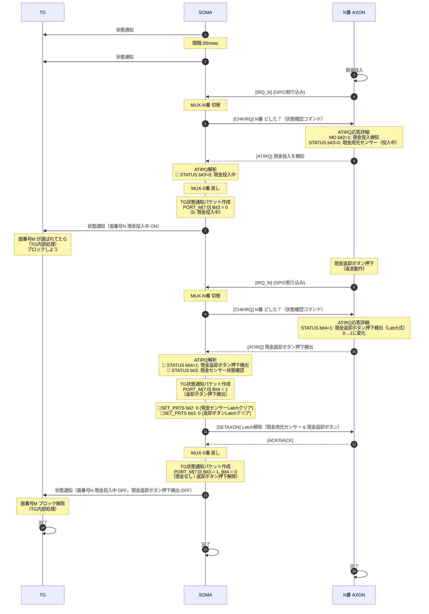
```mermaid
sequenceDiagram
    autonumber
    participant TG as TG
    participant SOMA as SOMA
    participant AXON as N番 AXON

    SOMA->>TG: 状態通知
    Note over SOMA: 間隔:20msec
    SOMA->>TG: 状態通知

    %% --- 現金投入 ---
    AXON->>AXON: 現金投入
    AXON->>SOMA: [IRQ_N] (GPIO割り込み)

    %% --- MUX 切替 ---
    Note over SOMA: MUX-N番 切替
    SOMA->>AXON: [CHKIRQ] N番 どした？（状態確認コマンド）
    Note over AXON: ATIRQ応答詳細:<br>MD bit2=1: 現金投入検知<br>STATUS bit3=0: 現金用光センサー（投入中）
    AXON-->>SOMA: [ATIRQ] 現金投入を検知

    %% --- ATIRQ解析 ---
    Note over SOMA: ATIRQ解析<br>🔵 STATUS bit3=0: 現金投入中

    %% --- MUX戻し ---
    Note over SOMA: MUX-0番 戻し
    Note over SOMA: TG状態通知パケット作成<br>PORT_M[7:0] Bit3 = 0<br>（0: 現金投入中）
    SOMA->>TG: 状態通知（面番号N 現金投入中 ON）

    %% --- ブロック動作開始（面番号Mが選択されていた場合） ---
    Note over TG: 面番号M が選ばれてたら<br>（TG内部処理）<br>ブロックしよう

    %% --- 返金動作 ---
    Note over AXON: 現金返却ボタン押下<br>（返金動作）
    AXON->>SOMA: [IRQ_N] (GPIO割り込み)

    %% --- MUX 切替 ---
    Note over SOMA: MUX-N番 切替
    SOMA->>AXON: [CHKIRQ] N番 どした？（状態確認コマンド）
    Note over AXON: ATIRQ応答詳細:<br>STATUS bit4=1: 現金返却ボタン押下検出（Latch式）<br>0→1に変化
    AXON-->>SOMA: [ATIRQ] 現金返却ボタン押下検出

    %% --- ATIRQ解析 ---
    Note over SOMA: ATIRQ解析<br>🔵 STATUS bit4=1: 現金返却ボタン押下検出<br>🔵 STATUS bit3: 現金センサー状態確認

    %% --- MUX 戻し ---
    Note over SOMA: TG状態通知パケット作成<br>PORT_M[7:0] Bit4 = 1<br>（返却ボタン押下検出）

    %% --- 再度MUX切替してリセット処理 ---
    Note over SOMA: 🔵SET_PRTS bit2: 0 (現金センサーLatchクリア)<br>🔵SET_PRTS bit3: 0 (返却ボタンLatchクリア)
    SOMA->>AXON: [SETAXON] Latch解除（現金用光センサー & 現金返却ボタン）
    AXON-->>SOMA: [ACK/NACK]

    %% --- MUX 戻し ---
    Note over SOMA: MUX-0番 戻し
    Note over SOMA: TG状態通知パケット作成<br>PORT_M[7:0] Bit3 = 1, Bit4 = 0<br>（現金なし / 返却ボタン押下解除）
    SOMA->>TG: 状態通知（面番号N 現金投入中 OFF、現金返却ボタン押下検出 OFF）

    %% --- ブロック解除 ---
    Note over TG: 面番号M ブロック解除<br>（TG内部処理）

    %% --- 完了 ---
    TG->>TG: 完了
    SOMA->>SOMA: 完了
    AXON->>AXON: 完了
```

---

## 10. 通常動作（購入以外） - 中止

### 10.1. 概要

キャッシュレス決済開始後、購入せずに中止するシーケンスです。

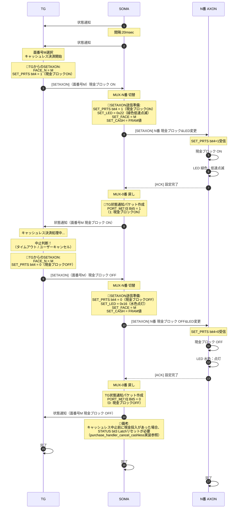
```mermaid
sequenceDiagram
    autonumber
    participant TG as TG
    participant SOMA as SOMA
    participant AXON as N番 AXON

    SOMA->>TG: 状態通知
    Note over SOMA: 間隔:20msec
    SOMA->>TG: 状態通知

    %% --- キャッシュレス決済開始（面選択） ---
    Note over TG: 面番号M選択<br>キャッシュレス決済開始
    Note over TG: 🔵TGからのSETAXON:<br>FACE_N = M<br>SET_PRTS bit4 = 1（現金ブロックON）
    TG->>SOMA: [SETAXON]（面番号M）現金ブロック ON

    %% --- MUX切替 ---
    Note over SOMA: MUX-N番 切替
    Note over SOMA: 🔵SETAXON送信準備:<br>SET_PRTS bit4 = 1（現金ブロックON）<br>SET_LED = 0x22（緑色低速点滅）<br>SET_FACE = M<br>SET_CASH = FRAM値
    SOMA->>AXON: [SETAXON] N番 現金ブロック&LED変更

    %% --- AXON動作（ブロック開始） ---
    Note over AXON: SET_PRTS bit4=1受信
    AXON->>AXON: 現金ブロック ON
    AXON->>AXON: LED 緑色：低速点滅
    AXON-->>SOMA: [ACK] 設定完了

    %% --- MUX戻し ---
    Note over SOMA: MUX-0番 戻し
    Note over SOMA: 🔵TG状態通知パケット作成<br>PORT_M[7:0] Bit5 = 1<br>（1: 現金ブロックON）
    SOMA->>TG: 状態通知（面番号M 現金ブロック ON）

    %% --- ユーザー操作待機中 ---
    Note over TG: キャッシュレス決済処理中...

    %% --- 中止発生 ---
    Note over TG: 中止判断！<br>（タイムアウト / ユーザーキャンセル）
    Note over TG: 🔵TGからのSETAXON:<br>FACE_N = M<br>SET_PRTS bit4 = 0（現金ブロックOFF）
    TG->>SOMA: [SETAXON]（面番号M）現金ブロック OFF

    %% --- MUX切替 ---
    Note over SOMA: MUX-N番 切替
    Note over SOMA: 🔵SETAXON送信準備:<br>SET_PRTS bit4 = 0（現金ブロックOFF）<br>SET_LED = 0x16（水色点灯）<br>SET_FACE = M<br>SET_CASH = FRAM値
    SOMA->>AXON: [SETAXON] N番 現金ブロック OFF&LED変更

    %% --- AXON動作（中止処理） ---
    Note over AXON: SET_PRTS bit4=0受信
    AXON->>AXON: 現金ブロック OFF
    AXON->>AXON: LED 水色：点灯
    AXON-->>SOMA: [ACK] 設定完了

    %% --- MUX戻し（中止完了） ---
    Note over SOMA: MUX-0番 戻し
    Note over SOMA: TG状態通知パケット作成<br>PORT_M[7:0] Bit5 = 0<br>（0: 現金ブロックOFF）
    SOMA->>TG: 状態通知（面番号M 現金ブロック OFF）

    %% --- 現金センサーLatchリセット（現金投入があった場合） ---
    Note over SOMA: 🔵備考:<br>キャッシュレス中止前に現金投入があった場合、<br>STATUS bit3 Latchリセットが必要<br>（purchase_handler_cancel_cashless実装参照）

    %% --- 完了 ---
    TG->>TG: 完了
    SOMA->>SOMA: 完了
    AXON->>AXON: 完了
```

---

## 11. 通常動作（購入以外） - 処理未了

### 11.1. 概要

キャッシュレス決済時（キャッシュレス決済 ⇒ 処理未了）のシーケンスです。
キャッシュレス決済が途中で処理未了となるシーケンスのため、特段実装の必要はなし。

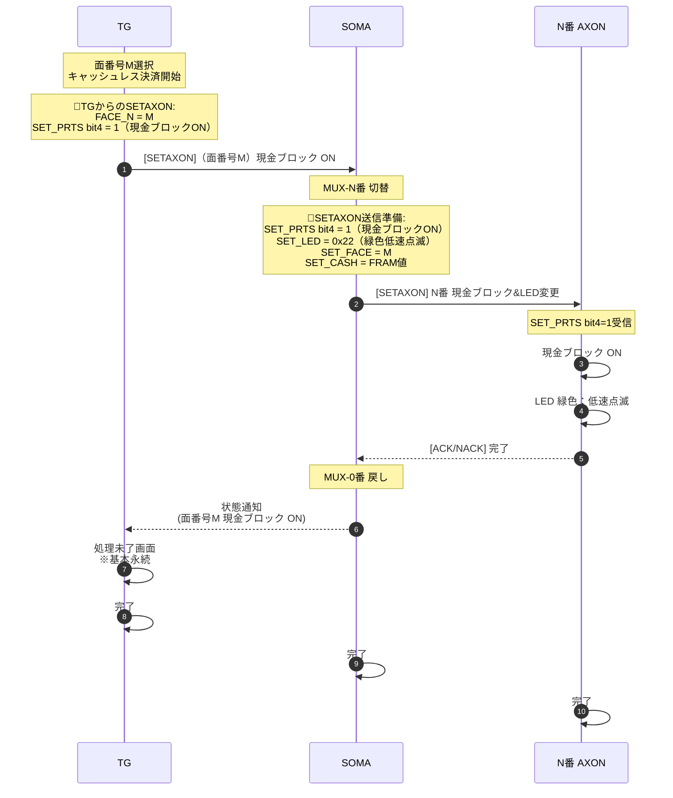
```mermaid
sequenceDiagram
    autonumber
    participant TG as TG
    participant SOMA as SOMA
    participant AXON as N番 AXON

    %% ==============================
    %% ① キャッシュレス決済時（処理終了）
    %% ==============================

    %% --- キャッシュレス決済開始（面選択） ---
    Note over TG: 面番号M選択<br>キャッシュレス決済開始
    Note over TG: 🔵TGからのSETAXON:<br>FACE_N = M<br>SET_PRTS bit4 = 1（現金ブロックON）
    TG->>SOMA: [SETAXON]（面番号M）現金ブロック ON

    %% --- MUX切替 ---
    Note over SOMA: MUX-N番 切替
    Note over SOMA: 🔵SETAXON送信準備:<br>SET_PRTS bit4 = 1（現金ブロックON）<br>SET_LED = 0x22（緑色低速点滅）<br>SET_FACE = M<br>SET_CASH = FRAM値

    SOMA->>AXON: [SETAXON] N番 現金ブロック&LED変更

    %% --- AXON動作（ブロック開始） ---
    Note over AXON: SET_PRTS bit4=1受信
    AXON->>AXON: 現金ブロック ON
    AXON->>AXON: LED 緑色：低速点滅
    AXON-->>SOMA: [ACK/NACK] 完了

    %% --- MUX戻し ---
    Note over SOMA: MUX-0番 戻し

    SOMA-->>TG: 状態通知<br>(面番号M 現金ブロック ON)

    TG->>TG: 処理未了画面<br>※基本永続

    %% --- 終了 ---
    TG->>TG: 完了
    SOMA->>SOMA: 完了
    AXON->>AXON: 完了
```

**備考**: 処理未了状態でドアOPENが発生した場合は、[12. ドアOPEN時の全PORT解除](#12-ドアopen時の全port解除)シーケンスへ移行

---

## 12. ドアOPEN時の全PORT解除

### 12.1. 概要

ドアOPEN検出時に、全PORT（1～9番）の現金ブロック・LED設定を解除するシーケンスです。
テスト画面への遷移や処理未了状態からの復帰時に実行されます。

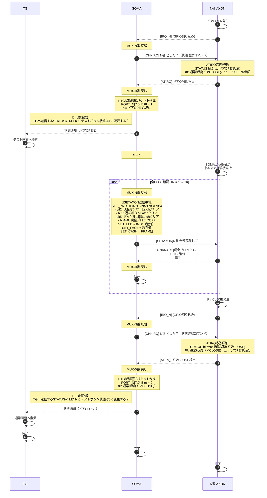
```mermaid
sequenceDiagram
    autonumber
    participant TG as TG
    participant SOMA as SOMA
    participant AXON as N番 AXON

    %% --- ドアOPEN発生 ---
    AXON->>AXON: ドアOPEN発生
    AXON-->>SOMA: [IRQ_N] (GPIO割り込み)

    Note over SOMA: MUX-N番 切替
    SOMA->>AXON: [CHKIRQ] N番 どした？（状態確認コマンド）
    Note over AXON: ATIRQ応答詳細:<br>STATUS bit6=1: ドアOPEN状態<br>（0: 通常状態(ドアCLOSE)、1: ドアOPEN状態）
    AXON-->>SOMA: [ATIRQ] ドアOPEN検出
    Note over SOMA: MUX-0番 戻し

    Note over SOMA: 🔵TG状態通知パケット作成<br>PORT_N[7:0] Bit6 = 1<br>（1: ドアOPEN状態）
    Note left of SOMA:🔴【要確認】<br>TGへ送信するSTATUSの MD bit0 テストボタン状態は1に変更する？
    SOMA-->>TG: 状態通知（ドアOPEN）
    TG->>TG: テスト画面へ遷移

    Note over SOMA: N = 1
    AXON->>AXON: SOMAから指令が<br>来るまでは現状維持

    %% --- 各PORTを順番にチェック ---
    loop 全PORT確認（N = 1 → 9）
        Note over SOMA: MUX-N番 切替
        Note over SOMA: 🔵SETAXON送信準備:<br>SET_PRTS = 0x2C (bit2+bit3+bit5)<br>- bit2: 現金センサーLatchクリア<br>- bit3: 返却ボタンLatchクリア<br>- bit5: ダイヤル回転Latchクリア<br>- bit4=0: 現金ブロックOFF<br>SET_LED = 0x00（消灯）<br>SET_FACE = 現在値<br>SET_CASH = FRAM値

        SOMA->>AXON: [SETAXON]N番 全部解除して
        AXON-->>SOMA: [ACK/NACK]現金ブロック OFF<br>LED：消灯<br>完了

        Note over SOMA: MUX-0番 戻し

        SOMA->>SOMA: N++

    end

    %% --- ドアCLOSE通知 ---
    AXON->>AXON: ドアCLOSE発生
    AXON-->>SOMA: [IRQ_N] (GPIO割り込み)

    Note over SOMA: MUX-N番 切替
    SOMA->>AXON: [CHKIRQ] N番 どした？（状態確認コマンド）
    Note over AXON: ATIRQ応答詳細:<br>STATUS bit6=0: 通常状態(ドアCLOSE)<br>（0: 通常状態(ドアCLOSE)、1: ドアOPEN状態）
    AXON-->>SOMA: [ATIRQ] ドアCLOSE検出
    Note over SOMA: MUX-0番 戻し

    Note over SOMA: 🔵TG状態通知パケット作成<br>PORT_N[7:0] Bit6 = 0<br>（0: 通常状態(ドアCLOSE)）
    Note left of SOMA:🔴【要確認】<br>TGへ送信するSTATUSの MD bit0 テストボタン状態は0に変更する？
    SOMA-->>TG: 状態通知（ドアCLOSE）
    TG->>TG: 通常画面へ復帰

    %% --- 終了 ---
    TG->>TG: 完了
    SOMA->>SOMA: 完了
    AXON->>AXON: 完了
```

---

## 13. 運用動作 - 0円設定

### 13.1. 概要

カプセルトイの0円設定：カプセルを取らせるシーケンスです。
ドアOPEN中にダイヤル回転が発生する場合のシーケンス

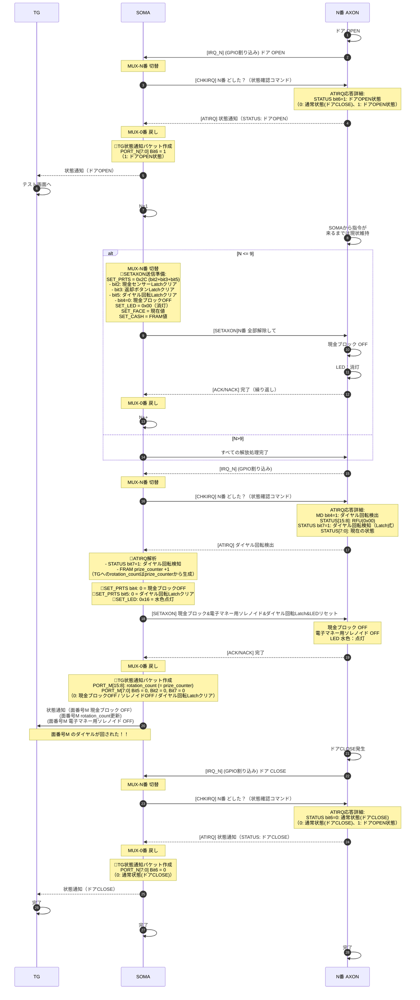
```mermaid
sequenceDiagram
    autonumber
    participant TG as TG
    participant SOMA as SOMA
    participant AXON as N番 AXON

    %% --- 初期状態：ドア OPEN ---
    AXON->>AXON: ドア OPEN
    AXON->>SOMA: [IRQ_N] (GPIO割り込み) ドア OPEN

    Note over SOMA: MUX-N番 切替
    SOMA->>AXON: [CHKIRQ] N番 どした？（状態確認コマンド）
    Note over AXON: ATIRQ応答詳細:<br>STATUS bit6=1: ドアOPEN状態<br>（0: 通常状態(ドアCLOSE)、1: ドアOPEN状態）
    AXON-->>SOMA: [ATIRQ] 状態通知（STATUS: ドアOPEN）
    Note over SOMA: MUX-0番 戻し

    Note over SOMA: 🔵TG状態通知パケット作成<br>PORT_N[7:0] Bit6 = 1<br>（1: ドアOPEN状態）
    SOMA-->>TG: 状態通知（ドアOPEN）

    %% --- テスト画面へ ---
    TG->>TG: テスト画面へ

    %% --- N=1 から順次処理 ---
    SOMA->>SOMA: N=1
    AXON->>AXON: SOMAから指令が<br>来るまでは現状維持

    %% --- ループ処理 N++ ---

    alt N <= 9
        Note over SOMA: MUX-N番 切替<br>🔵SETAXON送信準備:<br>SET_PRTS = 0x2C (bit2+bit3+bit5)<br>- bit2: 現金センサーLatchクリア<br>- bit3: 返却ボタンLatchクリア<br>- bit5: ダイヤル回転Latchクリア<br>- bit4=0: 現金ブロックOFF<br>SET_LED = 0x00（消灯）<br>SET_FACE = 現在値<br>SET_CASH = FRAM値
        SOMA->>AXON: [SETAXON]N番  全部解除して
        AXON->>AXON: 現金ブロック OFF
        AXON->>AXON: LED：消灯
        AXON-->>SOMA: [ACK/NACK] 完了（繰り返し）
        Note over SOMA: MUX-0番 戻し
        SOMA->>SOMA: N++
    else N>9
        %% --- 全ポート解除完了 ---
        SOMA->>AXON: すべての解放処理完了
    end

   %% --- 割り込み通知 ---
    AXON-->>SOMA: [IRQ_N] (GPIO割り込み)

    %% --- MUX切替 ---
    Note over SOMA: MUX-N番 切替
    SOMA->>AXON: [CHKIRQ] N番 どした？（状態確認コマンド）
    Note over AXON: ATIRQ応答詳細:<br>MD bit4=1: ダイヤル回転検出<br>STATUS[15:8]: RFU(0x00)<br>STATUS bit7=1: ダイヤル回転検知（Latch式）<br>STATUS[7:0]: 現在の状態
    AXON-->>SOMA: [ATIRQ] ダイヤル回転検出

    Note over SOMA: 🔵ATIRQ解析<br>- STATUS bit7=1: ダイヤル回転検知<br>- FRAM prize_counter +1<br>（TGへのrotation_countはprize_counterから生成）

    %% --- リセット処理要求 ---
    Note over SOMA: 🔵SET_PRTS bit4: 0 = 現金ブロックOFF<br>🔵SET_PRTS bit5: 0 = ダイヤル回転Latchクリア<br>🔵SET_LED: 0x16 = 水色点灯
    SOMA->>AXON: [SETAXON] 現金ブロック&電子マネー用ソレノイド&ダイヤル回軩Latch&LEDリセット
    Note over AXON: 現金ブロック OFF<br>電子マネー用ソレノイド OFF<br>LED 水色：点灯
    AXON-->>SOMA: [ACK/NACK] 完了

    %% --- MUX戻し ---
    Note over SOMA: MUX-0番 戻し

    %% --- 状態通知（TGへ） ---
    Note over SOMA: 🔵TG状態通知パケット作成<br>PORT_M[15:8]: rotation_count (= prize_counter)<br>PORT_M[7:0] Bit5 = 0, Bit2 = 0, Bit7 = 0<br>（0: 現金ブロックOFF / ソレノイドOFF / ダイヤル回転Latchクリア）
    SOMA->>TG: 状態通知（面番号M 現金ブロック OFF）<br>(面番号M rotation_count更新)<br>(面番号M 電子マネー用ソレノイド OFF)

    %% --- コメント ---
    Note over TG,SOMA: 面番号M のダイヤルが回された！！


    %% --- 最終：ドア CLOSE ---
    AXON->>AXON: ドアCLOSE発生
    AXON->>SOMA: [IRQ_N] (GPIO割り込み) ドア CLOSE

    Note over SOMA: MUX-N番 切替
    SOMA->>AXON: [CHKIRQ] N番 どした？（状態確認コマンド）
    Note over AXON: ATIRQ応答詳細:<br>STATUS bit6=0: 通常状態(ドアCLOSE)<br>（0: 通常状態(ドアCLOSE)、1: ドアOPEN状態）
    AXON-->>SOMA: [ATIRQ] 状態通知（STATUS: ドアCLOSE）
    Note over SOMA: MUX-0番 戻し

    Note over SOMA: 🔵TG状態通知パケット作成<br>PORT_N[7:0] Bit6 = 0<br>（0: 通常状態(ドアCLOSE)）
    SOMA-->>TG: 状態通知（ドアCLOSE）

    %% --- 終了 ---
    TG->>TG: 完了
    SOMA->>SOMA: 完了
    AXON->>AXON: 完了
```

---

## 14. 運用動作 - 売り切れ時

### 14.1. 概要

売り切れ時（売り切れの面のLEDの色を変えたいが特許回避の為、やらない）のシーケンスです。

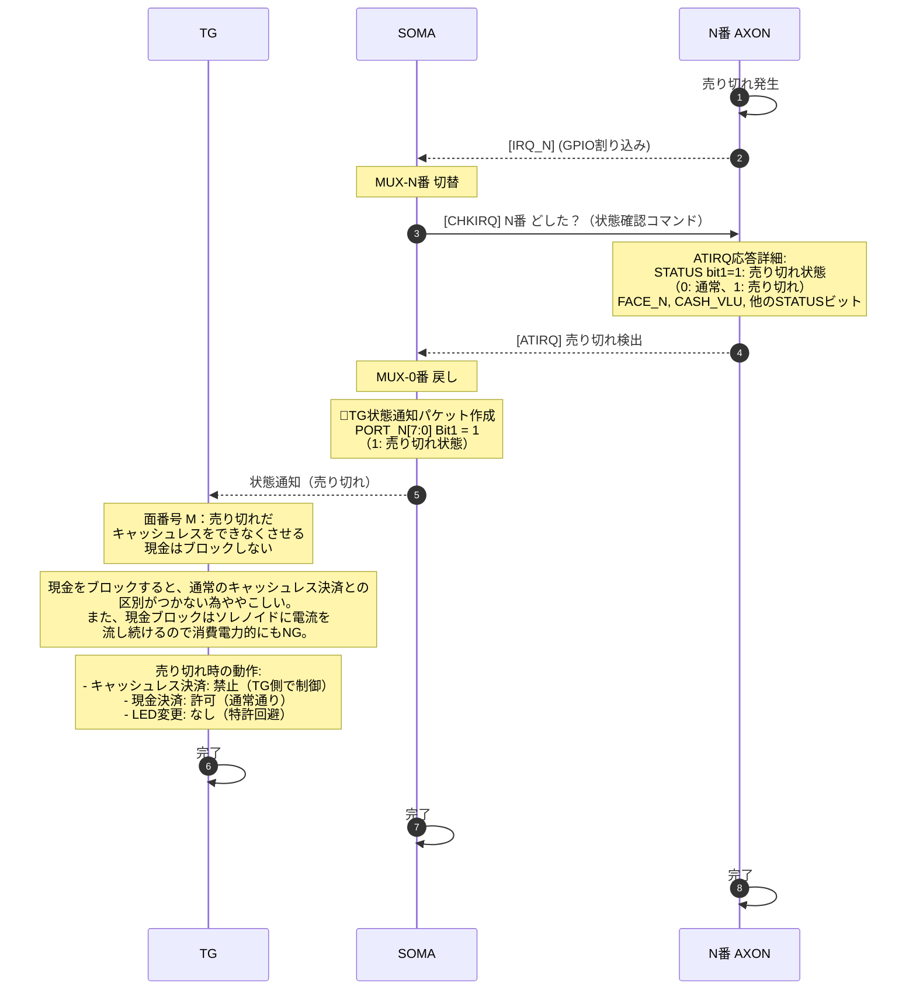
```mermaid
sequenceDiagram
    autonumber
    participant TG as TG
    participant SOMA as SOMA
    participant AXON as N番 AXON

    %% --- 売り切れ発生 ---
    AXON->>AXON: 売り切れ発生
    AXON-->>SOMA: [IRQ_N] (GPIO割り込み)

    Note over SOMA: MUX-N番 切替
    SOMA->>AXON: [CHKIRQ] N番 どした？（状態確認コマンド）
    Note over AXON: ATIRQ応答詳細:<br>STATUS bit1=1: 売り切れ状態<br>（0: 通常、1: 売り切れ）<br>FACE_N, CASH_VLU, 他のSTATUSビット
    AXON-->>SOMA: [ATIRQ] 売り切れ検出
    Note over SOMA: MUX-0番 戻し

    Note over SOMA: 🔵TG状態通知パケット作成<br>PORT_N[7:0] Bit1 = 1<br>（1: 売り切れ状態）
    SOMA-->>TG: 状態通知（売り切れ）

    %% --- TG側の処理 ---
    Note over TG: 面番号 M：売り切れだ<br>キャッシュレスをできなくさせる<br>現金はブロックしない

    Note over TG: 現金をブロックすると、通常のキャッシュレス決済との<br>区別がつかない為ややこしい。<br>また、現金ブロックはソレノイドに電流を<br>流し続けるので消費電力的にもNG。

    Note over TG: 売り切れ時の動作:<br>- キャッシュレス決済: 禁止（TG側で制御）<br>- 現金決済: 許可（通常通り）<br>- LED変更: なし（特許回避）

    %% --- 終了 ---
    TG->>TG: 完了
    SOMA->>SOMA: 完了
    AXON->>AXON: 完了
```

---

## 15. 運用鍵更新シーケンス

> **✅ SOMA実装状況（2026年1月7日更新）:**

> **未実装（TODO）:**
> - ⚠️ 設定鍵による暗号化・復号化（現状は平文として処理）
> - ⚠️ AXON基板への運用鍵更新コマンド送信


### 15.0. 運用鍵更新コマンド（SETOKEY）

運用鍵更新コマンド（SETOKEY）は、TGからSOMA、SOMAからAXONに送信され、AES256の運用鍵を更新するコマンドです。

> **✅ 暗号化仕様確定（2026年1月20日）:**
>
> **暗号化方式**: AES-256 ECBモード
> **鍵長**: 256ビット（32バイト）
> **パケット長**: 36バイト（Header 1byte + LEN 1byte + OKEY 32bytes + CRC16 2bytes）
>
> **重要**: SETOKEYコマンドのOKEYフィールドは32バイトの運用鍵を設定鍵で暗号化して送信します。

**パケット構造:**

| フィールド | バイト位置 | サイズ | 値 | 説明 |
|---|---|---|---|---|
| Header | 1st | 1 byte | 0x11 | コマンド識別子 |
| LEN | 2nd | 1 byte | 0x20 | データ長(32バイト) |
| OKEY | 3rd ~ 34th | 32 bytes | [0:255] | 新運用鍵（AES-256用256ビット鍵） |
| CRC16 | 35th ~ 36th | 2 bytes | [0:65535] | CRC16 |

**暗号化対象:** 3rd Byte ~ 34th Byte（新運用鍵部分）を設定鍵で暗号化

**処理:**
- SOMAは受信後、設定鍵で3rd~18th Byteを復号し、新運用鍵を一時保存
- チャレンジ/レスポンス方式で新運用鍵の正当性を検証
- 検証成功後、新運用鍵を採用し通常動作を再開

### 15.1. 運用鍵更新の手順

運用鍵を安全に更新するための手順は以下の通りです：

1. **新運用鍵の受信と保存**
   運用鍵更新コマンドを受信すると、SOMAは状態通知の定常送信を中断。運用鍵更新コマンドを復号し、新運用鍵を一時的に内部に記録。

2. **チャレンジパケットの送信**
   SOMAは16バイトの乱数を生成し、その乱数を設定鍵で暗号化したチャレンジパケットを送信。

3. **チャレンジパケットの復号**
   TGはチャレンジパケットを設定鍵で復号し、平文の乱数を取り出す。

4. **レスポンスパケットの送信**
   TGは取り出した乱数を新運用鍵（運用鍵更新コマンドで送った鍵）で暗号化し、SOMAに送信（レスポンスパケット）。

5. **レスポンスパケットの検証**
   SOMAはレスポンスパケットを手順1で受信した新運用鍵で復号し、乱数を取り出す。

6. **乱数の照合と鍵の採用**
   SOMAは取り出した乱数と、手順2で生成した乱数値の比較を行い、一致した場合に新運用鍵を採用し、新運用鍵にて通常動作を再開する。

7. **更新完了の確認**
   TGはSOMAからの通常動作時の状態通知の受信を確認し、新運用鍵にて暗号化された正規のパケットと判定したら終了。

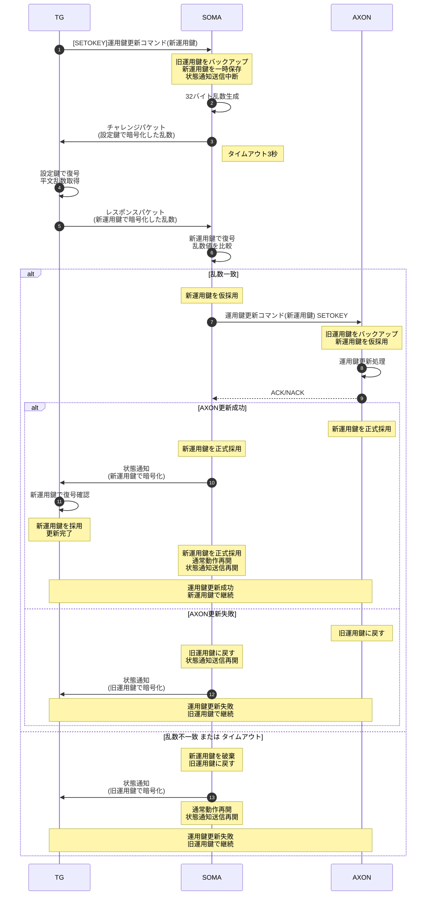
```mermaid
sequenceDiagram
    autonumber
    participant TG as TG
    participant SOMA as SOMA
    participant AXON as AXON

    TG->>SOMA: [SETOKEY]運用鍵更新コマンド(新運用鍵)
    Note over SOMA: 旧運用鍵をバックアップ<br/>新運用鍵を一時保存<br/>状態通知送信中断

    SOMA->>SOMA: 32バイト乱数生成

    SOMA->>TG: チャレンジパケット<br/>(設定鍵で暗号化した乱数)
    Note right of SOMA: タイムアウト3秒

    TG->>TG: 設定鍵で復号<br/>平文乱数取得
    TG->>SOMA: レスポンスパケット<br/>(新運用鍵で暗号化した乱数)

    SOMA->>SOMA: 新運用鍵で復号<br/>乱数値を比較

    alt 乱数一致
        Note over SOMA: 新運用鍵を仮採用

        SOMA->>AXON: 運用鍵更新コマンド(新運用鍵) SETOKEY
        Note over AXON: 旧運用鍵をバックアップ<br/>新運用鍵を仮採用
        AXON->>AXON: 運用鍵更新処理
        AXON-->>SOMA: ACK/NACK

        alt AXON更新成功
            Note over AXON: 新運用鍵を正式採用
            Note over SOMA: 新運用鍵を正式採用
            SOMA->>TG: 状態通知<br/>(新運用鍵で暗号化)

            TG->>TG: 新運用鍵で復号確認
            Note over TG: 新運用鍵を採用<br/>更新完了
            Note over SOMA: 新運用鍵を正式採用<br/>通常動作再開<br/>状態通知送信再開
            Note over TG,AXON: 運用鍵更新成功<br/>新運用鍵で継続
        else AXON更新失敗
            Note over AXON: 旧運用鍵に戻す
            Note over SOMA: 旧運用鍵に戻す<br/>状態通知送信再開
            SOMA->>TG: 状態通知<br/>(旧運用鍵で暗号化)
            Note over TG,AXON: 運用鍵更新失敗<br/>旧運用鍵で継続
        end

    else 乱数不一致 または タイムアウト
        Note over SOMA: 新運用鍵を破棄<br/>旧運用鍵に戻す
        SOMA->>TG: 状態通知<br/>(旧運用鍵で暗号化)
        Note over SOMA: 通常動作再開<br>状態通知送信再開
        Note over TG,AXON: 運用鍵更新失敗<br/>旧運用鍵で継続
    end
```

### 15.2. チャレンジパケット

チャレンジパケットは、SOMA基板にて生成しTGに送られます。SOMA基板は16バイトの乱数を生成、乱数を設定鍵で暗号化、更にヘッダ（"0x11"）とLEN（”0x10”）とCRC16を付加します。

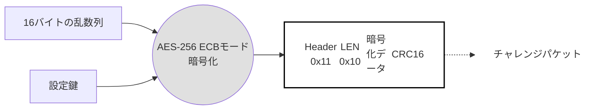
```mermaid
flowchart LR
    RND["16バイトの乱数列"]
    KEY["設定鍵"]
    ENC(("AES-256 ECBモード<br>暗号化"))
    PKT["<table><tr><td>Header<br>0x11</td><td>LEN<br>0x10</td><td>暗号化データ</td><td>CRC16</td></tr></table>"]
    LABEL["チャレンジパケット"]

    RND --> ENC
    KEY --> ENC
    ENC --> PKT
    PKT -.-> LABEL

    style ENC fill:#e0e0e0
    style PKT fill:#fff,stroke:#000,stroke-width:2px
    style LABEL fill:none,stroke:none


```


### 15.3. レスポンスパケット

レスポンスパケットは、TGにて生成しSOMA基板に送ります。TGはチャレンジパケットのデータ部を設定鍵にて復号、平文の乱数を取り出します。更に取り出した乱数を新運用鍵にて暗号化、ヘッダ（"0x11"）とLEN（"0x10”）とCRC16を付加します。

チャレンジパケット送出後、3秒以内にレスポンスパケットを受信しない場合タイムアウトとなり、運用鍵更新は中止され、通常動作に戻ります。

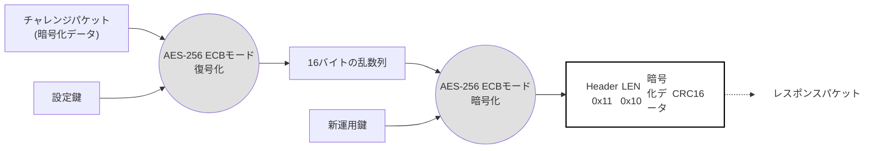
```mermaid
flowchart LR
    CPKT["チャレンジパケット<br>(暗号化データ)"]
    KEY1["設定鍵"]
    DEC(("AES-256 ECBモード<br>復号化"))
    RND["16バイトの乱数列"]
    KEY2["新運用鍵"]
    ENC(("AES-256 ECBモード<br>暗号化"))
    PKT["<table><tr><td>Header<br>0x11</td><td>LEN<br>0x10</td><td>暗号化データ</td><td>CRC16</td></tr></table>"]
    LABEL["レスポンスパケット"]

    CPKT --> DEC
    KEY1 --> DEC
    DEC --> RND
    RND --> ENC
    KEY2 --> ENC
    ENC --> PKT
    PKT -.-> LABEL

    style DEC fill:#e0e0e0
    style ENC fill:#e0e0e0
    style PKT fill:#fff,stroke:#000,stroke-width:2px
    style LABEL fill:none,stroke:none


```

### 15.4. タイムアウト処理の詳細

**タイムアウト仕様:**
- **起点**: チャレンジパケット送信時
- **タイムアウト時間**: 3秒
- **待機動作**: SOMAはレスポンスパケットの受信を待機
- **遅延パケット処理**: タイムアウト後に到着したレスポンスパケットは破棄
- **復旧処理**: 新運用鍵を破棄し、旧運用鍵で状態通知送信を再開

---


## 16. ファームウェアアップデートシーケンス

> **⚠️ SOMA実装状況:**
>
> **TG→SOMA間 (16.2 - SOMA用FW更新):**
> - ✅ MFWUPコマンド受信処理は実装済み ([tg_uart.c:1213](../../../src/peripheral/uart/t2s/tg_uart.c#L1213))
> - ✅ **CODEPKTパケット受信・OTA書き込み処理（40バイト）** ([tg_uart.c:1507](../../../src/peripheral/uart/t2s/tg_uart.c#L1507))
>   - **パケット構造**: Header(1) + LEN(1) + Address(4) + FW_CODE(32) + CRC16(2) = **40バイト**
>   - **構造体定義**: [t2s_packet.h:142](../../../src/main/protocol/t2s_packet.h#L142) `CODE_PACKET`
>   - **Header値**: 0xA1 (T2S_HEADER_CODEPKT) - TG-SOMA間専用
>   - **受信処理**: firmware_update_start/write_chunk/finish関数を使用
>   - ✅ **仕様準拠**: Table 6-2のCODEPKT仕様（40バイト、Header=0xA1）と完全一致
> - ✅ **CODEOK応答送信（8バイト）** - CODEPKT受信成功時
>   - **パケット構造**: Header(1) + LEN(1) + Address(4) + CRC16(2) = **8バイト**
>   - **構造体定義**: [t2s_packet.h:151](../../../src/main/protocol/t2s_packet.h#L151) `CODE_ACK_PACKET`
>   - **Header値**: 0xB0 (T2S_HEADER_CODEOK)
>   - **ビルド関数**: [t2s_packet.c:437](../../../src/main/protocol/t2s_packet.c#L437) `t2s_packet_build_codeok()`
>   - ✅ **仕様準拠**: Table 6-4のCODEOK仕様（8バイト、Header=0xB0）と完全一致
> - ✅ **CODENG応答送信（8バイト）** - CODEPKT受信失敗時
>   - **パケット構造**: Header(1) + LEN(1) + Address(4) + CRC16(2) = **8バイト**
>   - **構造体定義**: [t2s_packet.h:151](../../../src/main/protocol/t2s_packet.h#L151) `CODE_ACK_PACKET` (共通)
>   - **Header値**: 0xB9 (T2S_HEADER_CODENG)
>   - **ビルド関数**: [t2s_packet.c:453](../../../src/main/protocol/t2s_packet.c#L453) `t2s_packet_build_codeng()`
>   - ✅ **仕様準拠**: Table 6-6のCODENG仕様（8バイト、Header=0xB9）と完全一致
> - ✅ **ERRCHK受信・CRC検証処理（6バイト）** ([tg_uart.c:1613](../../../src/peripheral/uart/t2s/tg_uart.c#L1613))
>   - **パケット構造**: Header(1) + LEN(1) + WholeCode_CRC16(2) + CRC16(2) = **6バイト**
>   - **構造体定義**: [t2s_packet.h:158](../../../src/main/protocol/t2s_packet.h#L158) `ERRCHK_PACKET`
>   - **Header値**: 0xC0 (T2S_HEADER_ERRCHK)
>   - **ビルド関数**: [t2s_packet.c:469](../../../src/main/protocol/t2s_packet.c#L469) `t2s_packet_build_errchk()`
>   - ✅ **仕様準拠**: Table 6-8のERRCHK仕様（6バイト、Header=0xC0）と完全一致
> - ✅ **CODEFIN応答送信（8バイト）** - ERRCHK検証結果
>   - **パケット構造**: RSLT(1) + LEN(1) + RX_CRC16(2) + CALC_CRC16(2) + CRC16(2) = **8バイト**
>   - **構造体定義**: [t2s_packet.h:163](../../../src/main/protocol/t2s_packet.h#L163) `CODE_FIN_PACKET`
>   - **Header値**: 0xD0 (T2S_HEADER_CODEFIN) - 成功時、Others - 失敗時
>   - **ビルド関数**: [t2s_packet.c:485](../../../src/main/protocol/t2s_packet.c#L485) `t2s_packet_build_codefin()`
>   - ✅ **仕様準拠**: Table 6-10のCODEFIN仕様（8バイト、RSLT=0xD0）と完全一致
> - ✅ **修正完了**: ERRCHK後の自動再起動を削除、SOMARBT待機に変更済み
> - ✅ SOMARBT受信・再起動処理は実装済み ([tg_uart.c:1227](../../../src/main/protocol/t2s/tg_uart.c#L1227))
>
> **TG→SOMA→AXON統合フロー (16.3 - AXON用FW更新):**
> - ✅ **実装済み**: SOMA/AXON判別（最初のCODEPKTアドレスで自動判別）([tg_uart.c:1525](../../../src/peripheral/uart/t2s/tg_uart.c#L1525))
>   - SOMA用: 例）address >= 0x10000 → OTAパーティションに書き込み
>   - AXON用: 例）address < 0x10000 → メモリバッファに保存（最大256KB）
> - ✅ **実装済み**: AXON用FWのメモリバッファ保存（最大256KB）([tg_uart.c:1586](../../../src/peripheral/uart/t2s/tg_uart.c#L1586))
> - ✅ **実装済み**: ERRCHK後のAXON全ポート（Port 1-9）自動配信 ([tg_uart.c:1665](../../../src/peripheral/uart/t2s/tg_uart.c#L1665))
>   - ポート間待機時間: 500ms
>   - 転送失敗時は該当ポートをスキップして継続
>
> **SOMA→AXON間の個別FW配信処理 (16.3.2):**
> - ✅ AFWUP送信は実装済み ([s2a_packet.c:784](../../../src/protocol/src/s2a_packet.c#L784))
> - ✅ **CODEPKTパケット送信処理（40バイト）** ([fw_update.c:28](../../../src/main/protocol/fw_update.c#L28), [s2a_packet.c:203](../../../src/main/protocol/s2a_packet.c#L203))
>   - **パケット構造**: Header(1) + LEN(1) + Address(4) + FW_CODE(32) + CRC16(2) = **40バイト**
>   - **構造体定義**: [t2s_packet.h:142](../../../src/main/protocol/t2s_packet.h#L142) `CODE_PACKET`
>   - **Header値**: 0xA5 (S2A_HEADER_CODEPKT) - SOMA-AXON間専用
>   - **ビルド関数**: `s2a_packet_build_codepkt()` - Header=0xA5, LEN=0x24(36バイト)
>   - **送信処理**: `send_codepkt_packet()` - `sizeof(codepkt)`で40バイト送信
>   - ✅ **仕様準拠**: Table 6-2のCODEPKT仕様（40バイト、Header=0xA5）と完全一致
> - ✅ **CODEOK応答受信処理（8バイト）** - AXON→SOMA ([fw_update.c:56](../../../src/main/protocol/fw_update.c#L56))
>   - **パケット構造**: Header(1) + LEN(1) + Address(4) + CRC16(2) = **8バイト**
>   - **構造体定義**: `CODE_ACK_PACKET`（TG-SOMA間と共通）
>   - **Header値**: 0xB4 (S2A_HEADER_CODEOK)
>   - **受信処理**: `wait_for_code_response()` - Header=0xB4を確認
>   - ✅ **仕様準拠**: Table 6-4のCODEOK仕様（8バイト、Header=0xB4）と完全一致
> - ✅ **CODENG応答受信処理（8バイト）** - AXON→SOMA ([fw_update.c:56](../../../src/main/protocol/fw_update.c#L56))
>   - **パケット構造**: Header(1) + LEN(1) + Address(4) + CRC16(2) = **8バイト**
>   - **構造体定義**: `CODE_ACK_PACKET`（共通）
>   - **Header値**: 0xBD (S2A_HEADER_CODENG)
>   - **受信処理**: `wait_for_code_response()` - Header=0xBDを確認
>   - ✅ **仕様準拠**: Table 6-6のCODENG仕様（8バイト、Header=0xBD）と完全一致
> - ✅ **ERRCHK送信処理（6バイト）** ([fw_update.c:93](../../../src/main/protocol/fw_update.c#L93), [s2a_packet.c:226](../../../src/main/protocol/s2a_packet.c#L226))
>   - **パケット構造**: Header(1) + LEN(1) + WholeCode_CRC16(2) + CRC16(2) = **6バイト**
>   - **構造体定義**: [t2s_packet.h:158](../../../src/main/protocol/t2s_packet.h#L158) `ERRCHK_PACKET`（共通）
>   - **Header値**: 0xC4 (S2A_HEADER_ERRCHK)
>   - **ビルド関数**: `s2a_packet_build_errchk()` - Header=0xC4, LEN=0x02
>   - **送信処理**: `send_errchk_packet()` - `sizeof(errchk)`で6バイト送信
>   - ✅ **仕様準拠**: Table 6-8のERRCHK仕様（6バイト、Header=0xC4）と完全一致
> - ✅ **CODEFIN応答受信処理（8バイト）** ([fw_update.c:117](../../../src/main/protocol/fw_update.c#L117))
>   - **パケット構造**: RSLT(1) + LEN(1) + RX_CRC16(2) + CALC_CRC16(2) + CRC16(2) = **8バイト**
>   - **構造体定義**: [t2s_packet.h:163](../../../src/main/protocol/t2s_packet.h#L163) `CODE_FIN_PACKET`（共通）
>   - **Header値**: 0xD4 (S2A_HEADER_CODEFIN) - 成功時
>   - **受信処理**: `wait_for_codefin_response()` - Header=0xD4を確認、CRC検証
>   - ✅ **仕様準拠**: Table 6-10のCODEFIN仕様（8バイト、RSLT=0xD4）と完全一致
> - ✅ AXONRBT送信は実装済み ([s2a_packet.c:852](../../../src/main/protocol/s2a_packet.c#L852))
> - ✅ ファームウェア送信の全シーケンス ([fw_update.c:145](../../../src/main/protocol/fw_update.c#L145))
>
> **実装完了した機能:**
> 1. ✅ TG→SOMA FW更新（OTA、アドレス >= 0x10000）
> 2. ✅ TG→SOMA→AXON FW転送（アドレス < 0x10000で自動判別）
> 3. ✅ AXON全9ポートへの一括FW配信（ポート間500ms待機、エラー時スキップ）
>
> **動作フロー:**
>
> フローチャートおよび詳細なシーケンス図は [16.2.2 シーケンス図（TG-SOMA間）](#1622-シーケンス図tg-soma間) および [16.3.2 シーケンス図（TG経由のAXON FW更新）](#1632-シーケンス図tg経由のaxon-fw更新) を参照してください。
>
> ```mermaid
> graph LR
>     A[TG] -->|①MFWUP| B[SOMA]
>     A -->|②CODEPKT×N<br/>address<0x10000| B
>     B -->|③CODEFIN| A
>     B -->|④自動配信| D[AXON<br/>Port1-9]
>     D -->|AFWUP→CODEPKT→<br/>ERRCHK→AXONRBT| D
>     D -->|完了| E[バッファ解放<br/>STATUS再開]
> ```

### 16.1. 概要

ファームウェアアップデートは、TG→SOMA、SOMA→AXONの2段階で実行されます。

**共通仕様:**
- アップデートコード・ファイルはASCIIテキスト形式の1ファイルで、前半にSOMAのバイナリ、後半にAXONのバイナリを含む
- 1行16バイト（TG-SOMA間は32バイト）のファームウェアコードで構成
- テキストから16進数に変換し、運用鍵で暗号化
- エラー検出は各行のCRC16と全データのCRC16で実施
- 暗号化範囲はファームウェアコード部のみ

**暗号化実装の扱い:**
- **TG-SOMA間**: 現在は暗号化無効（`NO_USE_ENCRYPTION`マクロ定義により無効化）
- **SOMA-AXON間**: 暗号化処理を有効にした場合を想定して実装

**保持される情報:**
- 設定鍵、運用鍵
- ユーザーメモリの内容

### 16.2. TG-SOMA間のファームウェアアップデート

#### 16.2.1. 手順

1. **FWアップデートコマンドの受信**
   FWアップデートコマンドを受信すると、SOMAは通知パケットの定期送信を中断し、アップデートコードの受信状態になります。

2. **コードパケットの送信**
   TGはテキスト形式のアップデートコード・ファイルを1行単位で読み出し、テキストから16進数に変換、運用鍵にて暗号化しSOMAに送信。1行32バイトのファームウェアコードで構成される。アドレス情報と行毎のCRC16を付加した上で送信。
   SOMAは、C:\DATA\DEVELOP\Git\Synapse_wifi_module\src\main\peripheral\fram\firmware_update.cのfirmware_update_write_chunk関数で受信したコードパケットを処理し、ota_0または、ota_1パーティションに書き込みを行う。
   firmware_update_write_chunkを使用する前には、firmware_update_start関数で初期化を行う必要がある。


3. **ACK/NACK応答の確認**
   SOMAからのCODEOK応答を受信したら、次の行を送信。CODENGが返った場合、同じ行を再送。
   firmware_update_write_chunkの結果に応じて、SOMAはCODEOKまたはCODENGをTGに送信する。

4. **エラー確認パケットの送信**

   最終行まで送信完了したら、firmware_update_finish関数を実行し、戻り値がOKなら、全FWコードのCRC16を含むエラー確認パケットを送信。


5. **完了応答と再起動の確認**
   - ブートパーティションを設定
   - CRC16一致：TGはSOMA再起動コマンドを送信。SOMAはFW更新を実行後、リセットして新ファームウェアで起動
   - CRC16不一致：SOMAは旧FWのまま通常動作へ戻る

6. **更新完了の確認**
   TGはSOMAからの通知パケットの受信を確認し終了。コード送信完了からリセット完了までは最大30秒。

#### 16.2.2. シーケンス図（TG-SOMA間）

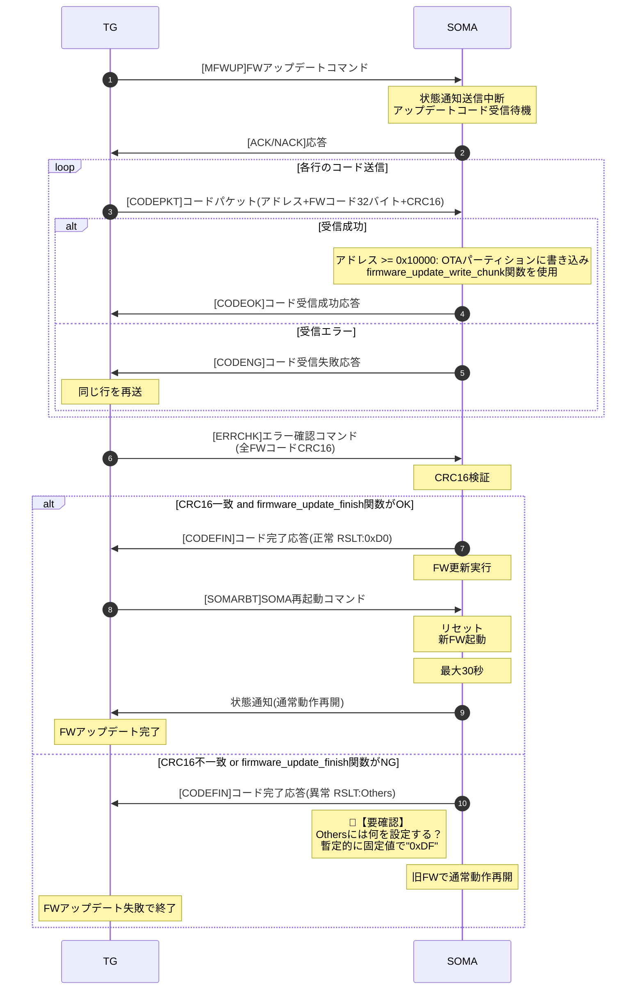
```mermaid
sequenceDiagram
    autonumber
    participant TG as TG
    participant SOMA as SOMA

    TG->>SOMA: [MFWUP]FWアップデートコマンド
    Note over SOMA: 状態通知送信中断<br/>アップデートコード受信待機
    SOMA->>TG: [ACK/NACK]応答

    loop 各行のコード送信
        TG->>SOMA: [CODEPKT]コードパケット(アドレス+FWコード32バイト+CRC16)
        alt 受信成功
            Note over SOMA: アドレス >= 0x10000: OTAパーティションに書き込み<br/>firmware_update_write_chunk関数を使用
            SOMA->>TG: [CODEOK]コード受信成功応答
        else 受信エラー
            SOMA->>TG: [CODENG]コード受信失敗応答
            Note over TG: 同じ行を再送
        end
    end

    TG->>SOMA: [ERRCHK]エラー確認コマンド<br>(全FWコードCRC16)
    Note over SOMA: CRC16検証
    alt CRC16一致 and firmware_update_finish関数がOK
        SOMA->>TG: [CODEFIN]コード完了応答(正常 RSLT:0xD0)
        Note over SOMA: FW更新実行
        TG->>SOMA: [SOMARBT]SOMA再起動コマンド
        Note over SOMA: リセット<br/>新FW起動
        Note over SOMA: 最大30秒
        SOMA->>TG: 状態通知(通常動作再開)
        Note over TG: FWアップデート完了
    else CRC16不一致 or firmware_update_finish関数がNG
        SOMA->>TG: [CODEFIN]コード完了応答(異常 RSLT:Others)
        Note left of SOMA: 🔴【要確認】<br/>Othersには何を設定する？<br>暫定的に固定値で"0xDF"
        Note over SOMA: 旧FWで通常動作再開
        Note over TG: FWアップデート失敗で終了
    end
```

#### 16.2.3. コードファイル形式

- 1行32バイトのファームウェアコード（TG-SOMA間、SOMA-AXON間共通）
- 32バイト中、未使用のバイトには0x00を埋め込む
- アドレス情報と行毎のCRC16を付加
- 運用鍵にて暗号化
- 前半にSOMA用、後半にAXON用のコードを含む

### 16.3. SOMA-AXON間のファームウェアアップデート

> **注意**: AXON用ファームウェアアップデートは**TG経由でのみ実行**されます。
> TGからMFWUPコマンドを受信後、CODEPKTのアドレスが0x10000未満の場合、SOMAは自動的に全9ポートのAXONへFWを配信します。

#### 16.3.1. 手順

1. **TGからのFWアップデートコマンド受信**
   TGからMFWUPコマンドを受信し、STATUS送信を中断してFW受信待機状態になります。

2. **TGからのコードパケット受信**
   TGから送信されるCODEPKTパケットをSOMAのメモリバッファ（最大256KB）に蓄積します。

3. **TGからのERRCHK受信とCODEFIN応答**
   全FWコードのCRC16検証を実施し、CODEFIN応答をTGに返します。

4. **AXON全ポートへの自動FW配信**
   CODEFIN送信後、SOMAは自動的にPort 1-9の全AXONへFWを配信します。
   - 各ポート: AFWUP → CODEPKT × N → ERRCHK → CODEFIN → AXONRBT
   - ポート間待機時間: 500ms
   - 転送失敗したポートはスキップして次へ継続

5. **完了応答と再起動**
   - CRC16一致：AXONはFW更新を実行後、リセットして新ファームウェアで起動
   - CRC16不一致：AXONは旧FWのまま通常動作へ戻る

6. **更新完了とバッファ解放**
   全ポートへの配信完了後、SOMAはメモリバッファを解放し、STATUS送信を再開します。

#### 16.3.2. シーケンス図（TG経由のSOMA-AXON FW更新）

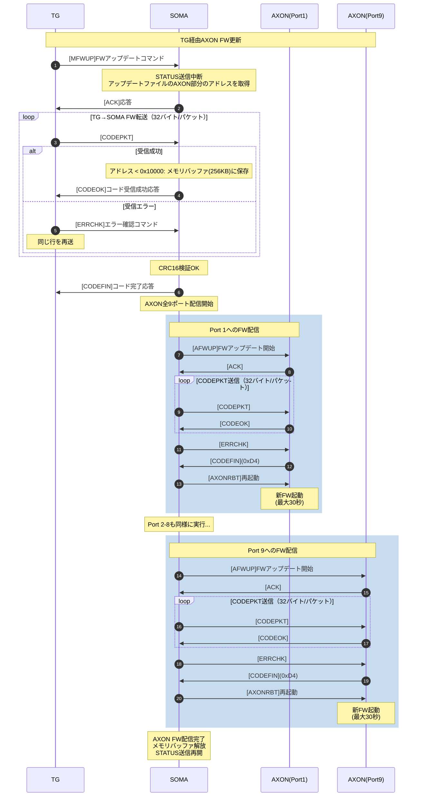
```mermaid
sequenceDiagram
    autonumber
    participant TG as TG
    participant SOMA as SOMA
    participant AXON1 as AXON(Port1)
    participant AXON9 as AXON(Port9)

    Note over TG,AXON9: TG経由AXON FW更新

    TG->>SOMA: [MFWUP]FWアップデートコマンド
    Note over SOMA: STATUS送信中断<br>アップデートファイルのAXON部分のアドレスを取得
    SOMA->>TG: [ACK]応答

    loop TG→SOMA FW転送（32バイト/パケット）
        TG->>SOMA: [CODEPKT]
        alt 受信成功
            Note over SOMA: アドレス < 0x10000: メモリバッファ(256KB)に保存
            SOMA->>TG: [CODEOK]コード受信成功応答
        else 受信エラー
            TG->>SOMA: [ERRCHK]エラー確認コマンド
            Note over TG: 同じ行を再送
        end
    end

    Note over SOMA: CRC16検証OK
    SOMA->>TG: [CODEFIN]コード完了応答

    Note over SOMA: AXON全9ポート配信開始

    rect rgb(200, 220, 240)
        Note over SOMA,AXON1: Port 1へのFW配信
        SOMA->>AXON1: [AFWUP]FWアップデート開始
        AXON1->>SOMA: [ACK]
        loop CODEPKT送信（32バイト/パケット）
            SOMA->>AXON1: [CODEPKT]
            AXON1->>SOMA: [CODEOK]
        end
        SOMA->>AXON1: [ERRCHK]
        AXON1->>SOMA: [CODEFIN](0xD4)
        SOMA->>AXON1: [AXONRBT]再起動
        Note over AXON1: 新FW起動<br/>(最大30秒)
    end

    Note over SOMA: Port 2-8も同様に実行...

    rect rgb(200, 220, 240)
        Note over SOMA,AXON9: Port 9へのFW配信
        SOMA->>AXON9: [AFWUP]FWアップデート開始
        AXON9->>SOMA: [ACK]
        loop CODEPKT送信（32バイト/パケット）
            SOMA->>AXON9: [CODEPKT]
            AXON9->>SOMA: [CODEOK]
        end
        SOMA->>AXON9: [ERRCHK]
        AXON9->>SOMA: [CODEFIN](0xD4)
        SOMA->>AXON9: [AXONRBT]再起動
        Note over AXON9: 新FW起動<br/>(最大30秒)
    end

    Note over SOMA: AXON FW配信完了<br/>メモリバッファ解放<br/>STATUS送信再開
```

#### 16.3.3. コードファイル形式

- 1行32バイトのファームウェアコード（TG-SOMA間、SOMA-AXON間共通）
- 32バイト中、未使用のバイトには0x00を埋め込む
- アドレス情報と行毎のCRC16を付加
- 運用鍵にて暗号化
- 前半にSOMA用、後半にAXON用のコードを含む

#### 16.3.4. 実装詳細

**判別ロジック（SOMA側のアドレス判定）:**

SOMAは、TGから受信した**CODEPKTパケットのアドレス情報**でFW配信先を自動判別します。

- **SOMA用FW (address >= 0x10000)**:
  - **動作**: OTAパーティション（ota_0またはota_1）に直接書き込み
  - **完了処理**: ERRCHKでOTA完了、SOMARBT待機（自動再起動しない）

- **AXON用FW (address < 0x10000)**:
  - **動作**: 256KBメモリバッファに一時保存（フラッシュ書き込みではなくRAMに蓄積）
  - **完了処理**: ERRCHKで全9ポートへ自動配信開始（上記シーケンス図参照）
  - **配信方法**: 各ポートで`fw_update_start()`を順次実行、バッファから読み出してAXONへ転送
  - **サイズ制約**: MSPM0G3507のフラッシュサイズ（128KB）まで対応

**判別のタイミング:**
- 最初のCODEPKTパケット受信時にアドレスをチェックし、FW配信先を確定
- 以降のCODEPKTパケットは、確定した配信先に従って処理を継続
- 次回のMFWUP受信時に判別状態をリセット

**実装場所:**

- [tg_uart.c](../../../src/peripheral/uart/t2s/tg_uart.c)
  - `handle_mfwup_command()`: FW更新開始（L1213）
  - `handle_codepkt_command()`: SOMA/AXON分岐処理（L1507）
  - `handle_errchk_command()`: AXON自動配信トリガー（L1613）
- [fw_update.c](../../../src/protocol/src/fw_update.c)
  - `fw_update_start()`: AXON個別ポートへのFW送信（L145）

**注意事項:**

1. AXON用FWは**TG経由でのみ更新可能**（直接更新の仕組みは存在しない）
2. TG-SOMA間、SOMA-AXON間ともにCODEPKTは**32バイト**
3. AXON用FWは最大256KBまで対応
4. 各ポート間で500msの待機時間を設定
5. 転送失敗したポートはスキップして次のポートに継続

---
